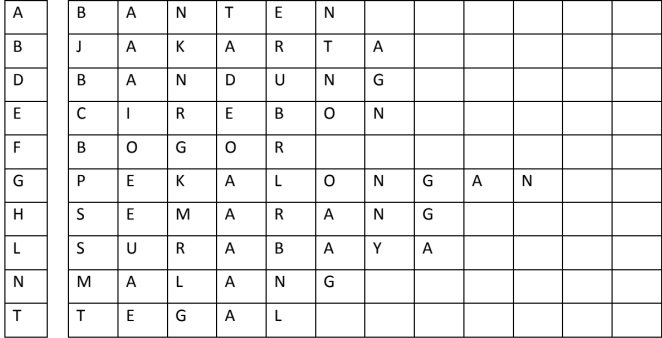
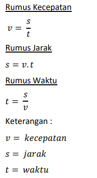

# <p align="center">Pertemuan 1 - Jobsheet 1 Konsep Dasar Pemilihan</p>

<br><br>

<p align="center">
    
</p>

<br><br>

<p align="center">
    Nama : Riovaldo Alfiyan Fahmi Rahman <br>
    NIM : 2341720209 <br>
    Prodi : D4 Teknik Informatika <br>
    Kelas : TI 1B
</p>

<br><br>

---

## 2.1 Pemilihan

### Pertanyaan

1.  Buatlah program untuk menghitung nilai akhir dari mahasiswa dengan ketentuan 20% nilai
    tugas, 20% dari nilai kuis, 30% nilai UTS, dan 40% nilai UAS. Setiap nilai yang dimasukkan
    mempunyai batas nilai 0 ‐ 100. Ketika pengguna memasukkan diluar rentang tersebut maka
    akan keluar output “nilai tidak valid”. Ketika nilai akhir sudah didapatkan selanjutnya
    lakukan konversi nilai dengan ketentuan sebagai berikut : <br>

     <br>

    Jika Nilai Huruf yang didapatkan adalah A,B+,B+C+,C maka LULUS, jika nilai huruf D dan E
    maka TIDAK LULUS.

    - Input dari program berupa komponen nilai tugas,kuis, UTS, UAS
    - Otuput dari program “nilai tidak valid” jika nilai yang dimasukkan diluar ketentuan
    - Output dari program berupa hasil nilai akhir, nilai huruf, dan keterangan
      LULUS/TIDAK LULUS <br>

    ### Code `Pemilihan24.java`

    ```java
    import java.util.Scanner;

    public class Pemilihan24 {

        public static void main(String[] args) {
            Scanner sc = new Scanner(System.in);
            System.out.println("Program Menghitung Nilai Akhir");

            System.out.println("========================");

            System.out.print("Masukkan Nilai Tugas: ");
            double NilaiTugas = sc.nextDouble();
            System.out.print("Masukkan Nilai Kuis: ");
            double NilaiKuis = sc.nextDouble();
            System.out.print("Masukkan Nilai UTS: ");
            double NilaiUTS = sc.nextDouble();
            System.out.print("Masukkan Nilai UAS: ");
            double NilaiUAS = sc.nextDouble();

            System.out.println("========================");
            System.out.println("========================");

            if (NilaiTugas < 0 || NilaiTugas > 100) {
                System.out.println("Nilai Tidak Valid");
            } else if (NilaiKuis < 0 || NilaiKuis > 100) {
                System.out.println("Nilai Tidak Valid");
            } else if (NilaiUTS < 0 || NilaiUTS > 100) {
                System.out.println("Nilai Tidak Valid");
            } else if (NilaiUAS < 0 || NilaiUAS > 100) {
                System.out.println("Nilai Tidak Valid");
            } else {
                double NilaiAkhir = NilaiTugas * 0.2 + NilaiKuis * 0.2 + NilaiUTS * 0.3 + NilaiUAS * 0.3;
                System.out.println("Nilai Akhir : " + NilaiAkhir);

                String NilaiHuruf;
                if (80 < NilaiAkhir && NilaiAkhir <= 100) {
                    NilaiHuruf = "A";
                } else if (73 < NilaiAkhir && NilaiAkhir <= 80) {
                    NilaiHuruf = "B+";
                } else if (65 < NilaiAkhir && NilaiAkhir <= 73) {
                    NilaiHuruf = "B";
                } else if (60 < NilaiAkhir && NilaiAkhir <= 65) {
                    NilaiHuruf = "C+";
                } else if (50 < NilaiAkhir && NilaiAkhir <= 60) {
                    NilaiHuruf = "C";
                } else if (39 < NilaiAkhir && NilaiAkhir <= 50) {
                    NilaiHuruf = "D";
                } else {
                    NilaiHuruf = "E";
                }
                System.out.println("Nilai Huruf : " + NilaiHuruf);

                System.out.println("========================");

                String Keterangan;
                if (50 < NilaiAkhir && NilaiAkhir <= 100) {
                    Keterangan = "SELAMAT ANDA LULUS YEY";
                } else {
                    Keterangan = "TIDAK LULUS";
                }
                System.out.println(Keterangan);
            }
        }
    }

    ```

    <br>

    ### Kondisi jika nilai tidak valid

     <br>

    ### Kondisi jika nilai valid

     <br>

<br><br>

---

## 2.2 Pemilihan

### 2.3.1 Praktikum Perulangan

1. Buatlah program yang dapat menampilkan deretan bilangan dari angka 1 sampai n kecuali
   angka 6 dan 10, angka ganjil dicetak dengan asterik “*”, angka genap dicetak sesuai bilangan
   aslinya, dengan n = 2 digit terakhir NIM anda.
   *bila n<10 maka tambahkan 10 (n+=10) <br>
   Contoh 1:<br>
   Input NIM: 2341720102 maka n=12 <br>
   `OUTPUT : _ 2 _ 4 \* _ 8 _ _ 12` <br>
   Contoh 2: <br>
   Input NIM: 2341720113 maka n=13 <br>
   `OUTPUT : _ 2 _ 4 \_ _ 8 _ \* 12` <br>

   ### Code `Perulangan24.java`

   ```java
       import java.util.Scanner;

       public class Perulangan24 {

           public static void main(String[] args) {
           Scanner sc = new Scanner(System.in);

           System.out.print("Masukkan NIM: ");
           String NIM = sc.next();

           int n = Integer.parseInt(NIM.substring(NIM.length() - 2));

           if (n < 10) {
               n += 10;
           }

           System.out.println("n : " + n);
           for (int i = 1; i <= n; i++) {
               if (i == 6 || i == 10) {
                   continue;
               }

               if (i % 2 == 0) {
                   System.out.print(i + " ");
               } else {
                   System.out.print("* ");
               }
           }
       }
   }
   ```

   <br>

   ### Output Program

    <br>

   <br><br>

---

## 2.3 Array

### 2.4.1 Praktikum Array

1. Buatlah program untuk menghitung IP Semester dari matakuliah yang Anda tempuh
   semester lalu. Formula untuk menghitung IP semester sebagai berikut : <br>

    <br>

   Nilai setara didapatkan pada tabel berikut :

    <br>

   ### Code `Array24.java`

   ```java
       import java.util.Scanner;
       public class Array24 {
           public static void main(String[] args) {
               Scanner sc = new Scanner(System.in);
               String[] matkul = { "Pancasila", "Konsep Teknologi Informasi", "Critical Thinking dan Problem Solving",
                       "Matematika Dasar", "Bahasa Inggris", "Dasar Pemrograman", "Praktikum Dasar Pemrograman",
                       "Keselamatan dan Kesehatan Kerja" };
               double[] sks = { 2, 2, 2, 3, 2, 2, 3, 2 };
               double nilaiMK[] = new double[8];
               String nilaiHuruf[] = new String[8];
               double bobotNilai[] = new double[8];

               for (int i = 0; i < bobotNilai.length; i++) {
                   System.out.print("Masukkan nilai angka untuk MK " + matkul[i] + " : ");
                   nilaiMK[i] = sc.nextDouble();
                   if (nilaiMK[i] <= 100 && nilaiMK[i] > 80) {
                       nilaiHuruf[i] = "A";
                       bobotNilai[i] = 4;
                   } else if (nilaiMK[i] <= 80 && nilaiMK[i] > 73) {
                       nilaiHuruf[i] = "B+";
                       bobotNilai[i] = 3.5;
                   } else if (nilaiMK[i] <= 73 && nilaiMK[i] > 65) {
                       nilaiHuruf[i] = "B";
                       bobotNilai[i] = 3;
                   } else if (nilaiMK[i] <= 65 && nilaiMK[i] > 60) {
                       nilaiHuruf[i] = "C+";
                       bobotNilai[i] = 2.5;
                   } else if (nilaiMK[i] <= 60 && nilaiMK[i] > 50) {
                       nilaiHuruf[i] = "C";
                       bobotNilai[i] = 2;
                   } else if (nilaiMK[i] <= 50 && nilaiMK[i] > 39) {
                       nilaiHuruf[i] = "D";
                       bobotNilai[i] = 1;
                   } else {
                       nilaiHuruf[i] = "E";
                       bobotNilai[i] = 0;
                   }
               }

               System.out.println("==============================");
               System.out.println("Hasil Konversi Nilai");
               System.out.println("==============================");

               System.out.println("MK\t\t\t\t\tNilai Angka\t\tNilai Huruf\t\tBobot Nilai");
               System.out.println("Pancasila\t\t\t\t" + nilaiMK[0] + "\t\t\t" + nilaiHuruf[0] + "\t\t\t" + bobotNilai[0]);
               System.out.println(
                       "Konsep Teknologi Informasi\t\t" + nilaiMK[1] + "\t\t\t" + nilaiHuruf[1] + "\t\t\t" + bobotNilai[1]);
               System.out.println("Critical Thinking dan Problem Solving\t" + nilaiMK[2] + "\t\t\t" + nilaiHuruf[2] + "\t\t\t"
                       + bobotNilai[2]);
               System.out.println("Matematika Dasar\t\t\t" + nilaiMK[3] + "\t\t\t" + nilaiHuruf[3] + "\t\t\t" + bobotNilai[3]);
               System.out.println("Bahasa Inggris\t\t\t\t" + nilaiMK[4] + "\t\t\t" + nilaiHuruf[4] + "\t\t\t" + bobotNilai[4]);
               System.out
                       .println("Dasar Pemrograman\t\t\t" + nilaiMK[5] + "\t\t\t" + nilaiHuruf[5] + "\t\t\t" + bobotNilai[5]);
               System.out.println(
                       "Praktikum Dasar Pemrograman\t\t" + nilaiMK[6] + "\t\t\t" + nilaiHuruf[6] + "\t\t\t" + bobotNilai[6]);
               System.out.println("Keselamatan dan Kesehatan Kerja\t\t" + nilaiMK[7] + "\t\t\t" + nilaiHuruf[7] + "\t\t\t"
                       + bobotNilai[7]);
               System.out.println("==============================");

               double nilaixsks = 0;
               double totalsks = 0;

               for (int i = 0; i < sks.length; i++) {
                   nilaixsks += (bobotNilai[i] * sks[i]);
                   totalsks += sks[i];
               }

               System.out.println("IP : " + (nilaixsks / totalsks));
           }
       }
   ```

### Output Program

 <br>

<br><br>

---

## 2.4 Fungsi

### 2.5.1 Praktikum Fungsi

### Code `Fungsi24.java`

```java
    public class Fungsi24 {
    static int stok[][] = {
            { 10, 5, 15, 7 },
            { 6, 11, 9, 12 },
            { 2, 10, 10, 5 },
            { 5, 7, 12, 9 }
    };

    public static void main(String[] args) {
        System.out.println("Pendapatan setiap cabang");
        System.out.println("========================");
        pendapatan();
        System.out.println("========================");
        stokRG4();
    }

    public static void pendapatan() {
        int harga[] = { 75000, 50000, 60000, 10000 };
        int total[] = new int[4];
        for (int i = 0; i < stok.length; i++) {
            for (int j = 0; j < stok[0].length; j++) {
                total[j] = (stok[i][0] * harga[0]) + (stok[i][1] * harga[1]) + (stok[i][2] * harga[2]) + (stok[i][3]
                        * harga[3]);
            }
            System.out.println("Pendapatan Royal Garden " + (i + 1) + " : " + total[i]);
        }
    }

    public static void stokRG4() {
        System.out.println("Sisa Stok Royal Garden 4");
        System.out.println("========================");
        System.out.println("Algonema\t:" + (stok[3][0] - 1));
        System.out.println("Keladi\t\t:" + (stok[3][1] - 2));
        System.out.println("Alocasia\t:" + (stok[3][2] - 0));
        System.out.println("Mawar\t\t:" + (stok[3][3] - 5));
    }

}
```

### Output Program

 <br>

<br><br>

---

## 2.4 Tugas

1. Susun program untuk membuat dua buah array berikut isinya sebagai berikut. Array
   pertama adalah array satu dimensi char KODE[10], berisi kode plat mobil. Array kedua, array
   dua dimensi char KOTA[10][12] berisi nama kota yang berpasangan dengan kode plat mobil.
   Ilustrasi tampilan array tersebut adalah sebagai berikut :

 <br>

Ketika pengguna memberikan input kode plat nomor maka program akan mengeluarkan
nama kota dari kode plat nomor tersebut.

### Code `Tugas124.java`

```java
 import java.util.Scanner;
    public class Tugas124 {
        public static void main(String[] args) {
            // Array kode plat mobil
            char[] KODE = { 'A', 'B', 'D', 'E', 'F', 'G', 'H', 'L', 'N', 'T' };
            // Array nama kota
            String[][] KOTA = {
                    { "B", "A", "N", "T", "E", "N" },
                    { "J", "A", "K", "A", "R", "T", "A" },
                    { "B", "A", "N", "D", "U", "N", "G" },
                    { "C", "I", "R", "E", "B", "O", "N" },
                    { "B", "O", "G", "O", "R" },
                    { "P", "E", "K", "A", "L", "O", "N", "G", "A", "N" },
                    { "S", "E", "M", "A", "R", "A", "N", "G" },
                    { "S", "U", "R", "A", "B", "A", "Y", "A" },
                    { "M", "A", "L", "A", "N", "G" },
                    { "T", "E", "G", "A", "L" }
            };

            Scanner sc24 = new Scanner(System.in);
            System.out.print("Masukkan kode plat mobil: ");
            char kode = sc24.next().charAt(0);
            sc24.close();

            // mencari nama kota berdasarkan kode plat mobil
            int kodeIndex = -1;
            for (int i = 0; i < KODE.length; i++) {
                if (KODE[i] == kode) {
                    kodeIndex = i;
                    break;
                }
            }

            // menampilkan kota sesuai kode plat
            if (kodeIndex != -1) {
                for (int j = 0; j < KOTA[kodeIndex].length; j++) {
                    System.out.print(KOTA[kodeIndex][j]);
                }
            } else {
                System.out.println("Kode plat mobil tidak valid.");
            }
        }
    }
```

### Output Program

 <br>

<br><br>

2. Buat program untuk menghitung rumus kecepatan, jarak, dan waktu
   Berikut adalah persamaan untuk menghitung rumus tersebut :

    <br>

   - Menu (Untuk memilih rumus yang akan dihitung (kecepatan/jarak/waktu))
   - Menghitung hasil perhitungan Kecepatan
   - Menghitung hasil perhitungan Jarak
   - Menghitung hasil perhitungan Waktu

   Panggil fungsi-fungsi tersebut pada fungsi main!

   ### Code `Tugas224.java`

   ```java
       import java.util.Scanner;
       public class Tugas224 {

           static Scanner sc04 = new Scanner(System.in);

           static double s;
           static double t;
           static double v;
           public static void main(String[] args) {
               MenuUtama();
           }

           private static void MenuUtama() {

               System.out.println("1. Hitung Kecepatan");
               System.out.println("2. Hitung Jarak");
               System.out.println("3. Hitung Waktu");
               System.out.print("Pilihan: ");

               int pilihan = sc04.nextInt();

               switch (pilihan) {
                   case 1:
                       System.out.print("Masukkan Jarak: ");
                       s = sc04.nextInt();
                       System.out.print("Masukkan Waktu: ");
                       t = sc04.nextInt();
                       System.out.println(HitungKecepatan(s, t) + "Km/jam");
                       break;

                   case 2:
                       System.out.print("Masukkan Kecepatan: ");
                       v = sc04.nextInt();
                       System.out.print("Masukkan Waktu: ");
                       t = sc04.nextInt();
                       System.out.println(HitungJarak(v, t) + "Km");
                       break;

                   case 3:
                       System.out.print("Masukkan Jarak: ");
                       s = sc04.nextInt();
                       System.out.print("Masukkan Kecepatan: ");
                       v = sc04.nextInt();
                       System.out.println(HitungWaktu(s, v) + " Jam");
                       break;

                   default:
                       System.out.println("Pilihan anda tidak diketahui !");;
               }
           }

           private static double HitungKecepatan(double s, double t) {
               return s/t;
           }

           private static double HitungJarak(double v, double t) {
               return v*t;
           }

           private static double HitungWaktu(double s, double v) {
               return s/v;
           }
       }
   ```

   ### Output Program `Kecepatan`

    <br>

   ### Output Program `Jarak`

    <br>

   ### Output Program `Waktu`

    <br>
