# <p align="center">Pertemuan 10 - Jobsheet 10 Stack </p>

<br><br>

<p align="center">
    
</p>

<br><br>

<p align="center">
    Nama : Riovaldo Alfiyan Fahmi Rahman <br>
    NIM : 2341720209 <br>
    Prodi : D4 Teknik Informatika <br>
    Kelas : TI 1B
</p>

<br><br>

---

## 10.2 Praktikum 1

### 10.2.1 Verifikasi Hasil Percobaan

- Code `Queue.java`

  ```java
    package Praktikum1;
    public class Queue {
        int [] data;
        int front, rear, size, max;

        public Queue(int n){
            max = n;
            data = new int[max];
            size = 0;
            front = rear = -1;
        }

        public boolean isEmpty() {
            if (size == 0){
                return true;
            } else {
                return false;
            }
        }

        public boolean isFull() {
            if (size == max){
                return true;
            } else {
                return false;
            }
        }

        public void peek(){
            if (!isEmpty()){
                System.out.println("Elemen terdepan : " + data[front]);
            } else {
                System.out.println("Queue masih kosong");
            }
        }

        public void print () {
            if (isEmpty()){
                System.out.println("Queue masih kosong");
            } else {
                int i = front;
                while (i != rear){
                    System.out.print(data[i] + " ");
                    i = (i + 1) % max;
                }
                System.out.println(data[i] + " ");
                System.out.println("Jumlah elemen = " + size);
            }
        }

        public void clear(){
            if (!isEmpty()){
                front = rear = -1;
                size = 0;
                System.out.println("Queue berhasil dikosongkan");
            } else {
                System.out.println("Queue masih kosong");
            }
        }

        public void Enqueue (int dt){
            if (isFull()) {
                System.out.println("Queue sudah penuh");
            } else {
                if (isEmpty()) {
                    front = rear = 0;
                } else {
                    if (rear == max -1){
                        rear = 0;
                    } else {
                        rear++;
                    }
                }
                data[rear] = dt;
                size++;
            }
        }

        public int Dequeue(){
            int dt = 0;
            if (isEmpty()){
                System.out.println("Queue masih kosong");
            } else {
                dt = data[front];
                size--;
                if (isEmpty()) {
                    front = rear = -1;
                } else {
                    if (front == max -1 ){
                        front = 0;
                    } else {
                        front++;
                    }
                }
            }
            return dt;
        }
  }
  ```

- Code `QueueMain.java`

  ```java
    package Praktikum1;
    import java.util.Scanner;
    public class QueueMain {
        public static void menu() {
            System.out.println("Masukkan operasi yang diinginkan : ");
            System.out.println("1. Enqueue");
            System.out.println("2. Dequeue");
            System.out.println("3. Print");
            System.out.println("4. Peek");
            System.out.println("5. Clear");
            System.out.println("---------------------------------------------");
        }

        public static void main(String[] args) {
            Scanner sc = new Scanner (System.in);
            System.out.print("Masukkan kapasitas queue : ");
            int n = sc.nextInt();
            Queue Q = new Queue(n);

            int pilih;
            do {
                menu();
                pilih = sc.nextInt();
                switch (pilih) {
                    case 1:
                        System.out.print("Masukkan data baru : ");
                        int dataMasuk = sc.nextInt();
                        Q.Enqueue(dataMasuk);
                        break;
                    case 2:
                        int dataKeluar = Q.Dequeue();
                        if (dataKeluar != 0){
                            System.out.println("Data yang dikeluarkan : " + dataKeluar);
                            break;
                        }
                    case 3:
                        Q.print();
                        break;
                    case 4:
                        Q.peek();
                        break;
                    case 5:
                        Q.clear();
                        break;
                    default:
                        break;
                }
            } while (pilih == 1 || pilih == 2 || pilih == 3 || pilih == 4 || pilih == 5);
        }
  }
  ```

- `Hasil Percobaan`<br>
  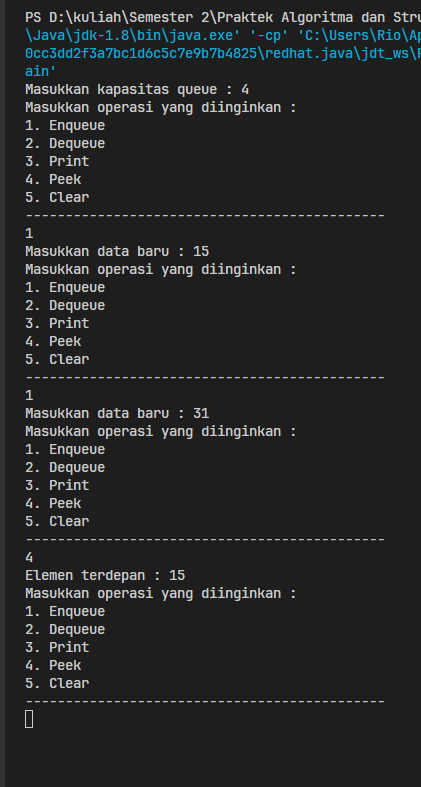

### 10.2.3Pertanyaan

1. Pada konstruktor, mengapa nilai awal atribut dan rear bernilai-1, sementara atribute size bernilai 0?<br>
   `JAWAB`<br><br>
   Pada nilai awal atribut `front` dan `rear` diatur -1 karena menunjukan bahwa antrian kosong, dan nilai -1 digunakan karena tidak ada indeks valid pada array yang memiliki nilai negatif. Kemudian untuk atribut `size` diatur ke 0 karena antrian masih kosong pada awalnya, sehingga tidak ada elemen di dalamnya.

2. Pada method `Enqueue`, jelaskan maksud dan kegunaan dari potongan kode berikut,
   <br>

   ```java
   if (rear == max -1){
       rear = 0;
   }
   ```

   `JAWAB`<br><br>
   Kode `if (rear == max-1)` berfungsi untuk memeriksa variabel `rear` jika sudah mencapai batas maksimum dari antrian, yang ditentukan oleh variabel `max`, namun jika variabel `rear` sudah mencapai batas maksikum, maka antrian sudah penuh. Kemudian untuk kondisi tersebut terpenuhi, potongan kode `rear = 0` akan dieksekusi.

3. Pada method `Dequeue`, jelaskan maksud dan kegunaan dari potongan kode berikut,
   <br>

   ```java
   if (front == max -1){
       front = 0;
   }
   ```

   `JAWAB`<br><br>

   Kode `if (front == max -1)` berfungsi untuk melakukan pemeriksaan pada variabel `front` jika sudah mencapai batas maksimum dari antrian yang ditentukan sebelumnya oleh variabel `max`, kemudian jika kondisi sudah terpenuhi, `front = 0` akan dieksekusi.

4. Pada method `print`, mengapa pada proses perulangan variabel i tidak dimuali dari 0 `(int i=0)`, melainkan `int i=front` ?<br>
   `JAWAB`<br><br>
   Karena kita ingin mulai mencetak elemen dari proses `front` hingga posisi sebelum `rear`, jadi alasan menggunakan `int i = front` untuk awal perulangan, untuk memastikan bahwa kita ingin mencetak elemen yang benar ada dalam antrian saat ini.
   <br><br>

5. Perhatikan kembali method `print`, jelaskan maksud dari potongan kode berikut,
   <br>

   ```java
   i = (i + 1 ) % max;
   ```

   `JAWAB`<br><br>
   Kode `i = (i + 1) % max;` digunakan untuk menggerakkan variabel `i` ke elemen berikutnya dalam antiran secara berulang, dan juga kode tersebut memastikan bahwa kita tidak dapat melewati antrian dari awal hingga akhir, dan akan kembalilagi ke awal jika telah mencapai akhir antrian.

6. Tunjukkan potongan kode program yang merupakan `queue overflow` ?<br>
   `JAWAB`<br><br>

   ```java
    public void Enqueue (int dt){
        if (isFull()) {
            System.out.println("Queue sudah penuh");
        } else {
            if (isEmpty()) {
                front = rear = 0;
            } else {
                if (rear == max -1){
                    rear = 0;
                } else {
                    rear++;
                }
            }
            data[rear] = dt;
            size++;
        }
    }
   ```

   dengan mencetak notifikasi `Queue sudah penuh` sebagai tanda `queue overflow`.

   ```java
    if (isFull()) {
            System.out.println("Queue sudah penuh");
        } else {
            //
        }
   ```

7. Pada saat terjadi `queue overflow` dan `queue underflow`, program tersebut tetap dapat berjalan
   dan hanya menampilkan teks informasi. Lakukan modifikasi program sehingga pada saat terjadi
   queue overflow dan queue underflow, program dihentikan!<br>
   `JAWAB`<br><br>

   - Modifikasi code `Queue.java`

   ```java
    public void Enqueue(int dt) {
        if (isFull()) {
            System.out.println("Queue sudah penuh");
            System.exit(1);
        } else {
            if (rear == max - 1 && front == 0 || rear == front - 1) {
                System.out.println("Queue sudah penuh");
                System.exit(1);
            } else {
                if (isEmpty()) {
                    front = rear = 0;
                } else {
                    if (rear == max - 1) {
                        rear = 0;
                    } else {
                        rear++;
                    }
                }
                data[rear] = dt;
                size++;
            }
        }
    }

    public int Dequeue() {
        int dt = 0;
        if (isEmpty()) {
            System.out.println("Queue masih kosong");
            System.exit(0);
        } else {
            dt = data[front];
            size--;
            if (isEmpty()) {
                front = rear = -1;
            } else {
                if (front == max -1 ){
                    front = 0;
                } else {
                    front++;
                }
            }
        }
        return dt;
    }
   ```

   - `Hasil Percobaan`
     - `Queue Overflow`<br>
       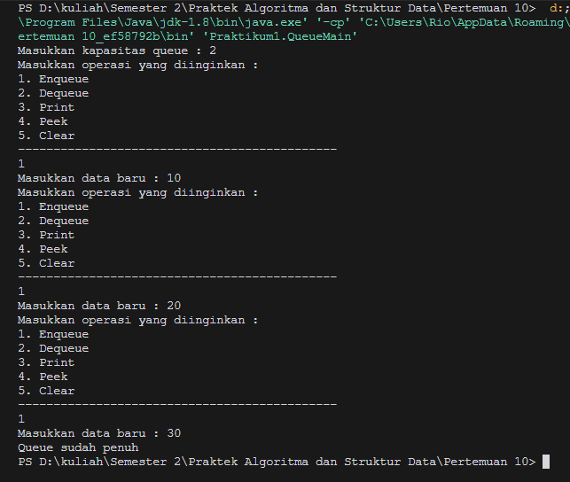
       <br>
     - `Queue Underflow`<br>
       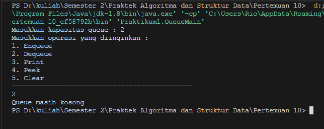

---

## 10.3 Praktikum 2

### 10.3.1 Verifikasi Hasil Percobaan

- Code tambahan `Nasabah.java`

  ```java
    package Praktikum2;
    public class Nasabah {
        String norek, nama, alamat;
        int umur;
        double saldo;
        Nasabah [] data;
        int front, rear, size, max;

        Nasabah(String norek, String nama, String alamat, int umur, double saldo) {
            this.norek = norek;
            this.nama = nama;
            this.alamat = alamat;
            this.umur = umur;
            this.saldo = saldo;
        }

        public Nasabah(int n){
            max = n;
            data = new Nasabah[max];
            size = 0;
            front = rear = -1;
        }

        public void Enqueue (Nasabah dt){
            if (isFull()) {
                System.out.println("Queue sudah penuh");
            } else {
                if (isEmpty()) {
                    front = rear = 0;
                } else {
                    if (rear == max -1){
                        rear = 0;
                    } else {
                        rear++;
                    }
                }
                data[rear] = dt;
                size++;
            }
        }

        public Nasabah Dequeue(){
            Nasabah dt = new Nasabah();
            if (isEmpty()){
                System.out.println("Queue masih kosong");
            } else {
                dt = data[front];
                size--;
                if (isEmpty()) {
                    front = rear = -1;
                } else {
                    if (front == max -1 ){
                        front = 0;
                    } else {
                        front++;
                    }
                }
            }
            return dt;
        }

        Nasabah(){

        }

        public void peek(){
            if (isEmpty()) {
                System.out.println("Elemen terdepan : " + data[front].norek + " " + data[front].nama + " " + data[front].alamat + " " + data[front].umur + " " + data[front].saldo);
            } else {
                System.out.println("Queue masih kosong");
            }
        }

        public void print () {
            if (isEmpty()){
                System.out.println("Queue masih kosong");
            } else {
                int i = front;
                while (i != rear){
                    System.out.println(data[i].norek + " " + data[i].nama + " " + data[i].alamat + " " + data[i].umur + " " + data[i].saldo);
                    i = (i + 1) % max;
                }
                System.out.println(data[i].norek + " " + data[i].nama + " " + data[i].alamat + " " + data[i].umur + " " + data[i].saldo);
                System.out.println("Jumlah elemen = " + size);
            }
        }

        public boolean isEmpty() {
            if (size == 0){
                return true;
            } else {
                return false;
            }
        }

        public boolean isFull() {
            if (size == max){
                return true;
            } else {
                return false;
            }
        }
    }
  ```

- Code `QueueMain.java`

  ```java
    package Praktikum2;
    import java.util.Scanner;
    public class QueueMain {
        public static void menu() {
            System.out.println("Masukkan operasi yang diinginkan : ");
            System.out.println("1. Antrian baru");
            System.out.println("2. Antrian keluar");
            System.out.println("3. Cek Antrian terdepan");
            System.out.println("4. Cek Semua Antrian");
            System.out.println("---------------------------------------------");
        }

        public static void main(String[] args) {
            Scanner sc = new Scanner(System.in);
            System.out.print("Masukkan kapasitas queue : ");
            int jumlah = sc.nextInt();
            Nasabah antri = new Nasabah(jumlah);

            int pilih;
            do {
                menu();
                pilih = sc.nextInt();
                sc.nextLine();
                switch(pilih){
                    case 1:
                        System.out.print("No rekening : ");
                        String norek = sc.nextLine();
                        System.out.print("Nama : ");
                        String nama = sc.nextLine();
                        System.out.print("Alamat : ");
                        String alamat = sc.nextLine();
                        System.out.print("Umur :");
                        int umur = sc.nextInt();
                        System.out.print("Saldo : ");
                        double saldo = sc.nextDouble();
                        Nasabah nb = new Nasabah(norek, nama, alamat, umur, saldo);
                        sc.nextLine();
                        antri.Enqueue(nb);
                        break;
                    case 2:
                        Nasabah data = antri.Dequeue();
                        if (!"".equals(data.norek) && !"".equals(data.nama) && !"".equals(data.alamat)
                                && data.umur != 0 &&  data.saldo != 0) {
                            System.out.println("Antrian yang keluar : " + data.norek + " " + data.nama + " " + data.alamat + " " + data.umur + " " + data.saldo);
                            break;
                        }
                    case 3:
                        antri.peek();
                        break;
                    case 4:
                        antri.print();
                        break;
                }
            } while (pilih == 1 || pilih == 2 || pilih == 3 || pilih ==4);
        }
    }
  ```

- `Hasil Percobaan`<br>
  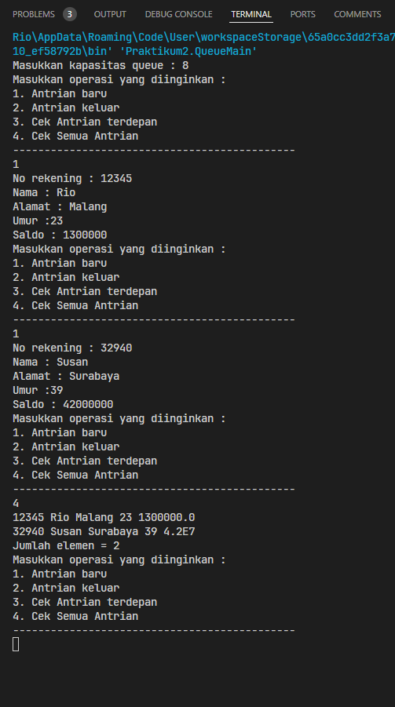
  <br>

### 10.3.2 Pertanyaan

1. Pada class `QueueMain`, jelaskan fungsi IF pada potongan kode program berikut
   <br>

   ```java
     if (!"".equals(data.norek) && !"".equals(data.nama) && !"".equals(data.alamat) && data.umur != 0 &&  data.saldo != 0) {
        System.out.println("Antrian yang keluar : " + data.norek + " " + data.nama + " " + data.alamat + " " + data.umur + " " + data.saldo);
        break;
    }
   ```

   <br>

   `JAWAB`<br><br>
   Jadi potongan kode berikut itu melakukan sebuah kondisi `if` untuk melakukan pengecekkan terhadap objek `data`, jadi pada keseluruhan `if` tersebut akan bernilai `true` jika semua kondisi diatas terpenuhi.

2. Lakukan modifikasi program dengan menambahkan method baru bernama `peekRear` pada class
   Queue yang digunakan untuk mengecek antrian yang berada di posisi belakang! Tambahkan pula
   daftar menu `5. Cek Antrian paling belakang` pada class `QueueMain` sehingga method `peekRear`
   dapat dipanggil!!<br>
   `JAWAB`<br><br>

   - Modifikasi code `Nasabah.java`

   ```java
    public void peekRear() {
        if (isEmpty()) {
            System.out.println("Queue masih kosong");
        } else {
            System.out.println("Elemen terbelakang : " + data[rear].norek + " " + data[rear].nama + " " + data[rear].alamat + " " + data[rear].umur + " " + data[rear].saldo);
        }
    }
   ```

   - `Hasil Percobaan`<br>
     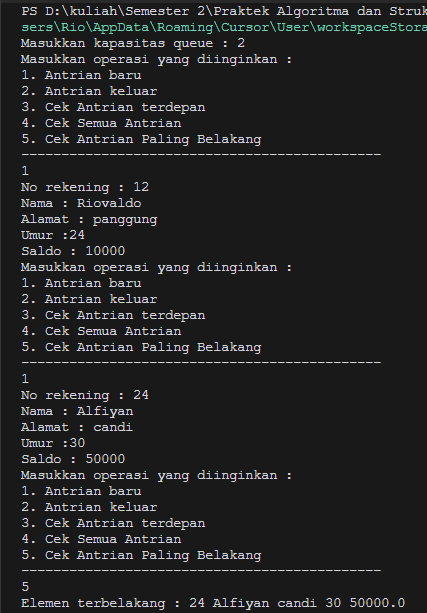

---

## 10.4 Tugas

### 10.3.1 Verifikasi Hasil Percobaan

- Code `Pembeli.java`

```java
package Tugas;

public class Pembeli {
    private String nama;
    private int noHP;
    public Pembeli(String nama, int noHP) {
        this.nama = nama;
        this.noHP = noHP;
    }
    public String getNama() {
        return nama;
    }
    public int getNoHP() {
        return noHP;
    }
    @Override
    public String toString() {
        return "Pembeli [nama=" + nama + ", noHP=" + noHP + "]";
    }
}
```

- Code `Queue.java`

```java
package Tugas;

public class Queue {
    private Pembeli[] antrian;
    private int front;
    private int rear;
    private int size;
    private int max;

    public Queue(int max) {
        this.antrian = new Pembeli[max];
        this.front = 0;
        this.rear = -1;
        this.size = 0;
        this.max = max;
    }

    public boolean isEmpty() {
        return size == 0;
    }

    public boolean isFull() {
        return size == max;
    }

    public void enqueue(Pembeli pembeli) {
        if (!isFull()) {
            rear++;
            if (rear == max) {
                rear = 0;
            }
            antrian[rear] = pembeli;
            size++;
        } else {
            System.out.println("Antrian penuh!");
        }
    }

    public Pembeli dequeue() {
        if (!isEmpty()) {
            Pembeli pembeli = antrian[front];
            front++;
            if (front == max) {
                front = 0;
            }
            size--;
            return pembeli;
        } else {
            System.out.println("Antrian kosong!");
            return null;
        }
    }

    public void print() {
        if (isEmpty()) {
            System.out.println("Antrian kosong!");
        } else {
            System.out.println("Antrian pembeli:");
            int i = front;
            for (int j = 0; j < size; j++) {
                System.out.println((j + 1) + ". " + antrian[i]);
                i++;
                if (i == max) {
                    i = 0;
                }
            }
        }
    }

    public void peek() {
        if (isEmpty()) {
            System.out.println("Antrian kosong!");
        } else {
            System.out.println("---------------------------------------------");
            System.out.println("Pembeli paling depan, ");
            System.out.println("Nama : " + antrian[front].getNama());
            System.out.println("Nomor Hp : " + antrian[front].getNoHP());
            System.out.println("---------------------------------------------");
            System.out.println("");
        }
    }

    public void peekRear() {
        if (isEmpty()) {
            System.out.println("Antrian kosong!");
        } else {
            int i = rear;
            if (i < 0) {
                i = max - 1;
            }
            System.out.println("---------------------------------------------");
            System.out.println("Pembeli paling belakang, ");
            System.out.println("Nama : " + antrian[i].getNama());
            System.out.println("Nomor Hp : " + antrian[i].getNoHP());
            System.out.println("---------------------------------------------");
            System.out.println("");
        }
    }

    public void peekPosition(String nama) {
        if (isEmpty()) {
            System.out.println("Antrian kosong!");
        } else {
            int i = front;
            for (int j = 0; j < size; j++) {
                if (antrian[i].getNama().equals(nama)) {
                    System.out.println("Pembeli " + nama + " berada di posisi ke-" + (j + 1));
                    System.out.println("---------------------------------------------");
                    return;
                }
                i++;
                if (i == max) {
                    i = 0;
                }
            }
            System.out.println("Pembeli " + nama + " tidak ditemukan di antrian.");
        }
    }

    public void daftarPembeli() {
        if (isEmpty()) {
            System.out.println("Antrian kosong!");
        } else {
            System.out.println("---------------------------------------------");
            System.out.println("Daftar pembeli:");
            int i = front;
            for (int j = 0; j < size; j++) {
                System.out.println((j + 1) + ". Nama: " + antrian[i].getNama() + ", No HP: " + antrian[i].getNoHP());
                i++;
                if (i == max) {
                    i = 0;
                }
            }
            System.out.println("---------------------------------------------");
            System.out.println("");
        }
    }
}
```

- Code `Warung.java`

```java
package Tugas;
import java.util.Scanner;
public class Warung {

    public static void menu(){
        System.out.println("1. Daftar ke antrian");
        System.out.println("2. Lihat daftar pembeli");
        System.out.println("3. Lihat pembeli di paling depan");
        System.out.println("4. Lihat pembeli di paling belakang");
        System.out.println("5. Cari pembeli di antrian");
        System.out.println("6. Keluar");
        System.out.println("---------------------------------------------");
        System.out.print("Pilih menu: ");
    }
    public static void main(String[] args) {
        Queue antrian = new Queue(8);
        Scanner sc = new Scanner(System.in);
        int pilih;
        do{
            menu();
            pilih = sc.nextInt();
            switch (pilih) {
                case 1:
                    System.out.print("Masukkan nama anda : ");
                    sc.nextLine();
                    String nama = sc.nextLine();
                    System.out.print("Masukkan No.Hp anda :  ");
                    int noHP = sc.nextInt();
                    Pembeli pembeli = new Pembeli(nama, noHP);
                    antrian.enqueue(pembeli);
                    System.out.println("---------------------------------------------");
                    System.out.println("Silahkan menunggu di antrian anda ! ");
                    System.out.println("---------------------------------------------");
                    break;
                case 2:
                    antrian.daftarPembeli();
                    break;
                case 3:
                    antrian.peek();
                    break;
                case 4:
                    antrian.peekRear();
                    break;
                case 5:
                    System.out.print("Masukkan nama pembeli yang ingin dicari: ");
                    sc.nextLine();
                    String cariNama = sc.nextLine();
                    antrian.peekPosition(cariNama);
                    break;
                case 6:
                    System.out.println("Terima kasih telah mengunjungi warung pecel kami ! ");
                    sc.close();
                    System.exit(0);
                    break;
                default:
                    System.out.println("Pilihan tidak valid");
            }
        } while (pilih == 1 || pilih == 2 || pilih == 3 || pilih == 4 || pilih == 5 || pilih == 6);
    }
}

```

- `Hasil Percobaan`<br><br>
  - `Daftar antrian` <br>
    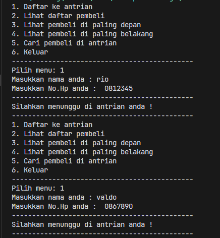
    <br><br><br>
  - `Melihat daftar pembeli` <br>
    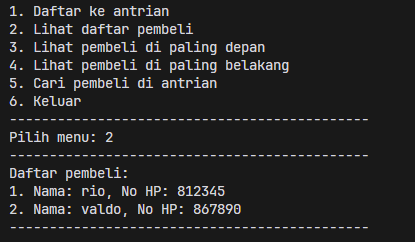
    <br><br><br>
  - `Antrian paling depan` <br>
    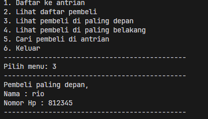
    <br><br><br>
  - `Antrian paling belakang` <br>
    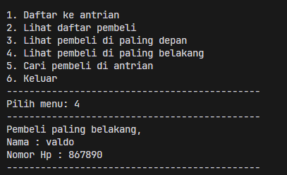
    <br><br><br>
  - `Mencari Pembeli` <br>
    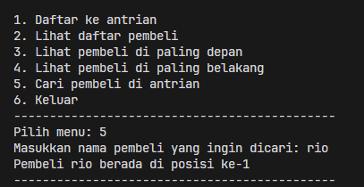
    <br><br><br>
  - `Mencari Pembeli` <br>
    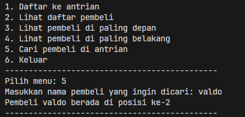
    <br><br><br>
  - `Mencari Pembeli` <br>
    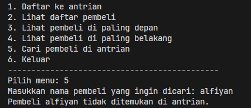
    <br><br><br>
