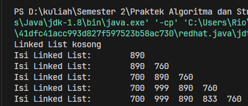
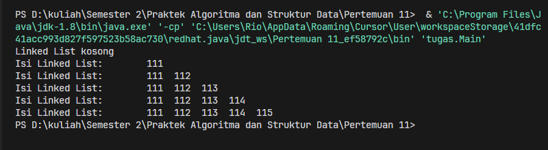

# <p align="center">Pertemuan 12 - Jobsheet 9 Linked List </p>

<br><br>

<p align="center">
    
</p>

<br><br>

<p align="center">
    Nama : Riovaldo Alfiyan Fahmi Rahman <br>
    NIM : 2341720209 <br>
    Prodi : D4 Teknik Informatika <br>
    Kelas : TI 1B
</p>

<br><br>

---

## 2.1 Pembuatan single linked list

### 2.1.1 Verifikasi Hasil Percobaan

- Code `Node.java`

  ```java
    public class Node {
    int data;
    Node next;

    public Node(int data, Node berikutnya){
        this.data = data;
        this.next = berikutnya;
    }

    public Node(){
        this.data = 0;
        this.next = null;
    }
  }

  ```

- Code `SingleLinkedList.java`

  ```java
    public class SingleLinkedList {
    Node head, tail;

        boolean isEmpty(){
            return head == null;
        }

        void print(){
            if(isEmpty()){
                System.out.println("Linked List kosong");
            } else {
                Node tmp = head;
                System.out.print("Isi Linked List: \t");
                while(tmp != null){
                    System.out.print(tmp.data + "  ");
                    tmp = tmp.next;
                }
                System.out.println("");
            }
        }

        void addFirst(int input){
            Node ndInput = new Node(input, null);
            if(isEmpty()){
                head = ndInput;
                tail = ndInput;
            } else {
                ndInput.next = head;
                head = ndInput;
            }
        }

        void addLast(int input){
            Node ndInput = new Node(input, null);
            if(isEmpty()){
                head = ndInput;
                tail = ndInput;
            } else {
                tail.next = ndInput;
                tail = ndInput;
            }
        }

        void insertAt(int index, int input){
            if (index < 0) {
                System.out.println("Index cannot be negative!");
                return;
            }
            if (index == 0){
                addFirst(input);
            } else {
                Node newNode = new Node(input, null);
                Node tmp = head;
                for(int i = 0; i < index - 1 && tmp != null; i++){
                    tmp = tmp.next;
                }
                if (tmp == null) {
                    System.out.println("Index out of bounds!");
                    return;
                }
                newNode.next = tmp.next;
                tmp.next = newNode;
                if (newNode.next == null) {
                    tail = newNode;
                }
            }
        }
    }
  ```

- Code `SLLMain.java`

  ```java
    public static void main(String[] args) {
        SingleLinkedList singLL = new SingleLinkedList();
        singLL.print();
        singLL.addFirst(890);
        singLL.print();
        singLL.addLast(760);
        singLL.print();
        singLL.addFirst(700);
        singLL.print();
        singLL.insertAt(1, 999);
        singLL.print();
        singLL.insertAt(3, 833);
        singLL.print();
    }
  ```

- `Hasil Percobaan`<br>
  

---

## 2.2 Modifikasi elemen pada single linked list

### 2.2.1 Verifikasi Hasil Percobaan

- Tambahan code `SingleLinkedList.java`

  ```java
    int getData(int index){
        Node tmp = head;
        for (int i = 0; i < index && tmp != null; i++){
            tmp = tmp.next;
        }
        if (tmp != null) {
            return tmp.data;
        } else {
            return -1;
        }
    }

    int indexOf(int key){
        Node tmp = head;
        int index = 0;
        while(tmp != null && tmp.data != key){
            tmp = tmp.next;
            index++;
        }
        if(tmp != null){
            return index;
        } else {
            return -1;
        }
    }

    void remove(int key) {
        if (isEmpty()) {
            System.out.println("Linked list masih kosong, tidak dapat dihapus");
            return;
        }

        if (head.data == key) {
            removeFirst();
            return;
        }

        Node temp = head;
        while (temp.next != null) {
            if (temp.next.data == key) {
                if (temp.next == tail) {
                    tail = temp;
                }
                temp.next = temp.next.next;
                return;
            }
            temp = temp.next;
        }
        System.out.println("Elemen tidak ditemukan dalam linked list.");
    }

    void removeFirst() {
        if (isEmpty()) {
            System.out.println("Linked list masih kosong, tidak dapat dihapus");
            return;
        }

        if (head == tail) {
            head = tail = null;
        } else {
            head = head.next;
        }
    }

    void removeLast() {
        if (isEmpty()) {
            System.out.println("Linked list masih kosong, tidak dapat dihapus");
            return;
        }

        if (head == tail) {
            head = tail = null;
            return;
        }

        Node temp = head;
        while (temp.next != tail) {
            temp = temp.next;
        }
        temp.next = null;
        tail = temp;
    }

    void removeAt(int index) {
        if (isEmpty()) {
            System.out.println("Linked list masih kosong, tidak dapat dihapus");
            return;
        }

        if (index == 0) {
            removeFirst();
            return;
        }

        if (index < 0) {
            System.out.println("Index tidak bisa negatif!");
            return;
        }

        Node temp = head;
        for (int i = 0; temp != null && i < index - 1; i++) {
            temp = temp.next;
        }

        if (temp == null || temp.next == null) {
            System.out.println("Indeks di luar batas!");
            return;
        }

        if (temp.next == tail) {
            tail = temp;
        }
        temp.next = temp.next.next;
    }
  ```

- Tambahan code `SLLMain.java`

  ```java
    System.out.println("Data pada indeks ke-1 : " + singLL.getData(1));
        System.out.println("Data 3 berada pada indeks ke-" + singLL.indexOf(760));

        singLL.remove(999);
        singLL.print();
        singLL.removeAt(0);
        singLL.print();
        singLL.removeFirst();
        singLL.print();
        singLL.removeLast();
        singLL.print();
  ```

- `Hasil Percobaan`<br>
  

---

## 3. Tugas

### 3.1.1 Verifikasi Hasil Percobaan

- Code `Node.java`

  ```java
    package tugas;
    public class Node {
        int data;
        Node next;

        public Node(int data, Node berikutnya){
            this.data = data;
            this.next = berikutnya;
        }

        public Node(int data){
            this.data = data;
            this.next = null;
        }
    }
  ```

- Code `SingleLinkedList.java`

  ```java
    package tugas;
    public class SingleLinkedList {
        Node head, tail;

        boolean isEmpty(){
            return head == null;
        }

        void print(){
            if(isEmpty()){
                System.out.println("Linked List kosong");
            } else {
                Node tmp = head;
                System.out.print("Isi Linked List: \t");
                while(tmp != null){
                    System.out.print(tmp.data + "  ");
                    tmp = tmp.next;
                }
                System.out.println("");
            }
        }

        void addFirst(int input){
            Node ndInput = new Node(input, null);
            if(isEmpty()){
                head = ndInput;
                tail = ndInput;
            } else {
                ndInput.next = head;
                head = ndInput;
            }
        }

        void addLast(int input){
            Node ndInput = new Node(input, null);
            if(isEmpty()){
                head = ndInput;
                tail = ndInput;
            } else {
                tail.next = ndInput;
                tail = ndInput;
            }
        }

        void insertAt(int index, int input){
            if (index < 0) {
                System.out.println("Index cannot be negative!");
                return;
            }
            if (index == 0){
                addFirst(input);
            } else {
                Node newNode = new Node(input, null);
                Node tmp = head;
                for(int i = 0; i < index - 1 && tmp != null; i++){
                    tmp = tmp.next;
                }
                if (tmp == null) {
                    System.out.println("Index out of bounds!");
                    return;
                }
                newNode.next = tmp.next;
                tmp.next = newNode;
                if (newNode.next == null) {
                    tail = newNode;
                }
            }
        }
    }
  ```

- Code `Main.java`

```java
    package tugas;
    public class Main {
        public static void main(String[] args) {
            SingleLinkedList linkedList = new SingleLinkedList();

            linkedList.print();
            linkedList.addFirst(111);
            linkedList.print();
            linkedList.addLast(112);
            linkedList.print();
            linkedList.addLast(113);
            linkedList.print();
            linkedList.insertAt(3, 114);
            linkedList.print();
            linkedList.insertAt(4, 115);
            linkedList.print();
        }
    }

```

- `Hasil Percobaan`<br>
  

---

## 4. Tugas

### 4.1.1 Verifikasi Hasil Percobaan
