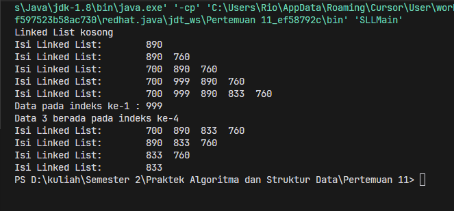

# <p align="center">Pertemuan 12 - Jobsheet 10 Double Linked List </p>

<br><br>

<p align="center">
    
</p>

<br><br>

<p align="center">
    Nama : Riovaldo Alfiyan Fahmi Rahman <br>
    NIM : 2341720209 <br>
    Prodi : D4 Teknik Informatika <br>
    Kelas : TI 1B
</p>

<br><br>

---

## 1.1 Verifikasi Hasil Percobaan

### 12.2.2 Verifikasi Hasil Percobaan

- Code `Node.java`

  ```java
    package doublelinkedlists;

    public class Node {

        int data;
        Node prev, next;

        Node (Node prev, int data, Node next) {
            this.prev=prev;
            this.data=data;
            this.next=next;
        }
    }
  ```

- Code `DoubleLinkedList.java`

  ```java
    package doublelinkedlists;

    public class DoubleLinkedLists {
        Node head;
        int size;

        public DoubleLinkedLists(){
            head = null;
            size = 0;
        }

        public boolean isEmpty(){
            return head == null;
        }

        public void addFirst(int item){
            if (isEmpty()) {
                head = new Node(null, item, null);
            } else {
                Node newNode = new Node(null, item, head);
                head.prev = newNode;
                head = newNode;
            }
            size++;
        }

        public void addLast(int item){
            if (isEmpty()){
                addFirst(item);
            } else {
                Node current = head;
                while (current.next != null){
                    current = current.next;
                }
                Node newNode = new Node(current, item, null);
                current.next = newNode;
                size++;
            }
        }

        public void add(int item, int index) throws Exception {
            if (isEmpty()) {
                addFirst(item);
            } else if (index < 0 || index > size) {
                throw new Exception("Nilai indeks di luar batas");
            } else {
                Node current = head;
                int i = 0;
                while (i < index) {
                    current = current.next;
                    i++;
                }
                if (current.prev == null) {
                    Node newNode = new Node(null, item, current);
                    current.prev = newNode;
                    head = newNode;
                } else {
                    Node newNode = new Node (current.prev, item, current );
                    newNode.prev = current.prev;
                    newNode.next = current;
                    current.prev.next = newNode;
                    current.prev = newNode;
                }
            }
            size++;
        }

        public int size(){
            return size;
        }

        public void clear(){
            head = null;
            size = 0;
        }

        public void print(){
            if (!isEmpty()){
                Node tmp = head;
                while (tmp != null) {
                    System.out.println(tmp.data + "\t");
                    tmp = tmp.next;
                }
                System.out.println("\nBerhasil Diisi");
            } else {
                System.out.println("Linked List Kosong");
            }
        }
    }
  ```

- Code `DoubleLinkedListMain.java`

  ```java
    public class DoubleLinkedListMain {
        public static void main(String[] args) {
            DoubleLinkedLists dll = new DoubleLinkedLists();
            dll.print();
            System.out.println("Size : " + dll.size());
            System.out.println("=======================================");
            dll.addFirst(3);
            dll.addLast(4);
            dll.addFirst(7);
            dll.print();
            System.out.println("Size : " + dll.size());
            System.out.println("=======================================");
            try {
                dll.add(40, 1);
            } catch (Exception e) {
                System.err.println("Pesan Error : " + e.getMessage());
            }
            dll.print();
            System.out.println("Size : " + dll.size());
            System.out.println("=======================================");
            dll.clear();
            dll.print();
            System.out.println("Size : " + dll.size());
        }
    }
  ```

- `Hasil Percobaan`<br>
  

### 12.2.3 Pertanyaan

1. Jelaskan perbedaan antara single linked list dengan double linked lists ! <br><br>
   `JAWAB` <br>
   Ada beberapa perbedaan pada `single linked list` dan `double linked list`, salah satu nya pada pointernya untuk `single` memiliki satu pointer yang menunjuk pada node berikutnya, namun untuk `double` memiliki 2 pointer yang dapat digunakan untuk menyimpan data node prev dan nextnya
   <br><br>

2. Perhatikan class Node, di dalamnya terdapat atribut next dan prev. Untuk apakah atribut tersebut ?<br><br>
   `JAWAB` <br>
   Sebagai referensi bagian yang merupakan bagian dari node prev dan next<br><br>

3. Perhatikan konstruktor pada class DoubleLinkedLists. Apa kegunaan inisialisasi atribut head dan size seperti pada gambar berikut ini ?<br><br>

   ```java
    public DoubleLinkedList(){
        head = null
        size = 0;
    }
   ```

   `JAWAB` <br>

   Kode diatas berguna untuk menginisialisasi linked list yang kosong dan berguna untuk menambahkan pada node pertama<br><br>

4. Pada method addFirst(), kenapa dalam pembuatan object dari konstruktor class Node prev dianggap sama dengan null?<br><br>
   `JAWAB` <br>
   Karena pada objek baru dari konstruktor di class node, parameter prev itu dianggap sama dengan null dalam pemanggilan `new Node(null, item, head)`<br><br>
5. Perhatikan pada method addFirst(). Apakah arti statement head.prev = newNode ?<br><br>
   `JAWAB` <br>
   Pada potongan kode `head.prev = newNode`, itu berguna membuat atribut prev dari node head dengan mengambil referensi pada node baru yang baru saja dibuat
   `<br><br>
6. Perhatikan isi method addLast(), apa arti dari pembuatan object Node dengan mengisikan parameter prev dengan current, dan next dengan null? Node newNode = new Node(current, item, null);<br><br>
   `JAWAB` <br>
   Jadi pada method `addLast() ` baris kode itu berguna untuk menampilkan bahwa Node baru akan menjadi Node terakhit dengan mengatur atribut next berupa null
   `<br><br>
7. Pada method add(), terdapat potongan kode program sebagai berikut<br><br>

   ```java
    if (current.prev == null){
        Node newNode = new Node (null,item, current);
        current.prev = newNode;
        head = newNode;
    }
   ```

   `JAWAB` <br>

   Kode diatas berguna untuk menambahkan Node baru diawal linked list ketika Node `current` yang sedang diakses merupakan node pertama, kemudian node baru tersebut akan menjadi node pertamaa / head, dan node sebelumnya itu sekarang menjadi node kedua dalam list<br><br>

---

## 12.3.1 Percobaan 2

### 12.3.2 Verifikasi Hasil Percobaan

- Tambahan code `DoubelLinkedList.java`

```java
  public void removeFirst() throws Exception{
        if (isEmpty()) {
            throw new Exception("Linked List masih kosong, tidak dapat dihapus");
        } else if (size == 1) {
            removeLast();
        } else {
            head = head.next;
            head.prev = null;
            size--;
        }
    }
    public void removeLast() throws Exception {
        if (isEmpty()) {
            throw new Exception("Linked List masih kosong, tidak dapat dihapus!");
        } else if (head.next == null) {
            head = null;
            size--;
            return;
        }
        Node current = head;
        while (current.next.next != null) {
            current = current.next;
        }
        current.next = null;
        size--;
    }

    public void remove(int index) throws Exception{
        if(isEmpty() || index >= size){
            throw new Exception("Nilai indeks diluar batas");
        } else if (index == 0){
            removeFirst();
        } else {
            Node current = head;
            int i = 0;
            while (i < index) {
                current = current.next;
                i++;
            }
            if (current.next == null) {
                current.prev.next = null;
            } else if (current.prev == null) {
                current = current.next;
                current.prev = null;
                head = current;
            } else {
                current.prev.next = current.next;
                current.next.prev = current.prev;
            }
            size--;
        }
    }
```

- Tambahan code `DoubleLinkedListMain.java`

  ```java
        dll.addLast(50);
        dll.addLast(40);
        dll.addLast(10);
        dll.addLast(20);
        dll.print();
        System.out.println("Size : " + dll.size());
        System.out.println("=======================================");
        try {
            dll.removeFirst();
        } catch (Exception e) {
            System.err.println("Pesan Error : " + e.getMessage());
        }
        dll.print();
        System.out.println("Size : " + dll.size());
        System.out.println("=======================================");
        try {
            dll.removeLast();
        } catch (Exception e) {
            System.err.println("Pesan Error : " + e.getMessage());
        }
        dll.print();
        System.out.println("Size : " + dll.size());
        System.out.println("=======================================");
        try {
            dll.remove(1);
        } catch (Exception e) {
            System.err.println("Pesan Error : " + e.getMessage());
        }
        dll.print();
        System.out.println("Size : " + dll.size());
  ```

- `Hasil Percobaan`<br>
  

### 12.3.3 Pertanyaan

1. Apakah maksud statement berikut pada method removeFirst()? head = head.next; head.prev = null;<br><br>
   `JAWAB` <br>
   Kegunaan pada potongan kode diatas berguna untuk memindahkan posisi head ke node yang ke 2 kemudian akan mengubahnya ke pointer prev dan currentnya head menjadi null
   <br><br>

2. Bagaimana cara mendeteksi posisi data ada pada bagian akhir pada method removeLast()?<br><br>
   `JAWAB` <br>
   Jadi dengan melakukan looping yang digunakan pada node linked list untuk mencari node kedua yang terakhir<br><br>

3. Jelaskan alasan potongan kode program di bawah ini tidak cocok untuk perintah remove

   ```java
    node tmp = head.next;

    head.next=tmp.next;
    tmp.next.prev=head;
   ```

   `JAWAB` <br>
   Karena tmp itu seharusnya pada node pertama dan merupakan head bukan `head.next` dan juga mengatur `head.next` ke `tmp.next`, maka itu akan melewati posisi node kedua dan langusung menghubungkan ke node pertama ke node setelahnya <br><br>

4. Jelaskan fungsi kode program berikut ini pada fungsi remove!

   ```java
    current.prev.next = current.next;
    current.next.prev = current prev;
   ```

   `JAWAB` <br>
   Pada potongan kode diatas itu berguna untuk menghubungkan node prev dan node next yang akan dihapus dan sehingga akan memutuskan hubungan antara node current dan node yang akan dihapus<br><br>

---

## 12.4.1 Percobaan 3

### 12.4.1 Verifikasi Hasil Percobaan

- Tambahan code `DoubelLinkedList.java`

```java
    public int getFirst() throws Exception {
        if(isEmpty()) {
            throw new Exception("Linked List Kosong");
        }
        return head.data;
    }

    public int getLast() throws Exception {
        if (isEmpty()) {
            throw new Exception("Linked List Kosong");
        }
        Node tmp = head;
        while (tmp.next != null) {
            tmp = tmp.next;
        }
        return tmp.data;
    }

    public int get (int index) throws Exception {
        if (isEmpty() || index >= size){
            throw new Exception("Nilai indeks di luar batas");
        }
        Node tmp = head;
        for (int i = 0; i < index; i++) {
            tmp = tmp.next;
        }
        return tmp.data;
    }
```

- Tambahan code `DoubleLinkedListMain.java`

  ```java
        dll.print();
        System.out.println("Size : " + dll.size());
        System.out.println("=======================================");
        dll.addFirst(3);
        dll.addLast(4);
        dll.addFirst(7);
        dll.print();
        System.out.println("Size : " + dll.size());
        System.out.println("=======================================");
        try {
            dll.add(40, 1);
        } catch (Exception e) {
            System.err.println("Pesan Error : " + e.getMessage());
        }
        dll.print();
        System.out.println("Size : " + dll.size());
        try {
            System.out.println("=======================================");
            try {
                System.out.println("Data awal pada Linked List adalah : " + dll.getFirst());
            } catch (Exception e) {
                System.out.println("Data awal pada Linked List adalah : List is empty");
            }

            try {
                System.out.println("Data akhir pada Linked List adalah : " + dll.getLast());
            } catch (Exception e) {
                System.out.println("Data akhir pada Linked List adalah : List is empty");
            }

            try {
                System.out.println("Data indeks ke-1 pada Linked List adalah : " + dll.get(1));
            } catch (IndexOutOfBoundsException e) {
                System.out.println("Data indeks ke-1 pada Linked List adalah : Index out of range");
            }
        } catch (Exception e) {
            e.printStackTrace();
        }
  ```

- `Hasil Percobaan`<br>
  

### 12.4.3 Pertanyaan

1. Jelaskan method size() pada class DoubleLinkedLists !<br><br>
   `JAWAB` <br>
   Kegunaan pada potongan kode diatas berguna untuk mengembalikan jumlah elemeen dan beberapa node pada double linked list
   <br><br>

2. Jelaskan cara mengatur indeks pada double linked lists supaya dapat dimulai dari indeks ke- 1! <br><br>
   `JAWAB` <br>
   Bisa menggunakan cara mengubah beberapa metode `add(int item, int index);` dan bisa mengubah logika pada metode add ketika akan menambahkan elemen pada indeks ke-1, dan itu akan menambahkan sebagaian elemen pertama dalam linked list<br><br>

3. Jelaskan perbedaan karakteristik fungsi Add pada Double Linked Lists dan Single Linked Lists!

   `JAWAB` <br>
   Pada setiap node pada `Double` memiliki 2 poinyer yang dapat menyimpan referensi prev dan next dan juga perlu untuk memperbarui dan menghubungkan apabila ada perubahan jika ada node baru, sedangkan `Single` menggunakan 1 pointer yang hanya memberikan referensi kepada node berikutnya<br><br>

4. Jelaskan perbedaan logika dari kedua kode program di bawah ini!<br>
   Kode a

   ```java
    public boolean isEmpty(){
        if(size == 0){
            return true;
        } else {
            return false;
        }
    }
   ```

   <br>

   Kode b

   ```java
    public boolean isEmpty(){
        return head == nulll;
    }
   ```

   `JAWAB` <br>
   Untuk `kode a` itu menggunakan variabel size yang berguna untuk menetukan linked list itu kosong atau ada, karena linked list itu dianggap kosong jika tidak ada elemen yang disimpan di dalamnya `size = 0`, kemudian untuk `kode b` menggunakan variabel head untuk menentukan linked list kosong atau ada, dan akan menampilkan linked list ini tidak memiliki head<br><br>

---

## 12.4.1 Tugas 1

Buat program antrian vaksinasi menggunakan queue berbasis double linked list sesuai ilustrasi
dan menu di bawah ini! (counter jumlah antrian tersisa di menu cetak(3) dan data orang yang
telah divaksinasi di menu Hapus Data(2) harus ada)

### 12.4.2 Verifikasi Percobaan
