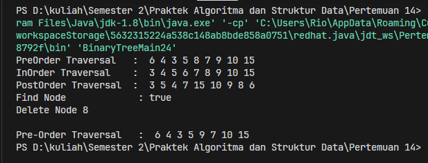

# <p align="center">Pertemuan 14 - Jobsheet 11 Tree </p>

<br><br>

<p align="center">
    
</p>

<br><br>

<p align="center">
    Nama : Riovaldo Alfiyan Fahmi Rahman <br>
    NIM : 2341720209 <br>
    Prodi : D4 Teknik Informatika <br>
    Kelas : TI 1B
</p>

<br><br>

---

### 13.2.1 Verifikasi Hasil Percobaan

- Code `Node24.java`

```java
public class Node24 {
    int data;
    Node24 left;
    Node24 right;

    public Node24(){

    }

    public Node24(int data){
        this.left = null;
        this.data = data;
        this.right = null;
    }
}

```

- Code `BinaryTree24.java`

```java
public class BinaryTree24 {
    Node24 root;

    public BinaryTree24() {
        root = null;
    }

    boolean isEmpty() {
        return root == null;
    }

    void add(int data) {
        if (isEmpty()) {
            root = new Node24(data);
        } else {
            Node24 current = root;
            while (true) {
                if (data < current.data) {
                    if (current.left != null) {
                        current = current.left;
                    } else {
                        current.left = new Node24(data);
                        break;
                    }
                } else if (data > current.data) {
                    if (current.right != null) {
                        current = current.right;
                    } else {
                        current.right = new Node24(data);
                        break;
                    }
                } else {
                    break;
                }
            }
        }
    }

    boolean find(int data) {
        boolean result = false;
        Node24 current = root;
        while (current != null) {
            if (current.data == data) {
                result = true;
                break;
            } else if (data > current.data) {
                current = current.right;
            } else {
                current = current.left;
            }
        }
        return result;
    }

    void traversePreOrder(Node24 node) {
        if (node != null) {
            System.out.print(" " + node.data);
            traversePreOrder(node.left);
            traversePreOrder(node.right);
        }
    }

    void traversePostOrder(Node24 node) {
        if (node != null) {
            traversePostOrder(node.left);
            traversePostOrder(node.right);
            System.out.print(" " + node.data);
        }
    }

    void traverseInOrder(Node24 node) {
        if (node != null) {
            traverseInOrder(node.left);
            System.out.print(" " + node.data);
            traverseInOrder(node.right);
        }
    }

    Node24 getSuccessor(Node24 del) {
        Node24 successor = del.right;
        Node24 successorParent = del;
        while (successor.left != null) {
            successorParent = successor;
            successor = successor.left;
        }

        if (successor != del.right) {
            successorParent.left = successor.right;
            successor.right = del.right;
        }
        return successor;
    }

    void delete(int data) {
        if (isEmpty()) {
            System.out.println("Tree is empty!");
            return;
        }

        Node24 parent = root;
        Node24 current = root;
        boolean isLeftChild = false;
        while (current != null) {
            if (current.data == data) {
                break;
            } else if (data < current.data) {
                parent = current;
                current = current.left;
                isLeftChild = true;
            } else if (data > current.data) {
                parent = current;
                current = current.right;
                isLeftChild = false;
            }
        }

        if (current == null) {
            System.out.println("Couldn't find data!");
            return;
        } else {
            if (current.left == null && current.right == null) {
                if (current == root) {
                    root = null;
                } else {
                    if (isLeftChild) {
                        parent.left = null;
                    } else {
                        parent.right = null;
                    }
                }
            } else if (current.left == null) {
                if (current == root) {
                    root = current.right;
                } else {
                    if (isLeftChild) {
                        parent.left = current.right;
                    } else {
                        parent.right = current.right;
                    }
                }
            } else if (current.right == null) {
                if (current == root) {
                    root = current.left;
                } else {
                    if (isLeftChild) {
                        parent.left = current.left;
                    } else {
                        parent.right = current.left;
                    }
                }
            } else {
                Node24 successor = getSuccessor(current);
                if (current == root) {
                    root = successor;
                } else {
                    if (isLeftChild) {
                        parent.left = successor;
                    } else {
                        parent.right = successor;
                    }
                    successor.left = current.left;
                }
            }
        }

    }
}
```

- Code `BinaryTreeMain24.java`

```java
public class BinaryTreeMain24 {
    public static void main(String[] args) {
        BinaryTree24 bt = new BinaryTree24();
        bt.add(6);
        bt.add(4);
        bt.add(8);
        bt.add(3);
        bt.add(5);
        bt.add(7);
        bt.add(9);
        bt.add(10);
        bt.add(15);

        System.out.print("PreOrder Traversal   : ");
        bt.traversePreOrder(bt.root);
        System.out.println();
        System.out.print("InOrder Traversal    : ");
        bt.traverseInOrder(bt.root);
        System.out.println();
        System.out.print("PostOrder Traversal  : ");
        bt.traversePostOrder(bt.root);
        System.out.println();
        System.out.println("Find Node             : " + bt.find(6));
        System.out.println("Delete Node 8 ");
        bt.delete(8);
        System.out.println();
        System.out.print("Pre-Order Traversal   : ");
        bt.traversePreOrder(bt.root);
        System.out.println();
    }
}
```

- `Hasil Percobaan`



### 13.2.2 Pertanyaan

1. Mengapa dalam binary search tree proses pencarian data bisa lebih efektif dilakukan dibanding
   binary tree biasa?<br><br>
   `JAWAB`<br>
2. Untuk apakah di class Node, kegunaan dari atribut left dan right?<br><br>
   `JAWAB`<br>
3. a. Untuk apakah kegunaan dari atribut root di dalam class BinaryTree?
   b. Ketika objek tree pertama kali dibuat, apakah nilai dari root?<br><br>
   `JAWAB`<br>
4. Ketika tree masih kosong, dan akan ditambahkan sebuah node baru, proses apa yang akan terjadi?<br><br>
   `JAWAB`<br>
5. Perhatikan method add(), di dalamnya terdapat baris program seperti di bawah ini. Jelaskan
   secara detil untuk apa baris program tersebut?
   ```java
    if (data<current.data){
        if(current.left != null){
            current = current.left;
        } else {
            current.left = new Node(data);
            break;
        }
    }
   ```
   <br><br>
   `JAWAB`<br>
