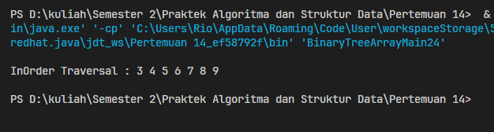

# <p align="center">Pertemuan 14 - Jobsheet 11 Tree </p>

<br><br>

<p align="center">
    
</p>

<br><br>

<p align="center">
    Nama : Riovaldo Alfiyan Fahmi Rahman <br>
    NIM : 2341720209 <br>
    Prodi : D4 Teknik Informatika <br>
    Kelas : TI 1B
</p>

<br><br>

---

## 13.2.1 Verifikasi Hasil Percobaan

- Code `Node24.java`

```java
public class Node24 {
    int data;
    Node24 left;
    Node24 right;

    public Node24(){

    }

    public Node24(int data){
        this.left = null;
        this.data = data;
        this.right = null;
    }
}

```

- Code `BinaryTree24.java`

```java
public class BinaryTree24 {
    Node24 root;

    public BinaryTree24() {
        root = null;
    }

    boolean isEmpty() {
        return root == null;
    }

    void add(int data) {
        if (isEmpty()) {
            root = new Node24(data);
        } else {
            Node24 current = root;
            while (true) {
                if (data < current.data) {
                    if (current.left != null) {
                        current = current.left;
                    } else {
                        current.left = new Node24(data);
                        break;
                    }
                } else if (data > current.data) {
                    if (current.right != null) {
                        current = current.right;
                    } else {
                        current.right = new Node24(data);
                        break;
                    }
                } else {
                    break;
                }
            }
        }
    }

    boolean find(int data) {
        boolean result = false;
        Node24 current = root;
        while (current != null) {
            if (current.data == data) {
                result = true;
                break;
            } else if (data > current.data) {
                current = current.right;
            } else {
                current = current.left;
            }
        }
        return result;
    }

    void traversePreOrder(Node24 node) {
        if (node != null) {
            System.out.print(" " + node.data);
            traversePreOrder(node.left);
            traversePreOrder(node.right);
        }
    }

    void traversePostOrder(Node24 node) {
        if (node != null) {
            traversePostOrder(node.left);
            traversePostOrder(node.right);
            System.out.print(" " + node.data);
        }
    }

    void traverseInOrder(Node24 node) {
        if (node != null) {
            traverseInOrder(node.left);
            System.out.print(" " + node.data);
            traverseInOrder(node.right);
        }
    }

    Node24 getSuccessor(Node24 del) {
        Node24 successor = del.right;
        Node24 successorParent = del;
        while (successor.left != null) {
            successorParent = successor;
            successor = successor.left;
        }

        if (successor != del.right) {
            successorParent.left = successor.right;
            successor.right = del.right;
        }
        return successor;
    }

    void delete(int data) {
        if (isEmpty()) {
            System.out.println("Tree is empty!");
            return;
        }

        Node24 parent = root;
        Node24 current = root;
        boolean isLeftChild = false;
        while (current != null) {
            if (current.data == data) {
                break;
            } else if (data < current.data) {
                parent = current;
                current = current.left;
                isLeftChild = true;
            } else if (data > current.data) {
                parent = current;
                current = current.right;
                isLeftChild = false;
            }
        }

        if (current == null) {
            System.out.println("Couldn't find data!");
            return;
        } else {
            if (current.left == null && current.right == null) {
                if (current == root) {
                    root = null;
                } else {
                    if (isLeftChild) {
                        parent.left = null;
                    } else {
                        parent.right = null;
                    }
                }
            } else if (current.left == null) {
                if (current == root) {
                    root = current.right;
                } else {
                    if (isLeftChild) {
                        parent.left = current.right;
                    } else {
                        parent.right = current.right;
                    }
                }
            } else if (current.right == null) {
                if (current == root) {
                    root = current.left;
                } else {
                    if (isLeftChild) {
                        parent.left = current.left;
                    } else {
                        parent.right = current.left;
                    }
                }
            } else {
                Node24 successor = getSuccessor(current);
                if (current == root) {
                    root = successor;
                } else {
                    if (isLeftChild) {
                        parent.left = successor;
                    } else {
                        parent.right = successor;
                    }
                    successor.left = current.left;
                }
            }
        }

    }
}
```

- Code `BinaryTreeMain24.java`

```java
public class BinaryTreeMain24 {
    public static void main(String[] args) {
        BinaryTree24 bt = new BinaryTree24();
        bt.add(6);
        bt.add(4);
        bt.add(8);
        bt.add(3);
        bt.add(5);
        bt.add(7);
        bt.add(9);
        bt.add(10);
        bt.add(15);

        System.out.print("PreOrder Traversal   : ");
        bt.traversePreOrder(bt.root);
        System.out.println();
        System.out.print("InOrder Traversal    : ");
        bt.traverseInOrder(bt.root);
        System.out.println();
        System.out.print("PostOrder Traversal  : ");
        bt.traversePostOrder(bt.root);
        System.out.println();
        System.out.println("Find Node             : " + bt.find(6));
        System.out.println("Delete Node 8 ");
        bt.delete(8);
        System.out.println();
        System.out.print("Pre-Order Traversal   : ");
        bt.traversePreOrder(bt.root);
        System.out.println();
    }
}
```

- `Hasil Percobaan`


### 13.2.2 Pertanyaan

1. Mengapa dalam binary search tree proses pencarian data bisa lebih efektif dilakukan dibanding
   binary tree biasa?<br><br>
   `JAWAB`<br><br>
   Dikarenakan Binary Search Tree itu memiliki sifat yang dimana setiap node itu memiliki semua nilai pada subtree kiri lebih kecil, dan semua nilai di subtree kanan lebih besar.<br><br>
2. Untuk apakah di class Node, kegunaan dari atribut left dan right?<br><br>
   `JAWAB`<br><br>
   Atribut left dan right pada class node berguna untuk menunjuk kepada child sebelah kiri dan child kanan dari node tersebut, yang dimana itu memnungkinkan pembentukan struktur pada pohon biner.<br><br>
3. a. Untuk apakah kegunaan dari atribut root di dalam class BinaryTree?<br>
   b. Ketika objek tree pertama kali dibuat, apakah nilai dari root?<br><br>
   `JAWAB`<br><br>
   a. Pada atribut root di dalam class BinaryTree itu berguna untuk menyimpan refernsi pada node akar dari tree, atribut ini merupakan titik masuk utama untuk semua operas yang dilakukan pada tree.<br>
   b. Ketika objek tree baru dibuat, nilai awal dari root merupakan nilai null dikarenakan kondisi tree masih kosong dan belum memiliki node.<br><br>
4. Ketika tree masih kosong, dan akan ditambahkan sebuah node baru, proses apa yang akan terjadi?<br><br>
   `JAWAB`<br><br>
   Saat kondisi tree masih kosong dan akan ditambahkan node baru, proses yang akan terjadi yaitu node baru akan menjadi root dari tree, dan untuk node baru ini akan diinisialisasi dan atribut root juga dari tree akan menunjuk kepada node baru tersebut<br><br>
5. Perhatikan method add(), di dalamnya terdapat baris program seperti di bawah ini. Jelaskan
   secara detil untuk apa baris program tersebut?
   ```java
    if (data<current.data){
        if(current.left != null){
            current = current.left;
        } else {
            current.left = new Node(data);
            break;
        }
    }
   ```
   <br><br>
   `JAWAB`<br><br>
   Untuk baris pertama `if (data<current.data)`, itu berguna untuk mengecek apakah data yang akan ditambahkan itu lebih kecil dari data node ( current ) saat ini, jika iya lebih kecil maka node baru akan ditempatkan pada subtree kiri. `if(current.left != null)` kemudian untuk selanjutnya kode ini juga mengecek apakah child kiri dari node saat ini itu tidak null, jika kondisi tidak null maka proses pencarian tempat yang tepat untuk node baru akan dilanjutkan dengan menggeser current ke node child kiri.` current = current.left;` selanjutnya untuk baris kode ini berguna jika child kiri dari node current adalah null, yang dimana sebagai tempat yang tempat untuk node baru yang telah ditemukan. `current.left = new Node(data);` untuk baris kode ini adalah membuat node baru dengan data yang telah diberikan dan menetapkan sebagai anak kiri dari node current, dan baris kode terakhir `break` yaitu untuk menghentikan loop, karena node baru telah berhasil ditambahkan ke tree

---

## 13.3.1 Verifikasi Hasil Percobaan

- Code `BinaryTreeArray24.java`

```java
public class BinaryTreeArray24 {
    int[] data;
    int idxLast;

    public BinaryTreeArray24() {
        data = new int[10];
        idxLast = -1;
    }

    void populateData(int[] data, int idxLast) {
        this.data = data;
        this.idxLast = idxLast;
    }

    void traverseInOrder(int idxStart) {
        if (idxStart <= idxLast) {
            traverseInOrder(2*idxStart+1);
            System.out.print(data[idxStart] + " ");
            traverseInOrder(2*idxStart+2);
        }
    }
}
```

- Code `BinaryTreeArrayMain24.java`

```java
public class BinaryTreeArrayMain24 {
    public static void main(String[] args) {
        BinaryTreeArray24 bta = new BinaryTreeArray24();
        int[] data = {6,4,8,3,5,7,9,0,0};
        int idxLast = 6;
        bta.populateData(data, idxLast);
        System.out.print("\nInOrder Traversal : ");
        bta.traverseInOrder(0);
        System.out.println("\n");
    }
}
```

- `Hasil Percobaan`



### 13.3.2 Pertanyaan

1. Apakah kegunaan dari atribut data dan idxLast yang ada di class BinaryTreeArray?<br><br>
   `JAWAB`<br><br>
   `data`, berguna untuk menyimpan element pada binary tree ke dalam array. `idxlast`, befungsi untuk menyimpan indeks terakhir dari element yang valid pada array<br><br>
2. Apakah kegunaan dari method populateData()?<br><br>
   `JAWAB`<br><br>
   Befungsi untuk mengisi array data dengan element tree dan juga menetapkan idxlast untuk menentukan batas akhir element valid<br><br>
3. Apakah kegunaan dari method traverseInOrder()?<br><br>
   `JAWAB`<br><br>
   Untuk melakuukan left-root-right pada binary tree yang disimpan dalam array dan akan diprint elemnt tree tersebut
4. Jika suatu node binary tree disimpan dalam array indeks 2, maka di indeks berapakah posisi left child dan rigth child masin-masing?<br><br>
   `JAWAB`<br><br>
   `Left child`, Indeks 5 (2 \* 2 + 1), `Right Child`, Indeks 6 (2 \* 2 + 2).
5. Apa kegunaan statement int idxLast = 6 pada praktikum 2 percobaan nomor 4?<br><br>
   `JAWAB`<br><br>
   Untuk menetapkan indeks terakhir pada element valid dalam array data untuk memastikan traversal hanya mengunjungi element yang valid

## 13.4 Tugas Praktikum

1. Buat method di dalam class BinaryTree yang akan menambahkan node dengan cara
   rekursif.<br><br>
   `JAWAB`<br><br>

   ```java
    public void addRecursive(int data) {
        root = addRecursive(root, data);
    }

    private Node13 addRecursive(Node13 current, int data) {
        if (current == null) {
            return new Node13(data);
        }
        if (data < current.data) {
            current.left = addRecursive(current.left, data);
        } else if (data > current.data) {
            current.right = addRecursive(current.right, data);
        } else {
            return current;
        }

        return current;
    }
   ```

   <br><br>

2. Buat method di dalam class BinaryTree untuk menampilkan nilai paling kecil dan yang
   paling besar yang ada di dalam tree.
   <br><br>
   `JAWAB`<br><br>

   ```java
    public int findMinValue() {
        return findMinValue(root);
    }

    private int findMinValue(Node13 current) {
        return current.left == null ? current.data : findMinValue(current.left);
    }

    public int findMaxValue() {
        return findMaxValue(root);
    }

    private int findMaxValue(Node13 current) {
        return current.right == null ? current.data : findMaxValue(current.right);
    }
   ```

   <br><br>

3. Buat method di dalam class BinaryTree untuk menampilkan data yang ada di leaf.
   <br><br>
   `JAWAB`<br><br>

   ```java
    public void displayLeafNodes() {
        displayLeafNodes(root);
    }

    private void displayLeafNodes(Node13 node) {
        if (node == null) {
            return;
        }
        if (node.left == null && node.right == null) {
            System.out.print(" " + node.data);
        }
        displayLeafNodes(node.left);
        displayLeafNodes(node.right);
    }
   ```

   <br><br>

4. Buat method di dalam class BinaryTree untuk menampilkan berapa jumlah leaf yang ada di dalam tree.
   <br><br>
   `JAWAB`<br><br>

   ```java
    public int countLeafNodes() {
        return countLeafNodes(root);
    }

    private int countLeafNodes(Node13 node) {
        if (node == null) {
            return 0;
        }
        if (node.left == null && node.right == null) {
            return 1;
        } else {
            return countLeafNodes(node.left) + countLeafNodes(node.right);
        }
    }
   ```

   <br><br>

5. Modifikasi class BinaryTreeArray, dan tambahkan : <br>
   • method add(int data) untuk memasukan data ke dalam tree <br>
   • method traversePreOrder() dan traversePostOrder()
   <br><br>
   `JAWAB`<br><br>
   • method add(int data) untuk memasukan data ke dalam tree <br>

   ```java
    void add(int data) {
        if (idxLast < this.data.length - 1) {
            this.data[++idxLast] = data;
        } else {
            System.out.println("Tree is full!");
        }
    }
   ```

   <br><br>

   • method traversePreOrder() dan traversePostOrder() <br>

   ```java
    void traversePreOrder(int idxStart) {
        if (idxStart <= idxLast && data[idxStart] != 0) {
            System.out.print(data[idxStart] + " ");
            traversePreOrder(2 * idxStart + 1);
            traversePreOrder(2 * idxStart + 2);
        }
    }
   ```

   <br><br>

   ```java
    void traversePostOrder(int idxStart) {
        if (idxStart <= idxLast && data[idxStart] != 0) {
            traversePostOrder(2 * idxStart + 1);
            traversePostOrder(2 * idxStart + 2);
            System.out.print(data[idxStart] + " ");
        }
    }
   ```

   <br><br>
