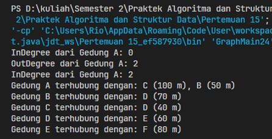
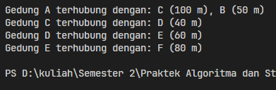

# <p align="center">Pertemuan 15 - Jobsheet 12 Graph </p>

<br><br>

<p align="center">
    
</p>

<br><br>

<p align="center">
    Nama : Riovaldo Alfiyan Fahmi Rahman <br>
    NIM : 2341720209 <br>
    Prodi : D4 Teknik Informatika <br>
    Kelas : TI 1B
</p>

<br><br>

---

## 2.1.2 Verifikasi Hasil Percobaan

- Code `Node24.java`

```java
public class Node24 {
    int data;
    Node24 prev, next;
    int jarak;

    Node24(Node24 prev, int data, int jarak, Node24 next){
        this.prev = prev;
        this.data = data;
        this.next = next;
        this.jarak = jarak;
    }
}
```

- Code `DoubleLinkedList24.java`

```java
public class DoubleLinkedList24 {
    Node24 head;
    int size;

    public DoubleLinkedList24() {
        head = null;
        size = 0;
    }

    public boolean isEmpty() {
        return head == null;
    }

    public void addFirst(int item, int jarak) {
        if (isEmpty()) {
            head = new Node24(null, item, jarak, null);
        } else {
            Node24 newNode = new Node24(null, item, jarak, head);
            head.prev = newNode;
            head = newNode;
        }
        size++;
    }

    public int getJarak(int index) throws Exception {
        if (isEmpty() || index >= size) {
            throw new Exception("Nilai indeks diluar batas");
        }
        Node24 tmp = head;
        for (int i = 0; i < index; i++) {
            tmp = tmp.next;
        }
        return tmp.jarak;
    }

    public void remove(int tujuan) {
        Node24 current = head;
        while (current != null) {
            if (current.data == tujuan) {
                if (current.prev != null) {
                    current.prev.next = current.next;
                } else {
                    head = current.next;
                }
                if (current.next != null) {
                    current.next.prev = current.prev;
                }
                size--;
                return;
            }
            current = current.next;
        }
    }

    public int size() {
        return size;
    }

    public int get(int index) throws Exception {
        if (isEmpty() || index >= size) {
            throw new Exception("Nilai indeks diluar batas");
        }
        Node24 tmp = head;
        for (int i = 0; i < index; i++) {
            tmp = tmp.next;
        }
        return tmp.data;
    }

    public void clear() {
        head = null;
        size = 0;
    }
}
```

- Code `Graph24.java`

```java
public class BinaryTreeMain24 {
    public static void main(String[] args) {
        BinaryTree24 bt = new BinaryTree24();
        bt.add(6);
        bt.add(4);
        bt.add(8);
        bt.add(3);
        bt.add(5);
        bt.add(7);
        bt.add(9);
        bt.add(10);
        bt.add(15);

        System.out.print("PreOrder Traversal   : ");
        bt.traversePreOrder(bt.root);
        System.out.println();
        System.out.print("InOrder Traversal    : ");
        bt.traverseInOrder(bt.root);
        System.out.println();
        System.out.print("PostOrder Traversal  : ");
        bt.traversePostOrder(bt.root);
        System.out.println();
        System.out.println("Find Node             : " + bt.find(6));
        System.out.println("Delete Node 8 ");
        bt.delete(8);
        System.out.println();
        System.out.print("Pre-Order Traversal   : ");
        bt.traversePreOrder(bt.root);
        System.out.println();
    }
}
```

- Code `GraphMain24.java`

```java
public class GraphMain24 {
    public static void main(String[] args) throws Exception {

        Graph24 gedung = new Graph24(6);
        gedung.addEdge(0, 1, 50);
        gedung.addEdge(0, 2, 100);
        gedung.addEdge(1, 3, 70);
        gedung.addEdge(2, 3, 40);
        gedung.addEdge(3, 4, 60);
        gedung.addEdge(4, 5, 80);
        gedung.degree(0);
        gedung.printGraph();

        gedung.removeEdge(1, 3);
        gedung.printGraph();

    }
}
```

- `Hasil Percobaan`<br><br>
  <b>Hasil Running pada langkah 14</b><br>
  <br><br>
  <b>Hasil Running pada langkah 17</b><br>
  <br><br>

## 2.1.3 Pertanyaan
