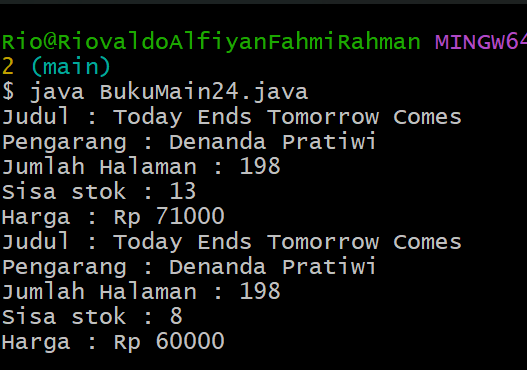
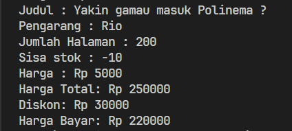

# Pertemuan 2 - Jobsheet 2 Object

Nama : Riovaldo Alfiyan Fahmi Rahman<br>
NIM : 2341720209<br>
Tugas : Jobsheet 2<br>

## 2.1 Percobaan 1 : Deklarasi Class, Atribut dan Method

Code :

```java
public class Buku24 {
    String judul, pengarang;
    int halaman, stok, harga;
    void tampilInformasi(){
        System.out.println("Judul : " + judul);
        System.out.println("Pengarang : " + pengarang);
        System.out.println("Jumlah Halaman : " + halaman);
        System.out.println("Sisa stok : " + stok);
        System.out.println("Harga : Rp " + harga);
    }

    void terjual (int jml){
        stok -= jml;
    }

    void restock (int jml){
        stok += jml;
    }

    void gantiHarga (int hrg){
        harga = hrg;
    }
}
```

### 2.1.2 Verifikasi Hasil Percobaan

Hasilnya akan error<br>


### 2.1.3 Pertanyaan

1. Sebutkan dua karakteristik class atau object!

   JAWAB :

   - Encapsulation ( Enkapsulasi ) dan Inheritance ( Pewarisan )

2. Perhatikan class Buku pada Praktikum 1 tersebut, ada berapa atribut yang dimiliki oleh class Buku? Sebutkan apa saja atributnya!

   JAWAB :

   - judul : String
   - pengarang : String
   - halaman : int
   - stok : int
   - harga : int

3. Ada berapa method yang dimiliki oleh class tersebut? Sebutkan apa saja methodnya!

   JAWAB :

   - tampilInformasi() : void
   - terjual(jml : int) : void
   - restock(n : int) : void
   - gantiHarga(hrg : int) : int

4. Perhatikan method terjual() yang terdapat di dalam class Buku. Modifikasi isi method tersebut
   sehingga proses pengurangan hanya dapat dilakukan jika stok masih ada (lebih besar dari 0)!

   JAWAB :

   ```java
        void terjual(int jml) {
            if (stok > 0) {
                stok -= jml;
                System.out.println(jml + " buku terjual. Sisa stok: " + stok);
            } else {
                System.out.println("Stok tidak mencukupi untuk melakukan penjualan.");
            }
        }
   ```

5. Menurut Anda, mengapa method restock() mempunyai satu parameter berupa bilangan int?

JAWAB :

- Menurut saya alasan method `restock()` mempunyai satu parameter yaitu bilangan bulat (int) dikarenakan jumlah tambahan buku yang akan ditambahkan ke dalam stok, dengan begitu parameter jml akan mewakili jumlah buku tambahan yang akan direstock ke dalam stok buku yang sudah ada.

6. Commit dan push kode program ke Github

## 2.2 Percobaan 2 : Instalasi Object, serta mengakses atribut dan method

Code :

```java
public class BukuMain24{
    public static void main(String[] args) {
        BukuMain24 bk1 = new BukuMain24();
        bk1.judul = "Today Ends Tomorrow Comes";
        bk1.pengarang = "Denanda Pratiwi";
        bk1.halaman = 198;
        bk1.stok = 13;
        bk1.harga = 71000;

        bk1.tampilInformasi();
        bk1.terjual(5);
        bk1.gantiHarga(60000);
        bk1.tampilInformasi();
    }
}

```

### 2.2.2 Verifikasi Hasil Percobaan

Hasilnya akan mengeluarkan ouput seperti gambar dibawah ini...


### 2.2.3 Pertanyaan

1. Pada class `BukuMain`, tunjukkan baris kode program yang digunakan untuk proses instansiasi!
   Apa nama object yang dihasilkan?

   JAWAB :

   - Pada baris kode

   ```java
    BukuMain24 bk1 = new BukuMain24();
   ```

2. Bagaimana cara mengakses atribut dan method dari suatu objek?

   JAWAB :

   - Untuk mengakses atribut dan metode dari suatu objek, kita perlu menggunakan operator titik ('.'), contohnya 'bk1.stok' mengakses atribut 'stok' dari objek 'bk1'

3. Mengapa hasil output pemanggilan method tampilInformasi() pertama dan kedua berbeda?

   JAWAB :

   - Dikarenakan data nya sudah terubah

## 2.3 Percobaan 3 : Membuat Konstruktor

Code :

```java
public class BukuMain24 {

    public static void main(String[] args) {
        Buku24 bk1 = new Buku24();
        bk1.judul = "Today Ends Tomorrow Comes";
        bk1.pengarang = "Denanda Pratiwi";
        bk1.halaman = 198;
        bk1.stok = 13;
        bk1.harga = 71000;

        bk1.tampilInformasi();
        bk1.terjual(5);
        bk1.gantiHarga(60000);
        bk1.tampilInformasi();

        Buku24 bk2 = new Buku24("Self Reward", "Maheera Ayesha", 160, 29, 59000);
        bk2.terjual(11);
        bk2.tampilInformasi();
    }
}

```

### 2.3.2 Verifikasi Hasil Percobaan

Hasilnya akan mengeluarkan ouput seperti gambar dibawah ini...


### 2..3 Pertanyaan

1. Pada class Buku di Percobaan 3, tunjukkan baris kode program yang digunakan untuk
   mendeklarasikan konstruktor berparameter!

   JAWAB :

   - Kode program yang digunakan untuk konstruktor berparameter pada class Buku24, berikut kode nya

   ```java
    public Buku24(String jud, String pg, int hal, int stok, int har) {
        judul = jud;
        pengarang = pg;
        halaman = hal;
        this.stok = stok;
        harga = har;
    }
   ```

2. Perhatikan class BukuMain. Apa sebenarnya yang dilakukan pada baris program berikut?

   ```java
   Buku24 bk2 = new Buku24("Self Reward", "Maheera Ayesha", 160, 29, 59000);

   ```

   JAWAB :

   - Jadi pada baris program tersebut menunjukkan penggunaan konstruktor berparameter dari class 'Buku24' yang bertujuan untuk membuat object baru dengan nilai-nilai spesifik, jadi baris program tersebut membuat object 'bk2' dari class 'Buku24' dengan nilai yang sudah ditentukan

3. Hapus konstruktor default pada class Buku, kemudian compile dan run program. Bagaimana
   hasilnya? Jelaskan mengapa hasilnya demikian!

   JAWAB :

   - Jika menghapus konstruktor default pada class Buku dan menjalankan program yang akan terjadi ialah kita akan mendapatkan pesan kesalahan / error kompilasi. Dengan menghapus konstruktor default dari class 'Buku24', tidak ada lagi konstruktor yang dapat membuat objek tanpa parameter

4. Setelah melakukan instansiasi object, apakah method di dalam class Buku harus diakses
   secara berurutan? Jelaskan alasannya!

   JAWAB :

   - Menurut saya Tidak, karena method pada class 'Buku24' itu tidak harus diakses secara berurutan setelah melakukan instansiasi objek, dan sebetulnya method tersebut dapat dipanggil secara terpisah namun harus sesuai dengan kebutuhan program kita. Jadi pada dasarnya tidak ada keharusan untuk memanggil method secara berurutan, namun penggunaan hal tersebut harus dipertimbangkan kembali dalam logika program dan hubungan antara method tersebut saat memutuskan urutan pemanggilan

5. Buat object baru dengan nama buku<NamaMahasiswa> menggunakan konstruktor
   berparameter dari class Buku!

   JAWAB :

   ```java
    Buku24 bkRio = new Buku24("Yakin gamau masuk Polinema ?", "Rio", 200, 40, 60000);
    bkRio.terjual(3);
    bkRio.gantiHarga(80000);
    bkRio.tampilInformasi();
   ```

## 2.4 Latihan Praktikum

1. - Code pada file "Buku24.java" : <br>

   ```java
       int hitungHargaTotal(int jmlTerjual){
           return harga * jmlTerjual;
       }

       int hitungDiskon(int hargaTotal){
           if (hargaTotal > 150000){
               return hargaTotal * 12 /100;
           } else if (hargaTotal >= 75000 && hargaTotal <= 150000) {
               return hargaTotal * 5 / 100;
           } else {
               return 0;
           }
       }

       int hitungHargaBayar(int hargaTotal, int diskon){
           return hargaTotal - diskon;
       }
   ```

   - Code pada file "BukuMain24.java" : <br>

   ```java
        Buku24 bkRio = new Buku24("Yakin gamau masuk Polinema ?", "Rio", 200, 40, 5000);
            bkRio.terjual(50);
            bkRio.tampilInformasi();

            // Menghitung harga total, diskon, dan harga bayar
            int hargaTotal = bkRio.hitungHargaTotal(50);
            int diskon = bkRio.hitungDiskon(hargaTotal);
            int hargaBayar = bkRio.hitungHargaBayar(hargaTotal, diskon);

            // Menampilkan hasil perhitungan
            System.out.println("Harga Total: Rp " + hargaTotal);
            System.out.println("Diskon: Rp " + diskon);
            System.out.println("Harga Bayar: Rp " + hargaBayar);
   ```

   - Output : <br>
     
