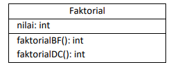
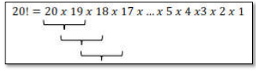
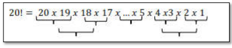
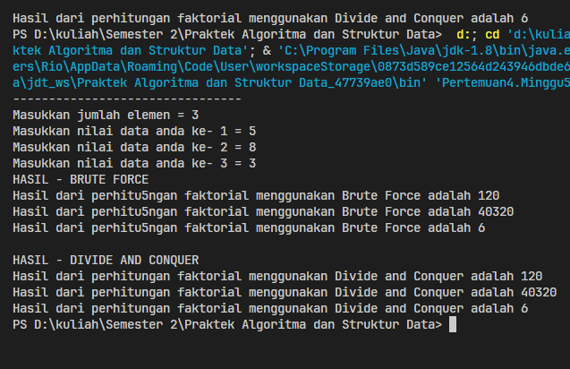
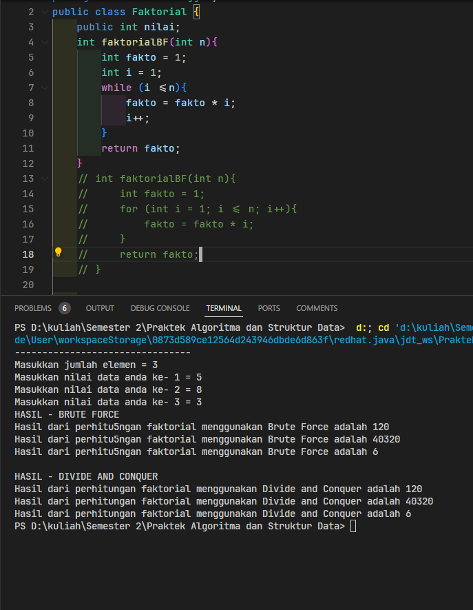
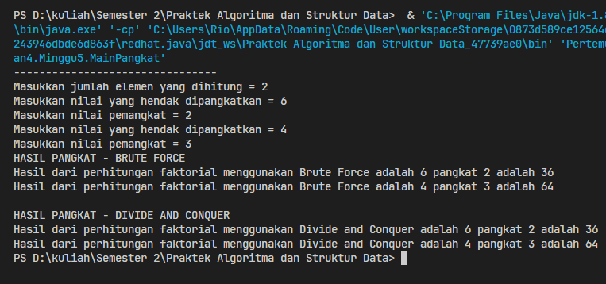
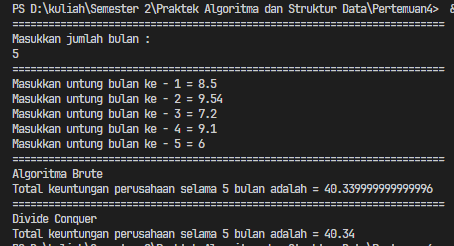
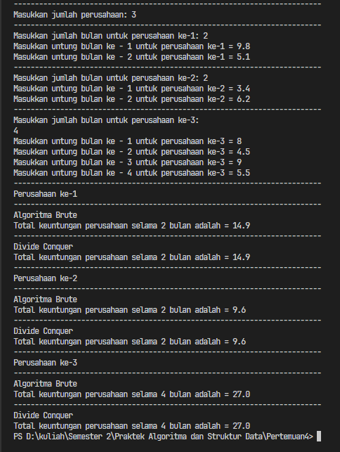
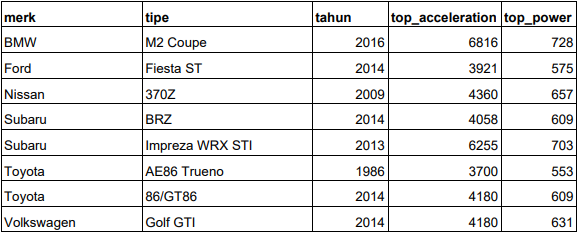

# <p align="center">Pertemuan 5 - Jobsheet 4 Brute Force dan Divide Conquer</p>

<br><br>

<p align="center">
    
</p>

<br><br>

<p align="center">
    Nama : Riovaldo Alfiyan Fahmi Rahman <br>
    NIM : 2341720209 <br>
    Prodi : D4 Teknik Informatika <br>
    Kelas : TI 1B
</p>

<br><br>

---

## 4.2 Menghitung Nilai Faktorial dengan Algoritma Brute Force dan Divide Conquer



<p>
Berdasarkan diagram class di atas, akan dibuat program class dalam Java. Untuk menghitung nilai 
faktorial suatu angka menggunakan 2 jenis algoritma, Brute Force dan Divide and Conquer. Jika 
digambarkan terdapat perbedaan proses perhitungan 2 jenis algoritma tersebut sebagai berikut :
Tahapan pencarian nilai faktorial dengan algoritma Brute Force :
</p>




### 4.2.2 Verifikasi Hasil Percobaan

- Code `Faktorial.java`

```java
package Pertemuan4.Minggu5;
public class Faktorial {
    public int nilai;
    int faktorialBF(int n){
        int fakto = 1;
        for (int i = 1; i <= n; i++){
            fakto = fakto * i;
        }
        return fakto;
    }

    int faktorialDC(int n){
        if (n == 0 | n == 1){
            return 1;
        } else {
            int fakto = n * faktorialDC(n-1);
            return fakto;
        }
    }
}
```

- Code `MainFaktorial.java`

```java
package Pertemuan4.Minggu5;
import java.util.Scanner;
public class MainFaktorial {
    public static void main(String[] args) {
        Scanner sc = new Scanner(System.in);
        System.out.println("--------------------------------");
        System.out.print("Masukkan jumlah elemen = ");
        int iJml = sc.nextInt();

        Faktorial[] fk = new Faktorial[10];
        for (int i=0; i < iJml; i++) {
            fk[i] = new Faktorial();
            System.out.print("Masukkan nilai data anda ke- " +(i+1)+ " = ");
            int iNilai = sc.nextInt();
            fk[i].nilai = iNilai;
        }

        System.out.println("HASIL - BRUTE FORCE");
        for(int i=0; i <iJml; i++) {
            System.out.println("Hasil dari perhitu5ngan faktorial menggunakan Brute Force adalah " + fk[i].faktorialBF(fk[i].nilai));
        }
        System.out.println("");
        System.out.println("HASIL - DIVIDE AND CONQUER");
        for(int i=0; i <iJml; i++) {
            System.out.println("Hasil dari perhitungan faktorial menggunakan Divide and Conquer adalah " + fk[i].faktorialDC(fk[i].nilai));
        }
    }
}

```

- `Hasil Percobaan`



### 4.2.3 Pertanyaan

1. Pada base line Algoritma Divide Conquer untuk melakukan pencarian nilai faktorial, jelaskan
   perbedaan bagian kode pada penggunaan if dan else!<br><br>
   `JAWAB`<br>

   Perbedaan penggunaan kode pada `if` dan `else`, jadi pada kode `if` itu menangani kasus dasar atau base case, namun pada bagian kode `else` itu menangani rekursif yang dimana bertugas untuk memecahkan masalah menjadi submasalah yang lebih kecil.
   <br><br>

2. Apakah memungkinkan perulangan pada method faktorialBF() dirubah selain menggunakan
   for?Buktikan!<br><br>
   `JAWAB`<br>

   Ya, bisa menggunakan selain `for` dengan menggunakan jenis perulangan seperti `while`

   
   <br><br>

3. Jelaskan perbedaan antara `fakto *= i;` dan `int fakto = n _ faktorialDC(n-1);` !<br><br>
   `JAWAB`<br>

   Jadi `fakto *= i;` merupakan operasi iteratif dalam perulangan, sedangkan `int fakto = n _ faktorialDC(n-1);` merupakan deklarasi variabel dengan nilai hasil dari panggilan rekursif dalam algoritma Divide Conquer

<br><br>

---

## 4.3 Menghitung Hasil Pangkat dengan Algoritma Brute Force dan Divide and Conquer

Pada praktikum ini kita akan membuat program class dalam Java. Untuk menghitung nilai pangkat
suatu angka menggunakan 2 jenis algoritma, Brute Force dan Divide and Conquer.

### 4.3.2 Verifikasi Hasil Percobaan

- Code `Pangkat.java`

```java
package Pertemuan4.Minggu5;

public class Pangkat {
    public int nilai,pangkat;

    public Pangkat(int nilai, int pangkat){
        this.nilai = nilai;
        this.pangkat = pangkat;
    }
    int pangkatBF(int a, int n){
        int hasil = 1;
        for(int i=0; i<n;i++){
            hasil *= a;
        }
        return hasil;
    }

    int pangkatDC(int a, int n){
        if(n == 0 ){
            return 1;
        } else {
            if (n%2==1){
                return (pangkatDC(a,n/2)*pangkatDC(a,n/2)*a);
            }else{
                return (pangkatDC(a,n/2)*pangkatDC(a,n/2));
            }
        }
    }
}
```

- Code `MainPangkat.java`

```java
package Pertemuan4.Minggu5;
import java.util.Scanner;

public class MainPangkat {
    public static void main(String[] args) {
        Scanner sc = new Scanner(System.in);
        System.out.println("--------------------------------");
        System.out.print("Masukkan jumlah elemen yang dihitung = ");
        int element = sc.nextInt();

        Pangkat[] png = new Pangkat[element];
        for (int i = 0; i < element; i++){
            png[i] = new Pangkat();
            System.out.print("Masukkan nilai yang hendak dipangkatkan = ");
            png[i].nilai = sc.nextInt();
            System.out.print("Masukkan nilai pemangkat = ");
            png[i].pangkat = sc.nextInt();
        }

        System.out.println("HASIL PANGKAT - BRUTE FORCE");
        for(int i=0; i <element; i++) {
            System.out.println("Hasil dari perhitungan faktorial menggunakan Brute Force adalah " + png[i].nilai + " pangkat " + png[i].pangkat + " adalah " + png[i].pangkatBF(png[i].nilai, png[i].pangkat)) ;
        }
        System.out.println("");
        System.out.println("HASIL PANGKAT - DIVIDE AND CONQUER");
        for(int i=0; i <element; i++) {
            System.out.println("Hasil dari perhitungan faktorial menggunakan Divide and Conquer adalah " + png[i].nilai + " pangkat " + png[i].pangkat + " adalah " + png[i].pangkatDC(png[i].nilai, png[i].pangkat)) ;
        }
    }
}
```

- `Hasil Percobaan`



### 4.3.3 Pertanyaan

1. Jelaskan mengenai perbedaan 2 method yang dibuat yaitu PangkatBF() dan PangkatDC()!<br><br>
   `JAWAB`<br>

   - Metode `PangkatBF()`

     1. Metode ini menggunakan pendektakn iteratif dengan menggunakan perualngan `for`
     2. Pada setiap iterasi niali `a` dikalikan dengan dirinya sendiri sebanyak `n` kali
     3. Metode `PangkatBF()` ini efektif namun memiliki komplekitas waktu `O(n)`, yang dimana `n` itu eksponen

   - Metode `PangkaDC()`
     1. Metode ini meggunakan pendekatan rekursif yang berdasarkan algoritma `Divide and Conquer`
     2. Algoritma `Divide and Conquer` ini membagikan masalah pangkat menjadi dua bagian yang lebih kecil dan akan menyelesaikan masing-masing secara `rekursif`
     3. Metode ini memilki komplekitas waktu yang bisa dibilang lebih baik daripada `Brute Force`.

2. Apakah tahap combine sudah termasuk dalam kode tersebut?Tunjukkan<br><br>
   `JAWAB`<br>

   ```java
   if (n % 2 == 1) {
      return (pangkatDC(a, n / 2) * pangkatDC(a, n / 2) * a);
   } else {
      return (pangkatDC(a, n / 2) * pangkatDC(a, n / 2));
   }
   ```

3. Modifikasi kode program tersebut, anggap proses pengisian atribut dilakukan dengan
   konstruktor.<br><br>
   `JAWAB`<br>

   - Code `Pangkat.java`

   ```java
      Pangkat(int a, int n){
         nilai = a;
         pangkat = n;
      }
   ```

   - Code `MainPangkat.java`

   ```java
      Pangkat[] png = new Pangkat[element];
         for (int i = 0; i < element; i++){
            png[i] = new Pangkat();
            System.out.print("Masukkan nilai yang hendak dipangkatkan = ");
            png[i].nilai = sc.nextInt();
            System.out.print("Masukkan nilai pemangkat = ");
            png[i].pangkat = sc.nextInt();
            png[i] = new Pangkat(nilai,pangkat);
        }
   ```

4. Tambahkan menu agar salah satu method yang terpilih saja yang akan dijalankan menggunakan
   switch-case.<br><br>
   `JAWAB`<br>

   ```java
      switch (menu) {
            case 1:
                System.out.println("HASIL PANGKAT - BRUTE FORCE");
                for(int i=0; i <element; i++) {
                    System.out.println("Hasil dari perhitungan faktorial menggunakan Brute Force adalah " + png[i].nilai + " pangkat " + png[i].pangkat + " adalah " + png[i].pangkatBF(png[i].nilai, png[i].pangkat)) ;
                }
                break;
            case 2:
                System.out.println("HASIL PANGKAT - DIVIDE AND CONQUER");
                for(int i=0; i <element; i++) {
                    System.out.println("Hasil dari perhitungan faktorial menggunakan Divide and Conquer adalah " + png[i].nilai + " pangkat " + png[i].pangkat + " adalah " + png[i].pangkatDC(png[i].nilai, png[i].pangkat)) ;
                }
                break;
            default:
                System.out.println("Pilihan anda tidak diketahui");
                break;
        }
   ```

<br><br>

---

## 4.4 Menghitung Sum Array dengan Algoritma Brute Force dan Divide and Conquer

<p>
Di dalam percobaan ini, kita akan mempraktekkan bagaimana proses divide, conquer, dan
combine diterapkan pada studi kasus penjumlahan keuntungan suatu perusahaan dalam beberapa
bulan.
</p>

### 4.4.2 Verifikasi Hasil Percobaan

- Code `Sum.java`

```java
package Pertemuan4.Minggu5;

public class Sum {
    int elemen;
    double keuntungan[], total;

    Sum(int elemen) {
        this.elemen = elemen;
        this.keuntungan = new double[elemen];
        this.total = 0;
    }

    double totalBF(double arr[]) {
        for (int i = 0; i < arr.length; i++) {
            total = total + arr[i];
        }
        return total;
    }

    double totalDC(double arr[], int l, int r) {
        if (l == r) {
            return arr[l];
        } else if (l < r) {
            int mid = (l + r) / 2;
            double lsum = totalDC(arr, l, mid - 1);
            double rsum = totalDC(arr, mid + 1, r);
            return lsum + rsum + arr[mid];
        }
        return 0;
    }
}


```

- Code `MainSum.java`

```java
package Pertemuan4.Minggu5;

import java.util.Scanner;

public class MainSum {
    public static void main(String[] args) {
        Scanner sc = new Scanner(System.in);
        System.out.println("========================================================================");
        System.out.print("Masukkan jumlah bulan : ");
        int elm = sc.nextInt();

        Sum sm = new Sum(elm);
        System.out.println("========================================================================");
        for (int i = 0; i < sm.elemen; i++) {
            System.out.print("Masukkan untung bulan ke - " + (i + 1) + " = ");
            sm.keuntungan[i] = sc.nextDouble();
        }

        System.out.println("========================================================================");
        System.out.println("Algoritma Brute");
        System.out.println(
                "Total keuntungan perusahaan selama " + sm.elemen + " bulan adalah = " + sm.totalBF(sm.keuntungan));
        System.out.println("========================================================================");
        System.out.println("Divide Conquer");
        System.out.println(
                "Total keuntungan perusahaan selama " + sm.elemen + " bulan adalah = " + sm.totalDC(sm.keuntungan, 0, sm.elemen-1));
    }
}
```

- `Hasil Percobaan`



### 4.4.3 Pertanyaan

1. Mengapa terdapat formulasi return value berikut?Jelaskan<br><br>
   `JAWAB`<br>

   Jadi untuk mencombine hasil penjumlahan dari sisi kiri, sisi kanan, dan juga dari bagian tengah

2. Kenapa dibutuhkan variable mid pada method TotalDC()?<br><br>
   `JAWAB`<br>

   Karena untuk membagi array menjadi dua bagian sama panjangnya

3. Program perhitungan keuntungan suatu perusahaan ini hanya untuk satu perusahaan saja. Bagaimana cara menghitung sekaligus keuntungan beberapa bulan untuk beberapa perusahaan.(Setiap perusahaan bisa saja memiliki jumlah bulan berbeda-beda)? Buktikan dengan program!<br><br>
   `JAWAB`<br>

   - Code `MainSum.java`

   ```java
   package Pertemuan4.Minggu5;
   import java.util.Scanner;

   public class MainSum {
      public static void main(String[] args) {
         Scanner sc = new Scanner(System.in);
         System.out.println("========================================================================");
         System.out.print("Masukkan jumlah bulan : ");
         int elm = sc.nextInt();

         Sum sm = new Sum(elm);
         System.out.println("========================================================================");
         for (int i = 0; i < sm.elemen; i++) {
               System.out.print("Masukkan untung bulan ke - " + (i + 1) + " = ");
               sm.keuntungan[i] = sc.nextDouble();
         }

         System.out.println("========================================================================");
         System.out.println("Algoritma Brute");
         System.out.println(
                  "Total keuntungan perusahaan selama " + sm.elemen + " bulan adalah = " + sm.totalBF(sm.keuntungan));
         System.out.println("========================================================================");
         System.out.println("Divide Conquer");
         System.out.println(
                  "Total keuntungan perusahaan selama " + sm.elemen + " bulan adalah = " + sm.totalDC(sm.keuntungan, 0, sm.elemen-1));
      }
   }

   ```

   - `Hasil Percobaan`

   

<br><br>

---

## 4.5 Latihan Praktikum

<p>
Sebuah  showroom memiliki daftar mobil dengan data sesuai tabel di bawah in
</p>



### 4.5.2 Verifikasi Hasil Percobaan

- Code `Mobil.java`

```java
package Pertemuan4.Minggu5;
    public class Mobil {
        public String merk;
        public String tipe;
        public int tahun;
        public int top_acceleration;
        public int top_power;

        public Mobil(String merk, String tipe, int tahun, int top_acceleration, int top_power) {
            this.merk = merk;
            this.tipe = tipe;
            this.tahun = tahun;
            this.top_acceleration = top_acceleration;
            this.top_power = top_power;
        }

        public int tertinggiDC(Mobil[] cars, int l, int r) {
            if (l == r) {
                return cars[l].top_acceleration;
            } else {
                int mid = (l + r) / 2;
                int leftMax = tertinggiDC(cars, l, mid);
                int rightMax = tertinggiDC(cars, mid + 1, r);
                return Math.max(leftMax, rightMax);
            }
        }

        public int terendahDC(Mobil[] cars, int l, int r) {
            if (l == r) {
                return cars[l].top_acceleration;
            } else {
                int mid = (l + r) / 2;
                int leftMin = terendahDC(cars, l, mid);
                int rightMin = terendahDC(cars, mid + 1, r);
                return Math.min(leftMin, rightMin);
            }
        }

        public double rataRataBF(Mobil[] cars) {
            int totalPower = 0;
            for (int i = 0; i < cars.length; i++) {
                totalPower += cars[i].top_power;
            }
            return (double) totalPower / cars.length;
        }
    }
```

- Code `MainMobil.java`

```java
package Pertemuan4.Minggu5;

public class MainMobil {
    public static void main(String[] args) {
        Mobil[] mobil = {
            new Mobil("BMW", "M2 Coupe", 2016, 6816, 728),
            new Mobil("Ford", "Fiesta ST", 2014, 3921, 575),
            new Mobil("Nissan", "370Z", 2009, 4360, 657),
            new Mobil("Subaru", "BRZ", 2014, 4058, 609),
            new Mobil("Subaru", "Impreza WRX STI", 2013, 6255, 703),
            new Mobil("Toyota", "AE86 Trueno", 1986, 3700, 553),
            new Mobil("Toyota", "86/GT86", 2014, 4180, 609),
            new Mobil("Volkswagen", "Golf GTI", 2014, 4180, 631)
        };

        Mobil showroom = new Mobil("Merk", "Tipe", 2022, 0, 0);

        int tertinggi = showroom.tertinggiDC(mobil, 0, mobil.length - 1);
        int terendah = showroom.terendahDC(mobil, 0, mobil.length - 1);
        double rataRata = showroom.rataRataBF(mobil);

        System.out.println("Top acceleration tertinggi: " + tertinggi);
        System.out.println("Top acceleration terendah: " + terendah);
        System.out.println("Rata-rata acceleration: " + rataRata);
    }
}
```

- `Hasil Percobaan`


