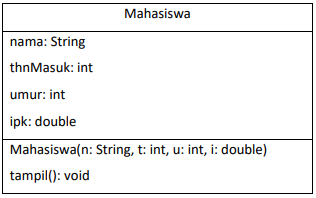
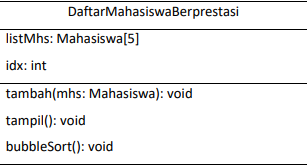
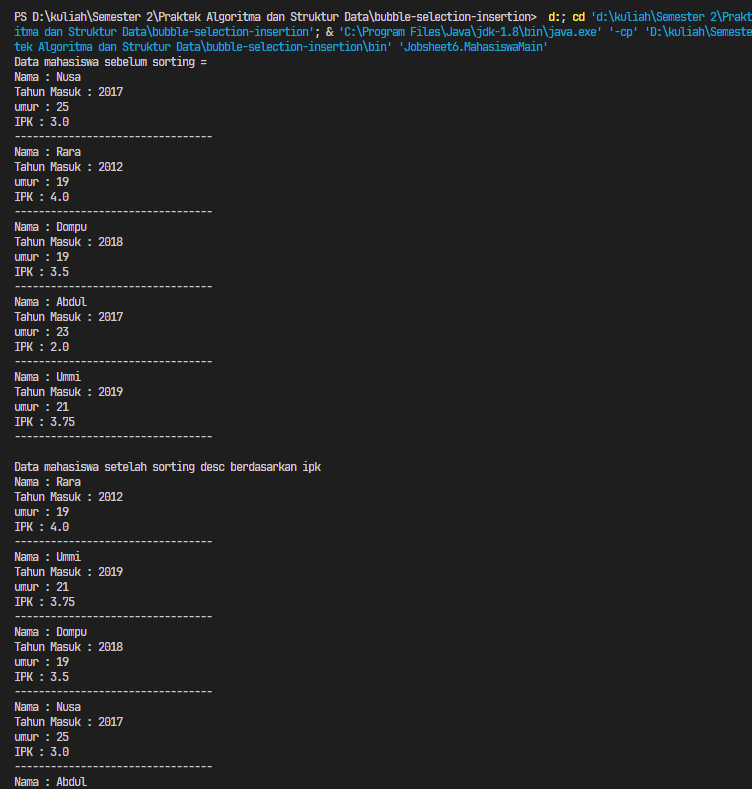
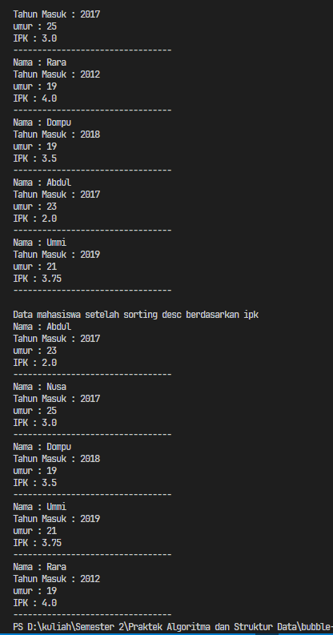
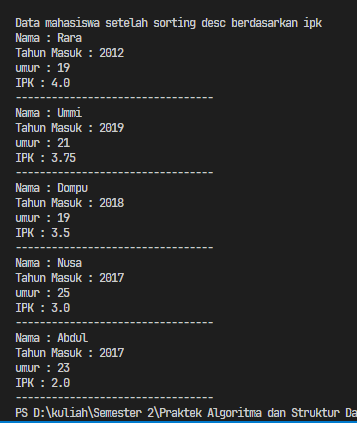
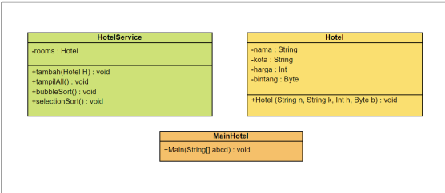
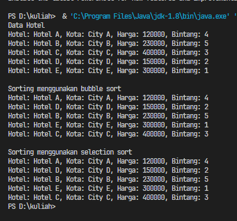

# <p align="center">Pertemuan 6 - Jobsheet 5 SORTING (BUBBLE, SELECTION, DAN INSERTION SORT)</p>

<br><br>

<p align="center">
    
</p>

<br><br>

<p align="center">
    Nama : Riovaldo Alfiyan Fahmi Rahman <br>
    NIM : 2341720209 <br>
    Prodi : D4 Teknik Informatika <br>
    Kelas : TI 1B
</p>

<br><br>

---

## 5.2 Mengurutkan Data Mahasiswa Berdasarkan IPK Menggunakan Bubble Sort



<p>
Perhatikan diagram class Mahasiswa di bawah ini! Diagram class ini yang selanjutnya
akan dibuat sebagai acuan dalam membuat kode program class Mahasiswa.
</p>



<p>
Berdasarkan class diagram di atas, kita akan membuat sebuah class Mahasiswa yang
berfunsi untuk membuat objek mahasiswa yang akan dimasukan ke dalam sebuah array.
Terdapat sebuah konstruktor berparameter dan juga fungsi tampil() untuk menampilkan
semua attribute yang ada
</p>

### 5.2.2 Verifikasi Hasil Percobaan

- Code `Mahasiswa.java`

```java
package Jobsheet6;

public class Mahasiswa {
    String nama;
    int thnMasuk, umur;
    double ipk;

    public Mahasiswa(String n, int t, int u, double i){
        nama = n;
        umur = u;
        thnMasuk = t;
        ipk = i;
    }

    void tampil(){
        System.out.println("Nama : " + nama);
        System.out.println("Tahun Masuk : " + thnMasuk);
        System.out.println("umur : " + umur);
        System.out.println("IPK : " +ipk);
    }
}

```

- Code `DaftarMahasiswaBerprestasi.java`

```java
package Jobsheet6;

public class DaftarMahasiswaBerprestasi {
    Mahasiswa listMhs[] = new Mahasiswa [5];
    int idx;

    void tambah(Mahasiswa m){
        if(idx<listMhs.length){
            listMhs[idx] = m;
            idx++;
        } else {
            System.out.println("Data sudah penuh");
        }
    }

    void tampil() {
        for (Mahasiswa m : listMhs){
            m.tampil();
            System.out.println("---------------------------------");
        }
    }

    void bubbleSort() {
        for (int i=0; i<listMhs.length-1; i++){
            for (int j=1; j<listMhs.length-i; j++){
                if(listMhs[j].ipk>listMhs[j-1].ipk){
                    Mahasiswa tmp = listMhs[j];
                    listMhs[j] = listMhs[j-1];
                    listMhs[j-1] = tmp;
                }
            }
        }
    }
}

```

- Code `MahasiswaMain.java`

```java
package Jobsheet6;
import java.util.Scanner;

public class MahasiswaMain {
    public static void main(String[] args) {
        DaftarMahasiswaBerprestasi list = new DaftarMahasiswaBerprestasi();
        Mahasiswa m1= new Mahasiswa ("Nusa", 2017, 25, 3);
        Mahasiswa m2 = new Mahasiswa ("Rara", 2012, 19, 4);
        Mahasiswa m3 = new Mahasiswa ("Dompu", 2018, 19, 3.5);
        Mahasiswa m4 = new Mahasiswa ("Abdul", 2017, 23, 2);
        Mahasiswa m5 = new Mahasiswa ("Ummi", 2019, 21, 3.75);
        list.tambah(m1);
        list.tambah (m2);
        list.tambah(m3);
        list.tambah(m4); list.tambah(m5);

        System.out.println("Data mahasiswa sebelum sorting = ");
        list.tampil();
        System.out.println("");
        System.out.println("Data mahasiswa setelah sorting desc berdasarkan ipk");
        list.bubbleSort();
        list.tampil();
    }
}

```

- `Hasil Percobaan`



### 5.2.3 Pertanyaan

1.  Terdapat di method apakah proses `bubble sort`!<br><br>
    `JAWAB`<br>

    Proses `bubble sort` terdapat pada method `bubbleSort()` pada class `DaftarMahasiswaBeprestasi`

    ```java
     void bubbleSort() {
         for (int i=0; i<listMhs.length-1; i++){
             for (int j=1; j<listMhs.length-i; j++){
                 if(listMhs[j].ipk>listMhs[j-1].ipk){
                     Mahasiswa tmp = listMhs[j];
                     listMhs[j] = listMhs[j-1];
                     listMhs[j-1] = tmp;
                 }
             }
         }
     }
    ```

    <br><br>

2.  Di dalam method `bubbleSort()`, terdapat baris program seperti dibawah ini

    ```java
    if(listMhs[j].ipk>listMhs[j-1].ipk){
            Mahasiswa tmp = listMhs[j];
            listMhs[j] = listMhs[j-1];
            listMhs[j-1] = tmp;
        }
    }
    ```

    untuk apakah proses tersebut ? <br><br>
    `JAWAB`<br>

    Jadi proses pada baris kode tersebut adalah melakukan proses pertukaran antara dua elemen array `listMhs` pada indeks `j` dan `j-1` jika kondisi tersebut yang diberikan terpenuhi

3.  Perhatikan perualangan di dalam `bubbleSort()` dibawah ini <br><br>

    `for (int i=0; i<listMhs.length-1; i++){`
    `for (int j=1; j<listMhs.length-i; j++){`

    a. Apakah perbedaan antara kegunaan perualangan i dan perualangan j ?<br>
    b. Mengapa syarat dari perulangan i adalah i<listMhs.length-1 ? <br>
    c. Mengapa syarat dari perulangan j adalah j<listMhs.length-i ? <br>
    d. Jika banyak data di dalam listMhs adalah 50, maka berapakali perulangan i akan
    berlangsung? Dan ada berapa Tahap bubble sort yang ditempuh? <br><br>

    `JAWAB`<br><br>
    a. `Perualagan i` digunakan untuk mengontrol iterasi pada pengecekkan dan pertukaran pada algoritma bubble sort<br>`Perualangan j` digunakan untuk melakukan perbandingan antara elemen berdekatan dan melakukan pertukaran jika diperlukan<br>

    b. Karena proses bubble sort memerlukan `n-1` langkah untuk mengurutkan `n` elemen, dimana `n` merupakan panjang dari array `listMhs`<br>

    c. Karena setiap langkah besar dari proses bubble sort, elemen terbesar akan dipindahkan ke posisi terakhir, yang dimana tidak perlu lagi memeriksa elemen tersebut di iterasi selanjutnya <br>

    d. Maka pada perulangan `i` akan berlangsung sebanyak `49` kali. Setiap iterasi `i` akan mengurangi jumlah elemen yang harus disortir, dan jumlah tahap dri proses bubble sort itu sama dengan jumlah iterasi `i` yaitu `49` tahap
    <br><br>

---

## 5.3 Mengurutkan Data Mahasiswa Berdasarkan IPK Menggunakan Selection Sort

<p>
Jika pada praktikum yang sebelumnya kita telah mengurutkan data mahasiwa berdasarkan
IPK menggunakan Bubble Sort secara descending, pada kali ini kita akan mencoba untuk
menambahkan fungsi pengurutan menggunakan Selection Sort.
</p>

### 5.3.2 Verifikasi Hasil Percobaan

- Code `DaftarMahasiswaBerprestasi.java`

```java
package Jobsheet6;

public class DaftarMahasiswaBerprestasi {
    Mahasiswa listMhs[] = new Mahasiswa [5];
    int idx;

    void tambah(Mahasiswa m){
        if(idx<listMhs.length){
            listMhs[idx] = m;
            idx++;
        } else {
            System.out.println("Data sudah penuh");
        }
    }

    void tampil() {
        for (Mahasiswa m : listMhs){
            m.tampil();
            System.out.println("---------------------------------");
        }
    }

    void bubbleSort() {
        for (int i=0; i<listMhs.length-1; i++){
            for (int j=1; j<listMhs.length-i; j++){
                if(listMhs[j].ipk>listMhs[j-1].ipk){
                    Mahasiswa tmp = listMhs[j];
                    listMhs[j] = listMhs[j-1];
                    listMhs[j-1] = tmp;
                }
            }
        }
    }

     void selectionSort() {
        for (int i=0; i<listMhs.length-1; i++){
            int idxMin = i;
            for (int j=i+1; j<listMhs.length; j++){
                if(listMhs[j].ipk<listMhs[idxMin].ipk){
                    idxMin = j;
                }
            }
            Mahasiswa tmp = listMhs[idxMin];
            listMhs[idxMin] = listMhs[i];
            listMhs[i] = tmp;
        }
    }
}

```

- Code `MahasiswaMain.java`

```java
package Jobsheet6;
import java.util.Scanner;

public class MahasiswaMain {
    public static void main(String[] args) {
        DaftarMahasiswaBerprestasi list = new DaftarMahasiswaBerprestasi();
        Mahasiswa m1= new Mahasiswa ("Nusa", 2017, 25, 3);
        Mahasiswa m2 = new Mahasiswa ("Rara", 2012, 19, 4);
        Mahasiswa m3 = new Mahasiswa ("Dompu", 2018, 19, 3.5);
        Mahasiswa m4 = new Mahasiswa ("Abdul", 2017, 23, 2);
        Mahasiswa m5 = new Mahasiswa ("Ummi", 2019, 21, 3.75);
        list.tambah(m1);
        list.tambah (m2);
        list.tambah(m3);
        list.tambah(m4); list.tambah(m5);

        System.out.println("Data mahasiswa sebelum sorting = ");
        list.tampil();
        System.out.println("");
        System.out.println("Data mahasiswa setelah sorting desc berdasarkan ipk");
        list.selectionSort();
        list.tampil();
    }
}

```

- `Hasil Percobaan`

<br>

`*` Coba jalankan kembali class Main, dan amati hasilnya! Apakah kini data mahasiswa telah
tampil urut menaik berdasar ipk?<br><br>
`JAWAB`
Benar, data mahasiswa menampilkan urut menaik berdasarkan IPK

### 5.3.3 Pertanyaan

1. Di dalam method selection sort, terdapat baris program seperti di bawah ini

   ```java
    int idxMin = i;
        for (int j=i+1; j<listMhs.length; j++){
            if(listMhs[j].ipk<listMhs[idxMin].ipk){
            idxMin = j;
        }
    }
   ```

   Untuk apakah proses tersebut ? jelaskan !<br><br>
   `JAWAB`<br>

   Pada proses yang terdapat dalam blok kode tersebut adalah proses pencarian indeks dari elemen terkecil (minimum) dalam bagian yang belum diurutkan dari array listMhs pada setiap iterasi dari algoritma selection sort.

   - Variabel `idxMin` digunakan untuk menyimpan indeks dari elemen terkecil yang ditemukan pada setiap iterasi `i` dari algoritma `selection sort`. Pada awalnya, `idxMin` diinisialisasi dengan nilai `i`, yang merupakan indeks awal dari bagian yang belum diurutkan.
   - Iterasi dimulai dari `i+1`, yang merupakan elemen setelah elemen yang sudah diurutkan.
   - Pada setiap iterasi `j`, dilakukan pengecekan apakah nilai IPK dari elemen pada `indeks j` lebih kecil dari nilai IPK dari elemen pada indeks `idxMin`.
   - Jika nilai IPK dari elemen pada indeks `j` lebih kecil dari nilai IPK dari elemen pada indeks `idxMin`, maka `idxMin` akan diperbarui dengan nilai `j`, yang menandakan bahwa elemen
   - Setelah selesai iterasi `j`, `idxMin` akan berisi indeks dari elemen terkecil dalam bagian yang belum diurutkan dari array listMhs.

<br><br>

---

## 5.4 Mengurutkan Data Mahasiswa Berdasarkan IPK Menggunakan Insertion Sort

<p>
Yang terakhir akan diimplementasikan Teknik sorting menggunakan Insertion Sort, dengan
mengurutkan IPK mahasiswa secara ascending.s
</p>

### 5.4.2 Verifikasi Hasil Percobaan

- Code `DaftarMahasiswaBerprestasi.java`

```java
package Jobsheet6;

public class DaftarMahasiswaBerprestasi {
    Mahasiswa listMhs[] = new Mahasiswa [5];
    int idx;

    void tambah(Mahasiswa m){
        if(idx<listMhs.length){
            listMhs[idx] = m;
            idx++;
        } else {
            System.out.println("Data sudah penuh");
        }
    }

    void tampil() {
        for (Mahasiswa m : listMhs){
            m.tampil();
            System.out.println("---------------------------------");
        }
    }

    void bubbleSort() {
        for (int i=0; i<listMhs.length-1; i++){
            for (int j=1; j<listMhs.length-i; j++){
                if(listMhs[j].ipk>listMhs[j-1].ipk){
                    Mahasiswa tmp = listMhs[j];
                    listMhs[j] = listMhs[j-1];
                    listMhs[j-1] = tmp;
                }
            }
        }
    }

    void selectionSort() {
        for (int i=0; i<listMhs.length-1; i++){
            int idxMin = i;
            for (int j=i+1; j<listMhs.length; j++){
                if(listMhs[j].ipk<listMhs[idxMin].ipk){
                    idxMin = j;
                }
            }
            Mahasiswa tmp = listMhs[idxMin];
            listMhs[idxMin] = listMhs[i];
            listMhs[i] = tmp;
        }
    }

    void insertionSort(){
        for (int i=1; i<listMhs.length; i++){
            Mahasiswa tmp = listMhs[i];
            int j = 1;
            while (j > 0 && listMhs[j-1].ipk>tmp.ipk){
                listMhs[j] = listMhs[j-1];
                j--;
            }
            listMhs[j] = tmp;
        }
    }
}


```

- Code `MahasiswaMain.java`

```java
package Jobsheet6;
import java.util.Scanner;

public class MahasiswaMain {
    public static void main(String[] args) {
        DaftarMahasiswaBerprestasi list = new DaftarMahasiswaBerprestasi();
        Mahasiswa m1= new Mahasiswa ("Nusa", 2017, 25, 3);
        Mahasiswa m2 = new Mahasiswa ("Rara", 2012, 19, 4);
        Mahasiswa m3 = new Mahasiswa ("Dompu", 2018, 19, 3.5);
        Mahasiswa m4 = new Mahasiswa ("Abdul", 2017, 23, 2);
        Mahasiswa m5 = new Mahasiswa ("Ummi", 2019, 21, 3.75);
        list.tambah(m1);
        list.tambah (m2);
        list.tambah(m3);
        list.tambah(m4); list.tambah(m5);

        System.out.println("Data mahasiswa sebelum sorting = ");
        list.tampil();
        System.out.println("");
        System.out.println("Data mahasiswa setelah sorting desc berdasarkan ipk");
        list.insertionSort();
        list.tampil();
    }
}

```

`*` Coba jalankan kembali class Main, dan amati hasilnya! Apakah kini data mahasiswa telah
tampil urut menaik berdasar ipk?<br><br>
`JAWAB`
Benar, data mahasiswa menampilkan urut menaik berdasarkan IPK

- `Hasil Percobaan`


### 5.4.3 Pertanyaan

1. Ubahlah fungsi pada InsertionSort sehingga fungsi ini dapat melaksanakan proses sorting
   dengan cara descending.<br><br>
   `JAWAB`<br>

   - `Code`

   ```java
    void insertionSort() {
        for (int i = 1; i < listMhs.length; i++) {
            Mahasiswa tmp = listMhs[i];
            int j = i - 1;
            while (j >= 0 && listMhs[j].ipk < tmp.ipk) {
                listMhs[j + 1] = listMhs[j];
                j--;
            }
            listMhs[j + 1] = tmp;
        }
    }
   ```

   - `Verifikasi Percobaan`<br>
     

<br><br>

---

## Latihan Praktikum

<p>
Sebuah platform travel yang menyediakan layanan pemesanan kebutuhan travelling sedang
mengembangkan backend untuk sistem pemesanan/reservasi akomodasi (penginapan), salah
satu fiturnya adalah menampilkan daftar penginapan yang tersedia berdasarkan pilihan filter
yang diinginkan user. Daftar penginapan ini harus dapat disorting berdasarkan<br>
1. Harga dimulai dari harga termurah ke harga tertinggi.<br>
2. Rating bintang penginapan dari bintang tertinggi (5) ke terendah (1)<br>
Buatlah proses sorting data untuk kedua filter tersebut dengan menggunakan algoritma
bubble sort dan selection sort. <br>
</p>



### 5.2.2 Verifikasi Hasil Percobaan

- Code `Hotel.java`

```java
package Jobsheet6;

public class Hotel {
    private String nama;
    private String kota;
    private int harga;
    private byte bintang;

    public Hotel(String n, String k, int h, byte b) {
        nama = n;
        kota = k;
        harga = h;
        bintang = b;
    }

    public int getHarga() {
        return harga;
    }

    public byte getBintang() {
        return bintang;
    }
    public byte getRatingBintang() {
        return bintang;
    }
    @Override
    public String toString() {
        return "Hotel: " + nama + ", Kota: " + kota + ", Harga: " + harga + ", Bintang: " + bintang;
    }
}

```

- Code `HotelService.java`

```java
package Jobsheet6;
public class HotelService {
    public static void bubbleSortHargaAsc(Hotel[] hotels) {
        for (int i = 0; i < hotels.length - 1; i++) {
            for (int j = 0; j < hotels.length - i - 1; j++) {
                if (hotels[j].getHarga() > hotels[j + 1].getHarga()) {
                    Hotel temp = hotels[j];
                    hotels[j] = hotels[j + 1];
                    hotels[j + 1] = temp;
                }
            }
        }
    }

    public static void bubbleSortRatingDesc(Hotel[] hotels) {
        for (int i = 0; i < hotels.length - 1; i++) {
            for (int j = 0; j < hotels.length - i - 1; j++) {
                if (hotels[j].getRatingBintang() < hotels[j + 1].getRatingBintang()) {
                    Hotel temp = hotels[j];
                    hotels[j] = hotels[j + 1];
                    hotels[j + 1] = temp;
                }
            }
        }
    }

    public static void selectionSortHargaAsc(Hotel[] hotels) {
        for (int i = 0; i < hotels.length - 1; i++) {
            int minIndex = i;
            for (int j = i + 1; j < hotels.length; j++) {
                if (hotels[j].getHarga() < hotels[minIndex].getHarga()) {
                    minIndex = j;
                }
            }
            Hotel temp = hotels[minIndex];
            hotels[minIndex] = hotels[i];
            hotels[i] = temp;
        }
    }

    public static void selectionSortRatingDesc(Hotel[] hotels) {
        for (int i = 0; i < hotels.length - 1; i++) {
            int maxIndex = i;
            for (int j = i + 1; j < hotels.length; j++) {
                if (hotels[j].getRatingBintang() > hotels[maxIndex].getRatingBintang()) {
                    maxIndex = j;
                }
            }
            Hotel temp = hotels[maxIndex];
            hotels[maxIndex] = hotels[i];
            hotels[i] = temp;
        }
    }
}


```

- Code `MainHotel.java`

```java
package Jobsheet6;

public class MainHotel {
    public static void main(String[] args) {
        Hotel hotel1 = new Hotel("Hotel A", "City A", 120000, (byte) 4);
        Hotel hotel2 = new Hotel("Hotel B", "City B", 230000, (byte) 5);
        Hotel hotel3 = new Hotel("Hotel C", "City C", 400000, (byte) 3);
        Hotel hotel4 = new Hotel("Hotel D", "City D", 150000, (byte) 2);
        Hotel hotel5 = new Hotel("Hotel E", "City E", 300000, (byte) 1);

        Hotel[] hotels = { hotel1, hotel2, hotel3, hotel4, hotel5 };

        System.out.println("Data Hotel");
        for (Hotel hotel : hotels) {
            System.out.println(hotel);
        }
        System.out.println("");
        System.out.println("Sorting menggunakan bubble sort");
        HotelService.bubbleSortHargaAsc(hotels);
        for (Hotel hotel : hotels) {
            System.out.println(hotel);
        }
        System.out.println("");
        System.out.println("Sorting menggunakan selection sort");
        HotelService.selectionSortHargaAsc(hotels);
        for (Hotel hotel : hotels) {
            System.out.println(hotel);
        }
    }
}

```

- `Hasil Latihan Praktikum`


