# <p align="center">Pertemuan 7 - Jobsheet 6 SEARCHING </p>

<br><br>

<p align="center">
    
</p>

<br><br>

<p align="center">
    Nama : Riovaldo Alfiyan Fahmi Rahman <br>
    NIM : 2341720209 <br>
    Prodi : D4 Teknik Informatika <br>
    Kelas : TI 1B
</p>

<br><br>

---

## 6.2 Pencarian Menggunakan Algoritma Sequential Search

<p>Berdasarkan class diagram di atas, akan dibuat class Buku yang berfunsi untuk membuat objek
buku yang akan dimasukan ke dalam sebuah array. Terdapat sebuah konstruktor berparameter dan
juga Method tampil() untuk menampilkan semua attribute yang ada.</p>

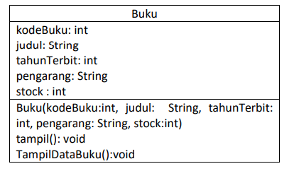

<p>Selanjutnya class diagram PencarianBuku merupakan representasi dari sebuah class yang
berfungsi untuk melakukan operasi-operasi dari objek array Buku, misalkan untuk menambahkan
objek Buku, menampilkan semua data Buku, untuk melakukan pencarian berdasarkan kode Buku
menggunakan algoritma Sequential Search, menampilkan posisi dari data yang dicari, serta
menampilkan data Buku yang dicari.</p>

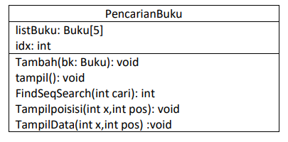

### 6.2.1 Verifikasi Hasil Percobaan

- Code `Buku24.java`

```java
package P7;
public class Buku24 {
    int kodeBuku, tahunTerbit, stock;
    String judulBuku, pengarang;
    public Buku24(int kodeBuku, String judulBuku, int tahunTerbit,String pengarang, int stock) {
        this.kodeBuku = kodeBuku;
        this.judulBuku = judulBuku;
        this.tahunTerbit = tahunTerbit;
        this.pengarang = pengarang;
        this.stock = stock;
    }
    public void tampilDataBuku24(){
        System.out.println("================================");
        System.out.println("Kode Buku : " + kodeBuku);
        System.out.println("Judul Buku : " +judulBuku);
        System.out.println("Tahun Terbit : " + tahunTerbit);
        System.out.println("Pengarang : " + pengarang);
        System.out.println("Stock : " + stock);
    }
}
```

- Code `PencarianBuku24.java`

```java
package P7;

import java.util.Arrays;
import java.util.Comparator;

public class PencarianBuku24 {
    Buku24 listBK[] = new Buku24[5];
    int idx;

    void tambah(Buku24 m){
        if (idx < listBK.length){
            listBK[idx] = m;
            idx++;
        } else {
            System.out.println("Data sudah penuh");
        }
    }

    void tampil(){
        for (int i = 0; i < idx; i++) {
            Buku24 m = listBK[i];
            m.tampilDataBuku24();
        }
    }

    // void tampil(){
    //     for (Buku24 m : listBK[i]){
    //         m.tampilDataBuku24();
    //     }
    // }

    public int FindSeqSearch(int cari){
        int posisi = -1;
        for (int j =0; j < idx; j++){
            if (listBK[j].kodeBuku == cari){
                posisi = j;
                break;
            }
        }
        return posisi;
    }

    public void TampilPosisi(int x, int pos){
        if (pos!=-1){
            System.out.println("Data : " + x + " ditemukan pada indeks " + pos);
        } else {
            System.out.println("Data : " + x + " data tidak dapat ditemukan");
        }
    }

    public void TampilData(int x, int pos){
        if (pos!=-1){
            System.out.println("Kode Buku\t : " + x);
            System.out.println("Judul\t : " + listBK[pos].judulBuku);
            System.out.println("Tahun Terbit\t : " + listBK[pos].tahunTerbit);
            System.out.println("Pengarang\t : " + listBK[pos].pengarang);
            System.out.println("Stock\t : " + listBK[pos].stock);
        } else {
            System.out.println("data " + x + " tidak ditemukan");
        }
    }
```

- Code `BukuMain24.java`

```java
package P7;

import java.util.Scanner;

public class BukuMain24 {
    public static void main(String[] args) {
        Scanner s = new Scanner(System.in);
        Scanner s1 = new Scanner(System.in);
        PencarianBuku24 data = new PencarianBuku24();
        int jumBuku = 5;

        System.out.println("---------------------------------------");
        System.out.println("Masukkan data Buku secara Urut dari Kode Buku Terkecil : ");

        for (int i = 0; i < jumBuku; i++) {
            System.out.println("---------------------------------------");
            System.out.print("Kode Buku \t: ");
            int kodeBuku = s.nextInt();
            System.out.print("Judul buku \t: ");
            String judulBuku = s1.nextLine();
            System.out.print("Tahun Terbit \t: ");
            int tahunTerbit = s.nextInt();
            System.out.print("Pengarang \t: ");
            String pengarang = s1.nextLine();
            System.out.print("Stock \t: ");
            int stock = s.nextInt();

            Buku24 m = new Buku24(kodeBuku, judulBuku, tahunTerbit, pengarang, stock);
            data.tambah(m);
        }
        System.out.println("---------------------------------------");
        System.out.println("Data Keseluruhan Buku : ");
        data.tampil();
        System.out.println("---------------------------------------");
        System.out.println("Pencarian Data : ");
        System.out.println("Masukkan Kode Buku yang dicari : ");
        System.out.print("Kode Buku : ");
        int cari  = s.nextInt();
        System.out.println(" Menggunakan sequential search ");
        int posisi = data.FindSeqSearch(cari);
        data.TampilPosisi(cari, posisi);
        data.TampilData(cari, posisi);
    }
}
```

- `Hasil Percobaan Jika Data Ditemukan`

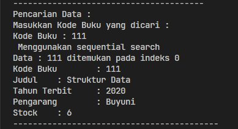

- `Hasil Percobaan Jika Data tidak Ditemukan`

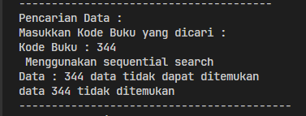

### 6.2.2. Pertanyaan

1. Jelaskan fungsi break yang ada pada method `FindSeqSearch` !<br><br>
   `JAWAB` <br><br>
   Fungsi `break` itu digunakan untuk menghentikan iterasi looping saat nilai `cari` ditemukan<br><br>
2. Jika Data Kode Buku yang dimasukkan tidak terurut dari kecil ke besar. Apakah program masih
   dapat berjalan? Apakah hasil yang dikeluarkan benar? Tunjukkan hasil screenshoot untuk bukti
   dengan kode Buku yang acak. Jelaskan Mengapa hal tersebut bisa terjadi?<br><br>
   `JAWAB`<br><br>
   Iya, data kode yang dimasukkan itu tidak urut dari kecil ke besar, maka program masih dapat dijalankan<br><br>
3. Buat method baru dengan nama FindBuku menggunakan konsep sequential search dengan tipe
   method dari FindBuku adalah BukuNoAbsen. Sehingga Anda bisa memanggil method
   tersebut pada class BukuMain seperti gambar berikut : <br><br>
   `JAWAB` <br><br>
   - Code `PencarianBuku24.java`
   ```java
    public Buku24 FindBuku(int cari){
        for (int j = 0; j < idx; j++) {
            if (listBK[j].kodeBuku == cari){
                return listBK[j];
            }
        }
        return null;
    }
   ```
   - Code `BukuMain24.java`
   ```java
    Buku24 dataBuku = data.FindBuku(cari);
    if (dataBuku != null) {
        dataBuku.tampilDataBuku24();
    }else {
        System.out.println("Buku yang anda cari dengan kode " + cari + " tidak dapat ditemukan");
    }
   ```
   - `Hasil Percobaan`<br>
     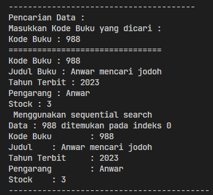

<br><br>

---

## 6.3 Pencarian Menggunakan Binary Search

### 6.3.1 Verifikasi Hasil Percobaan

- Code Penambahan pada `BukuMain24.java`

```java
System.out.printl("------------------------------------------");
System.out.println("Menggunakan Binary Search ");
posisi = data.FindBinarySearch(cari, 0, data.idx - 1);
data.TampilPosisi(cari, posisi);
data.TampilData(cari, posisi);
```

- Code Penambahan pada `PencarianBuku241`

```java
public int FindBinarySearch(int cari, int left, ing right){
    if (right >= left) {
        int mid = left + (right - left) / 2;
        if (listBK[mid].kodeBuku == cari) {
            return mid;
        }
        if (listBK[mid].kodeBuku > cari) {
            return FindBinarySearch(cari, left, mid - 1);
        }
        return FindBinarySearch(cari, mid + 1, right);
    }
    return -1;
}
```

- Code `Hasil Percobaan`

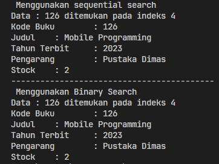

### 6.3.3 Pertanyaan

1. Tunjukkan pada kode program yang mana proses divide dijalankan!<br><br>
   `JAWAB`<br><br>
   ```java
    int mid = left + (right - left) / 2 ;
   ```
2. Tunjukkan pada kode program yang mana proses conquer dijalankan!<br><br>
   `JAWAB`<br><br>
   ```java
    return FindBinarySearch(cari, left, mid - 1);
   ```
   ```java
    return FindBinarySearch(cari, mid + 1, right);
   ```
3. Jika data Kode Buku yang dimasukkan tidak urut. Apakah program masih dapat berjalan? Mengapa
   demikian! Tunjukkan hasil screenshoot untuk bukti dengan kode Buku yang acak. Jelaskan
   Mengapa hal tersebut bisa terjadi?<br><br>
   `JAWAB`<br><br>
   Program tersebut masih dapat dijalankan meskipun data `kodeBuku` tidak diurutkan, Namun untuk metod `FindBinarySearch` itu diharapkan pencarian biner membutuhkan data yang sudah terurut

   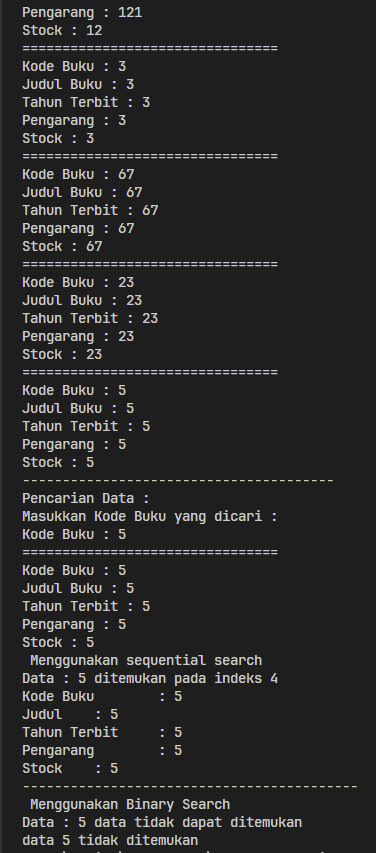

4. Jika Kode Buku yang dimasukkan dari Kode Buku terbesar ke terkecil (missal : 20215, 20214,
   20212, 20211, 20210) dan elemen yang dicari adalah 20210. Bagaimana hasil dari binary search?
   Apakah sesuai? Jika tidak sesuai maka ubahlah kode program binary seach agar hasilnya sesuai!<br><br>
   `JAWAB`<br><br>
   Outputnya tidak sesuai karena data tidak urut, untuk mengatasi hal seperti ini yaitu dengan mengurutkan datanya terlebih dahulu

   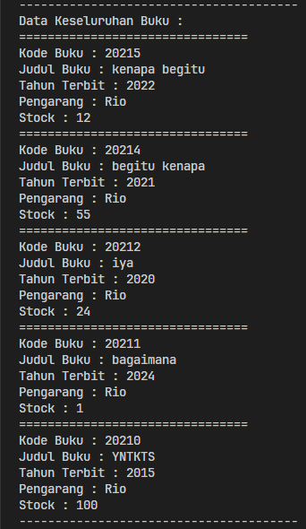
   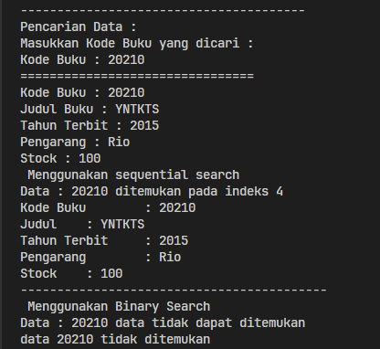

## 6.4 Pengayaan Divide dan Conquer

### 6.4.1 Verifikasi Hasil Percobaan

- Code `MergeSorting24.java`

```java
package P5;

public class MergeSorting24 {
    public void mergeSort(int[] data){
        sort(data, 0, data.length -1);
    }
    public void merge(int[] data, int left, int middle, int right){
        int [] temp = new int [data.length];
        for (int i = left; i <= right; i++){
            temp[i] = data[i];
        }
        int a = left;
        int b= middle + 1;
        int c = left;

        while (a <= middle && b <= right){
            if (temp[a] <= temp[b]){
                data[c] = temp[a];
                a++;
            } else {
                data[c] = temp[b];
                b++;
            }
            c++;
        }
        int s = middle - a;
        for (int i = 0; i <= s; i++) {
            data[c + i] = temp[a + i];
        }
    }

    public void sort(int data[], int left, int right){
        if (left < right){
            int middle = (left + right) / 2;
            sort(data, left, middle);
            sort(data, middle + 1, right);
            merge(data, left, middle, right);
        }
    }

    public void printArray(int arr[]){
        for (int i = 0; i < arr.length; i++){
            System.out.print(arr[i] + " ");
        }
        System.out.println();
    }
}
```

- Code `MergeSortingMain24.java`

```java
package P5;
public class MergeSortMain24 {
    public static void main(String[] args) {
        int data[] = {10,40,30,50,70,20,100,90};
        System.out.println("Sorting menggunakan Merge Sort");
        MergeSorting24 mSort = new MergeSorting24();
        System.out.println("Data awal ");
        mSort.printArray(data);
        mSort.mergeSort(data);
        System.out.println("Setelah Diurutkan");
        mSort.printArray(data);
    }
}
```

- `Hasil Percobaan`<br>
  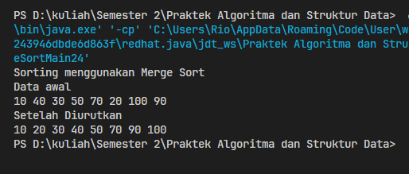

<br><br>

---

## 6.5 Latihan Praktikum

1. Modifikasi percobaan searching diatas dengan ketentuan berikut ini

- Ubah tipe data dari kode Buku yang awalnya int menjadi String

  - Code `Buku24.java`

    ```java
    public class Buku24 {
    String kodeBuku, judulBuku, pengarang;
    int tahunTerbit, stock;

        public Buku24(String kodeBuku, String judulBuku, int tahunTerbit, String pengarang, int stock) {
            this.kodeBuku = kodeBuku;
            this.judulBuku = judulBuku;
            this.tahunTerbit = tahunTerbit;
            this.pengarang = pengarang;
            this.stock = stock;
        }
    }
    ```

- Tambahkan method untuk pencarian kode Buku (bertipe data String) dengan menggunakan
  sequential search dan binary search.

  - Code `PencarianBuku24.java`

    ```java
    public int FindSeqSearch(int cari) {
        int posisi = -1;
        for (int j=0; j<listBk.length; j++) {
            if (Integer.parseInt(listBk[j].kodeBuku)==cari){
                posisi = j;
                break;
            }
        }
        return posisi;
    };

    public int FindBinarySearch(int cari, int left, int right) {
        int mid;
        if (right >= left) {
            mid = left + (right - left) / 2;
            if (cari == Integer.parseInt(listBk[mid].kodeBuku)) {
                return (mid);
            } else if (Integer.parseInt(listBk[mid].kodeBuku) > cari) {
                return FindBinarySearch(cari, left, mid - 1);
            } else {
                return FindBinarySearch(cari, mid + 1, right);
            }
        }
        return -1;
    }
    ```

- `Hasil Percobaan` <br>
  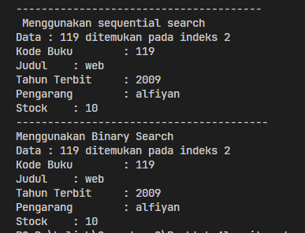
  <br><br>

2. Modifikasi percobaan searching diatas dengan ketentuan berikut ini<br>

   - Tambahkan method pencarian judul buku menggunakan sequential search dan binary
     search. Sebelum dilakukan searching dengan binary search data harus dilakukan pengurutan
     dengan menggunakan algoritma Sorting (bebas pilih algoritma sorting apapun)! Sehingga
     ketika input data acak, maka algoritma searching akan tetap berjalan<br><br>

     - Code `PencarianBuku24.java`

       `Sequential Search`

       ```java
        public int FindSeqSearch(int cari) {
            String cariStr = Integer.toString(cari);
            int posisi = -1;
            for (int j=0; j<idx; j++) {
                if (listBK[j].judulBuku.equalsIgnoreCase(cariStr)){
                    posisi = j;
                    break;
                }
            }
            return posisi;
        };
       ```

       `Binary Search`

       ```java
        public int FindBinarySearch(int cari, int left, int right) {
            String cariStr = Integer.toString(cari);
            int mid;
            if (right >= left) {
                mid = left + (right - left) / 2;
                if ((listBK[mid].judulBuku.equalsIgnoreCase(cariStr))) {
                    return (mid);
                } else if (listBK[mid].judulBuku.compareToIgnoreCase(cariStr) > 0) {
                    return FindBinarySearch(cari, left, mid - 1);
                } else {
                    return FindBinarySearch(cari, mid + 1, right);
                }
            }
            return -1;
        }
       ```

       `Sorting menggunakan Bubble Sort`

       ```java
        void sortBubble(){
            for(int i=0; i<listBK.length-1; i++){
                for(int j=1; j<listBK.length-i; j++){
                    if(listBK[j].judulBuku.length() < listBK[j-1].judulBuku.length()){
                        Buku24 tmp = listBK[j];
                        listBK[j] = listBK[j-1];
                        listBK[j-1] = tmp;
                    }
                }
            }
        }
       ```

   - `Hasil Percobaan`<br>
     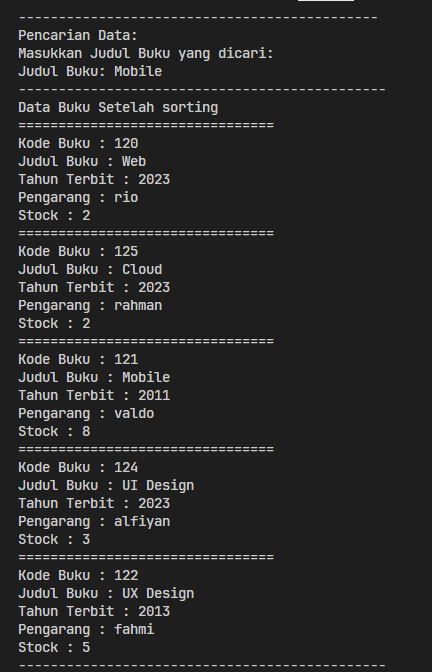
     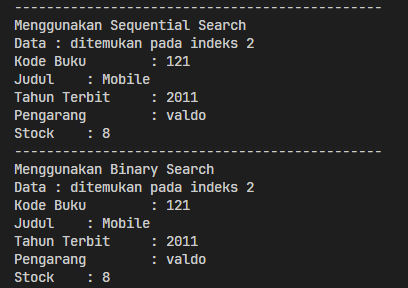

   - Buat aturan untuk mendeteksi hasil pencarian judul buku yang lebih dari 1 hasil dalam
     bentuk kalimat peringatan! Pastikan algoritma yang diterapkan sesuai dengan kasus yang
     diberikan!<br><br>

     - Code `PencarianBuku24.java`

       `Sequential Search`

       ```java
        public int FindJudulSequential(String cari) {
            int posisi = -1;
            jumlahHasil = 0; // Set ulang jumlah hasil
            for (int j = 0; j < listBK.length; j++) {
                if (listBK[j].judulBuku.equalsIgnoreCase(cari)) {
                    posisi = j;
                    jumlahHasil++; // Tambahkan jumlah hasil jika ditemukan
                }
            }
            return posisi;
        };
       ```

       `Binary Search`

       ```java
        public int FindJudulBinary(String cari, int left, int right){
            int mid;
            if (right >= left) {
                mid = left + (right - left) / 2;
                if (listBK[mid].judulBuku.equalsIgnoreCase(cari)) {
                    return (mid);
                } else if (listBK[mid].judulBuku.length() > cari.length()) {
                    return FindJudulBinary(cari, left, mid - 1);
                } else {
                    return FindJudulBinary(cari, mid + 1, right);
                }
            }
            return -1;
        }
       ```

       `Code Hasil Pencarian`

       ```java
        int jumlahHasil = 0;
        public int getJumlahHasil(){
            return jumlahHasil;
        }
       ```

       `Hasil Percobaan`<br>
       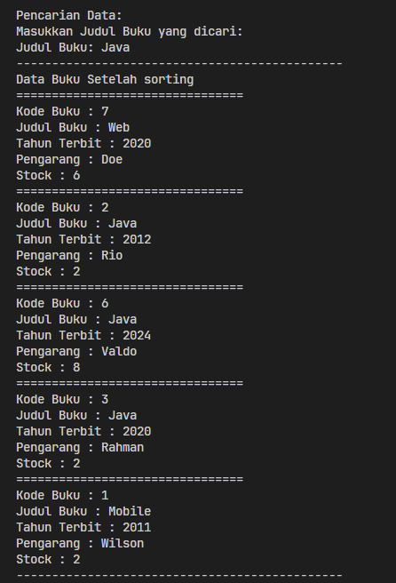
       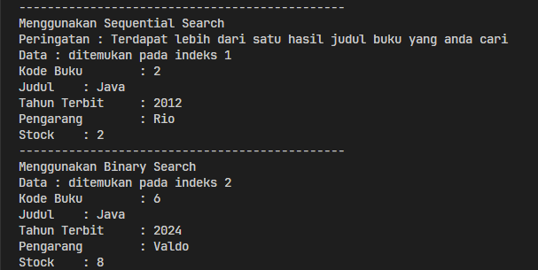
