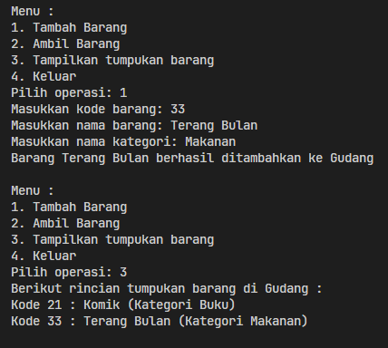

# <p align="center">Pertemuan 8 - Jobsheet 7 Stack </p>

<br><br>

<p align="center">
    
</p>

<br><br>

<p align="center">
    Nama : Riovaldo Alfiyan Fahmi Rahman <br>
    NIM : 2341720209 <br>
    Prodi : D4 Teknik Informatika <br>
    Kelas : TI 1B
</p>

<br><br>

---

## 2.1 Percobaan 1 : Penyimpanan Tumpukan Barang dalam Gudang

### 2.1.2 Verifikasi Hasil Percobaan

- Code `Barang24.java`

  ```java
   package testing;
   public class Barang24 {
       int kode;
       String nama, kategori;

       public Barang24(int kode, String nama, String kategori) {
           this.kode = kode;
           this.nama = nama;
           this.kategori = kategori;
       }
   }
  ```

- Code `Gudang24.java`

  ```java
   package testing;
   public class Gudang24 {
       Barang24[] tumpukan;
       int size;
       int top;

       public Gudang24(int kapasitas){
           size = kapasitas;
           tumpukan = new Barang24[size];
           top = -1;
       }

       // public boolean cekKosong(){
       //     if (top == -1){
       //         return true;
       //     } else {
       //         return false;
       //     }
       // }

       // public boolean cekPenuh(){
       //     if (top == -1){
       //         return true;
       //     } else {
       //         return false;
       //     }
       // }

       public boolean cekKosong(){
           return top < 0;
       }

       public boolean cekPenuh(){
           return top == size - 1;
       }

       public void tambahBarang(Barang24 brg){
           if (!cekPenuh()){
               top++;
               tumpukan[top] = brg;
               System.out.println("Barang " + brg.nama + " berhasil ditambahkan ke Gudang");
           } else {
               System.out.println("Gagal ! Tumpukan barang di gudang sudah penuh");
           }
       }

       public Barang24 ambilBarang(){
           if (!cekKosong()){
               Barang24 delete = tumpukan[top];
               top--;
               System.out.println("Barang " + delete.nama + " diambil dari gudang");
               System.out.println("Kode unik dalam biner : " + konversiDesimalKeBiner(delete.kode));
               return delete;
           } else {
               System.out.println("Tumpukan barang kosong");
               return null;
           }
       }

       public Barang24 lihatBarangTeratas(){
           if (!cekKosong()){
               Barang24 barangTeratas = tumpukan[top];
               System.out.println("Barang teratas : " + barangTeratas.nama );
               return barangTeratas;
           } else {
               System.out.println("Tumpukan barang kosong");
               return null;
           }
       }

       public void tampilkanBarang(){
           if (!cekKosong()){
               System.out.println("Berikut rincian tumpukan barang di Gudang : ");
               for (int i = 0; i <= top; i++){
                   System.out.printf("Kode %d : %s (Kategori %s)\n", tumpukan[i].kode, tumpukan[i].nama, tumpukan[i].kategori);
               }
           }else {
               System.out.println("Tumpukan barang kosong");
           }
       }
   }

  ```

- Code `Utama24.java`

  ```java
   package testing;
   import java.util.Scanner;
   public class Utama24 {
       public static void main(String[] args) {
           Gudang24 gudang = new Gudang24(7);
           Scanner sc = new Scanner(System.in);
           while (true) {
               System.out.println("\nMenu :");
               System.out.println("1. Tambah Barang");
               System.out.println("2. Ambil Barang");
               System.out.println("3. Tampilkan tumpukan barang");
               System.out.println("4. Keluar");
               System.out.print("Pilih operasi: ");
               int pilihan = sc.nextInt();
               sc.nextLine();

               switch (pilihan) {
               case 1:
                   System.out.print("Masukkan kode barang: ");
                   int kode = sc.nextInt();
                   sc.nextLine();
                   System.out.print("Masukkan nama barang: ");
                   String nama = sc.nextLine();
                   System.out.print("Masukkan nama kategori: ");
                   String kategori = sc.nextLine();
                   Barang24 barangBaru = new Barang24(kode, nama, kategori);
                   gudang.tambahBarang(barangBaru);
                   break;
               case 2:
                   gudang.ambilBarang();
                   break;
               case 3:
                   gudang.tampilkanBarang();
                   break;
               case 4:
                   break;
               default:
                   System.out.println("Pilihan anda tidak valid");
               }
           }
       }
   }
  ```

- `Hasil Percobaan`<br>
  
  <br>
  

### 2.1.3. Pertanyaan

1. Lakukan perbaikan pada kode program, sehingga keluaran yang dihasilkan sama dengan verifikasi hasil percobaan! Bagian mana saja yang perlu diperbaiki?<br>
   `JAWAB`<br><br>
   Pada method `tampilBarang` dan pada baris code `for (int i = 0; i <= top; i++)` dirubah menjadi `for (int i = top; i >= 0; i--)`, sehingga output bisa dilakukan menjadi indeks atas ke indeks bawah
   

2. Berapa banyak data barang yang dapat ditampung di dalam tumpukan? Tunjukkan potongan kode programnya!<br>
   `JAWAB`<br><br>
   Jadi data barang yang dapat ditampung di dalam tumpukan adalah 7,

   ```java
    Gudang4 gudang = new Gudang4(7);
   ```

3. Mengapa perlu pengecekan kondisi !cekKosong() pada method tampilkanBarang? Kalau kondisi tersebut dihapus, apa dampaknya?<br>
   `JAWAB`<br><br>
   Kegunaan pengcekkan kondisi pada method `tampilBarang()` dilakukan agar bisa memastikan bahwa hanya mencoba menampilkan barang jika tumpukan kosong, Namun jika pengecekan kondisi tersebut dihapus, maka program akan mencoba melakukan iterasi pada array tumpukan yang kosong yang bisa mengakibatkan output yang tidak sesuai / error

4. Modifikasi kode program pada class Utama sehingga pengguna juga dapat memilih operasi lihat barang teratas, serta dapat secara bebas menentukan kapasitas gudang!<br>
   `JAWAB`<br><br>
   Baris code `Menentukan Kapasitas Gedung`
   ```java
    System.out.print("Masukkan kapasitas gedung : ");
    int kapasitasGedung = sc.nextInt();
    sc.nextLine();
    Gudang24 gudang = new Gudang24(kapasitasGedung);
   ```
   Baris code `Melihat Barang Paling Atas`
   ```java
    case 4:
        if (!gudang.cekKosong()){
            System.out.println("Barang paling atas : " + gudang.tumpukan[gudang.top].nama);
        } else {
            System.out.println("Tumpukan barang di gudang kosong");
        }
   ```
   `Hasil Percobaan`<br>
   

<br><br>

---

## 2.2 Percobaan 2 : Konversi Kode Barang ke Biner

### 2.2.2 Verifikasi Hasil Percobaan

1. Code tambahan `Gudang24.java`

```java
  public String konversiDesimalKeBiner(int kode){
      StackKonversi24 stack = new StackKonversi24();
      while(kode > 0){
          int sisa = kode % 2;
          stack.push(sisa);
          kode = kode / 2;
      }
      String biner = new String();
      while (!stack.isEmpty()){
          biner += stack.pop();
      }
      return biner;
  }

  public Barang24 ambilBarang(){
      if (!cekKosong()){
          Barang24 delete = tumpukan[top];
          top--;
          System.out.println("Barang " + delete.nama + " diambil dari gudang");
          System.out.println("Kode unik dalam biner : " + konversiDesimalKeBiner(delete.kode));
          return delete;
      } else {
          System.out.println("Tumpukan barang kosong");
          return null;
      }
  }
```

2. Code `StackKonversi24.java`

```java
  package testing;
  import java.util.Scanner;
      public class StackKonversi24 {
  int size, top;
  int [] tumpukanBiner;

      public StackKonversi24(){
          this.size = 32;
          tumpukanBiner = new int[size];
          top = -1;
      }

      public boolean isEmpty(){
          return top == -1;
      }

      public boolean isFull(){
          return top == size -1;
      }

      public void push(int data){
          if (isFull()){
              System.out.println("Stack sudah penuh");
          } else {
              top++;
              tumpukanBiner[top] = data;
          }
      }

      public int pop(){
          if (isEmpty()){
              System.out.println("Stack kosong");
              return -1;
          } else {
              int data = tumpukanBiner[top];
              top--;
              return data;
          }
      }
  }
```

3. `Hasil Percobaan`<br>
   
   <br>

### 2.2.3. Pertanyaan

1. Pada method konversiDesimalKeBiner, ubah kondisi perulangan menjadi while (kode != 0), bagaimana hasilnya? Jelaskan alasannya! <br>
   `JAWAB` <br><br>
   Jika merubah kondisi perulangan manjadi `while (kode != 0)`,akan menyebabkan perulangan berhenti ketika nilai `kode` sudah tidak menjadi lebih besar dari 0, yang dimana perulangan akan terus berjalan sampai kode mencapai 0<br><br>
   - Baris Code menggunakan `while (kode > 0)`<br>
     
   - Baris Code menggunakan `while (kode != 0)`<br>
     <br>
2. Jelaskan alur kerja dari method konversiDesimalKeBiner!<br>
   `JAWAB`<br><br>
   Jadi metod ini mengonversi bilangan desimal menjadi representasi binernya dengan cara melakukan pembagian berulang dan menyimpan sisa pembagian dalam stack, kemudia program membaca sisa-sisa tersebut dari stack untuk membentuk representasi biner

<br><br>

---

## 2.3 Percobaan 3 : Konversi Notasi Infix ke Postfix

### 2.3.2 Verifikasi Hasil Percobaan

- Code `Postfix24.java`

```java
package testing;
public class Postfix24 {
    int n, top;
    char[] stack;

    public Postfix24(int total){
        n = total;
        top = -1;
        stack = new char[n];
        push('(');
    }

    public void push(char c){
        top++;
        stack[top] = c;
    }

    public char pop(){
        char item = stack[top];
        top--;
        return item;
    }

    public boolean IsOperand(char c){
        if ((c >= 'A' && c <= 'Z') || (c >= 'a' && c <= 'z' ) || (c >= '0' && c <= '9') || c == ' ' || c == '.' ) {
            return true;
        } else {
            return false;
        }
    }

    public boolean IsOperator(char c){
        return (c == '^' || c == '%' || c == '/' || c == '*' || c == '-' || c == '+');
    }

    public int derajat(char c){
        switch (c) {
            case '^':
                return 3;
            case '%':
                return 2;
            case '/':
                return 2;
            case '*':
                return 2;
            case '-':
                return 1;
            case '+':
                return 1;
            default:
                return 0;
        }
    }

    public String konversi (String Q){
        StringBuilder p = new StringBuilder();
        char c;
        for (int i = 0; i < n; i++){
            c = Q.charAt(i);
            if (IsOperand(c)){
                p.append(c);
            }
            if (c == '('){
                push(c);
            }
            if (c == ')'){
                while (stack[top] != '(') {
                    p.append(pop());
                }
                pop();
            }
            if (IsOperator(c)){
                while (derajat(stack[top]) >= derajat(c)) {
                    p.append(pop());
                }
                push(c);
            }
        }
        return p.toString();
    }
}
```

- Code `PostfixMain24.java`

```java
package testing;
import java.util.Scanner;

public class PostfixMain24 {
    public static void main(String[] args) {
        Scanner sc = new Scanner(System.in);
        String P, Q;
        System.out.print("Masukkan ekspresi matematika : ");
        Q = sc.nextLine();
        Q = Q.trim();
        Q = Q + ")";
        int total = Q.length();
        Postfix24 post = new Postfix24(total);
        P = post.konversi(Q);
        System.out.println("Postfix : " + P);
    }
}
```

- `Hasil Percobaan`<br>
  

### 2.3.3. Pertanyaan

1. Pada method derajat, mengapa return value beberapa case bernilai sama? Apabila return value diubah dengan nilai berbeda-beda setiap case-nya, apa yang terjadi?<br>
   `JAWAB`<br><br>
   Jadi alasan mengapa return value dibeberapa case bernilai sama
   dikarenakan beberapa operator memiliki prioritas yang sama dalam urutan operasi matematika, seperti `operator perkalian` \*, `pembagian` /, dan `modulus` % memiliki prioritas yang sama sehingga semuanya mengembalikan nilai 2, untuk `penjumlahan` + dan `pengurangan` -, keduanya memiliki prioritas yang sama dengan mengembalikan nilai 1. <br><br>Namun apabila mengubah return value agar setiap case memiliki nilai yang berbeda, maka urutan operasi dalam eskpresi matematika akan berubah. Misalnya, jika kita mengubah return value untuk setiap operator sehingga setiap operator memiliki prioritas yang unik, maka urutan operasi dalam ekspresi matematika akan mengikuti prioritas tersebut. Ini akan mempengaruhi hasil perhitungan dari ekspresi yang menggunakan operator-operator tersebut.

2. Jelaskan alur kerja method konversi!<br>
   `JAWAB`<br><br>

   - Inisialisasi sebuah StringBuilder p yang akan menyimpan ekspresi postfix.
   - Dilakukan iterasi melalui setiap karakter dalam ekspresi infix Q.

     - Untuk setiap karakter c dalam ekspresi infix:
       - Jika c adalah operand (bilangan), maka langsung tambahkan karakter tersebut ke dalam p. - Jika c adalah tanda kurung buka (, maka masukkan ( ke dalam stack.
       - Jika c adalah tanda kurung tutup ), maka lakukan pengulangan sampai menemukan tanda kurung buka (. Selama melakukan pengulangan, pop operator dari stack dan tambahkan ke dalam p sampai menemukan tanda kurung buka, kemudian pop tanda kurung buka tersebut dari stack.
       - Jika c adalah operator, maka lakukan langkah berikut:
         - Selama prioritas operator di stack lebih besar atau sama dengan prioritas operator c, pop operator dari stack dan tambahkan ke dalam p.
         - Setelah selesai perulangan, masukkan operator c ke dalam stack.

   - Setelah selesai iterasi, jika masih ada operator di dalam stack, pop semua operator dari stack dan tambahkan ke dalam p.
   - Kemudian kembalikan hasil konversi dalam bentuk String yang merupakan ekspresi postfix.

3. Pada method konversi, apa fungsi dari potongan kode berikut?<br>
   `JAWAB` <br><br>
   Pada potongan kode
   ```java
   c = Q.charAt(i);
   ```
   Berfungsi untuk mengambil karakter pada posisi indeks `i` dari String `Q` yang merupakan ekspresi infinix yang akan dikonversi menjadi postfix

<br><br>

---

## 2.4 Latihan Praktikum

Perhatikan dan gunakan kembali kode program pada Percobaan 1. Tambahkan dua method berikut
pada class Gudang:

- Method `lihatBarangTerbawah` digunakan untuk mengecek barang pada tumpukan terbawah
- Method `cariBarang` digunakan untuk mencari ada atau tidaknya barang berdasarkan kode
  barangnya atau nama barangnya

### 2.4.2 Verifikasi Hasil Percobaan

- Code tambahan `Gudang24.java`

  ```java
    // Latihan Praktikum
    public void lihatBarangBawah(){
        if(!cekKosong()){
            System.out.println("Barang Terbawah : " + tumpukan[0].nama);
        } else {
            System.out.println("Tumpukan barang kosong");
        }
    }

    public void mencariBarang(String keyword){
        boolean ditemukan = false;
        if (!cekKosong()){
            for (int i = 0; i <= top; i++){
                if(tumpukan[i].nama.equalsIgnoreCase(keyword) || tumpukan[i].kode == Integer.parseInt(keyword)){
                    System.out.println("Barang yang anda cari ditemukan");
                    System.out.printf("Kode : %d, Nama : %s, Kategori : %s\n", tumpukan[i].kode, tumpukan[i].nama, tumpukan[i].kategori);
                    ditemukan = true;
                    break;
                }
            }
        }
        if(!ditemukan){
            System.out.println("Barang yang anda cari tidak ditemukan");
        }
    }
  ```

- Code tambahan `Utama24.java`

  ```java
    case 5:
        gudang.lihatBarangBawah();
        break;
    case 6:
        System.out.print("Input kode barang atau nama barang yang ingin anda cari : ");
        String keyword = sc.nextLine();
        gudang.mencariBarang(keyword);
        break;
  ```

- `Hasil Percobaan`<br>
  <br>
  
