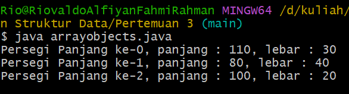
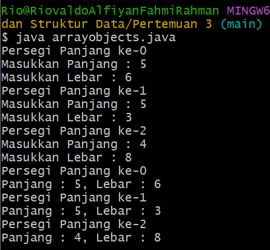
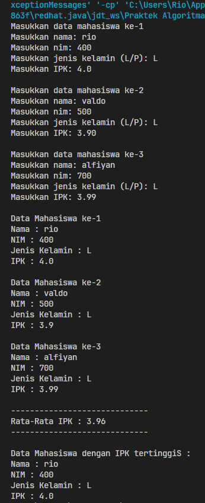

# <p align="center">Pertemuan 3 - Jobsheet 3 Array Of Objek</p>

<br><br>

<p align="center">
    
</p>

<br><br>

<p align="center">
    Nama : Riovaldo Alfiyan Fahmi Rahman <br>
    NIM : 2341720209 <br>
    Prodi : D4 Teknik Informatika <br>
    Kelas : TI 1B
</p>

<br><br>

---

## 3.2 Percobaan 1 : Membuat Array dari Object, mengisi dan menampilkan

### Code `ArrayObjects.java`

```java
    public class ArrayObjects {
        public static void main(String[] args) {
            PersegiPanjang[] ppArray = new PersegiPanjang[3];

            ppArray[0] = new PersegiPanjang();
            ppArray[0].panjang = 110;
            ppArray[0].lebar = 30;

            ppArray[1] = new PersegiPanjang();
            ppArray[1].panjang = 80;
            ppArray[1].lebar = 40;

            ppArray[2] = new PersegiPanjang();
            ppArray[2].panjang = 100;
            ppArray[2].lebar = 20;

            System.out.println("Persegi Panjang ke-0, panjang: " + ppArray[0].panjang + ", lebar: " + ppArray[0].lebar);
            System.out.println("Persegi Panjang ke-1, panjang: " + ppArray[1].panjang + ", lebar: " + ppArray[1].lebar);
            System.out.println("Persegi Panjang ke-2, panjang: " + ppArray[2].panjang + ", lebar: " + ppArray[2].lebar);
        }
    }
```

### Code `PersegiPanjang,java`

```java
package Pertemuan3;
public class PersegiPanjang {
    public int panjang;
    public int lebar;
}
```

### Verifikasi Hasil Program

 <br>

### Pertanyaan

1. Berdasarkan uji coba 3.2, apakah class yang akan dibuat array of object harus selalu memiliki
   atribut dan sekaligus method?Jelaskan!

   `Jawab : `

   Menurut saya tidak, karena class yang akan dibuat sebagai `array of object` tidak harus memiliki atribut dan juga method, seperti pada uji coba 3.2 class `ArrayObjects` memiliki atribut `panjang` dan `lebar`, namun tidak memiliki method.<br><br>

2. Apakah class PersegiPanjang memiliki konstruktor?Jika tidak, kenapa dilakukan pemanggilan
   konstruktur pada baris program berikut :

   ```java
    ppArray[1] = new ArrayObjects();
   ```

   `Jawab : `

   Menurut saya Ya, alasannya karena `ArrayObjects` memiliki `konstruktor` default, jadi pada baris program `ppArray[1] = new ArrayObjects();`, itu memanggiil konstruktor default untuk membuat objek baru dari class `ArrayObjects`.<br><br>

3. Apa yang dimaksud dengan kode berikut ini:

   ```java
    ArrayObjects[] ppArray = new ArrayObjects[3];
   ```

   `Jawab : `

   Pada baris kode diatas tersebut `mendeklarasikan` dan `menginisialisasi` sebuah array dari objek-objek `ArrayObjects` dengan panjang `3`.<br><br>

4. Apa yang dimaksud dengan kode berikut ini:

   ```java
    ppArray[1] = new ArrayObjects();
    ppArray[1].panjang = 80;
    ppArray[1].lebar = 40;
   ```

   `Jawab : `

   1. `ppArray[1] = new ArrayObjects();`, kode ini berguna untuk membuat sebuah objek baru dari class `ArrayObjects` yang menggunakan konstruktor default. Dengan kata lain, kode tersebut `menginisialisasi`elemen kedua dari array `ppArray` dengan sebuah objek baru dari class `ArrayObjects`. <br><br>
   2. `ppArray[1].panjang = 80;`, pada kode ini bertujuan untuk mengakses objek yang telah dibuat pada indeks ke-1 dari array `ppArray` dan menetapkan nilai 80 ke atribut `panjang` dari objek tersebut. Dengan kata lain, objek Persegi Panjang yang berada indeks -1 dari array `ppArray` memiliki panjang 80.<br><br>
   3. `ppArray[1].lebar = 40;`, pada kode ini juga hampir sama seperti diatas untuk mengakses objek yang telah dibuat pada indeks ke-1 dari array `ppArray` dan menetapkan nilai 40 ke atribut `lebar` dari objek. Dengan kata lain, objek Persegi Panjang yang berada pada indeks ke-1 dari array `ppArray` memiliki lebar 40.

   - Jadi yang dimaksud dari kode diatas merupakan inisialiasi array dan juga untuk mengisi atribut<br><br>

5. Mengapa class main dan juga class PersegiPanjang dipisahkan pada uji coba 3.2?

   `Jawab : `

   Pemisahan class `PersegiPanjang.java` dan `ArrayObjects.java` ke dalam dua file terpisah untuk meningkatkan keterbacaan kode secara mudah, dan skalabilitas kode.

<br><br>

---

## 3.3 Percobaan 2 : Menerima Input isian Array Menggunakan Looping

### Code `ArrayObjects.java`

```java
    import java.util.Scanner;
        public class ArrayObjects {
            public int panjang,lebar;
            public static void main(String[] args) {
                Scanner sc = new Scanner(System.in);
                ArrayObjects[] ppArray = new ArrayObjects[3];
                for(int i = 0; i < 3; i++){
                    ppArray[i] = new ArrayObjects();
                    System.out.println("Persegi Panjang ke-" + i);
                    System.out.print("Masukkan Panjang : ");
                    ppArray[i].panjang = sc.nextInt();
                    System.out.print("Masukkan Lebar : ");
                    ppArray[i].lebar = sc.nextInt();
                }
                for(int i = 0; i < 3; i++){
                    System.out.println("Persegi Panjang ke-" + i);
                    System.out.println("Panjang : " + ppArray[i].panjang + ", Lebar : " + ppArray[i].lebar);
                }
            }
        }
```

### Verifikasi Hasil Program

 <br>

### Pertanyaan

1.  Apakah array of object dapat diimplementasikan pada array 2 Dimensi?

    `Jawab : `

    Ya, `Array of Objects` bisa kita implementasikan pada array 2 dimensi, dan juga kita dapat membuat array 2 dimensi yang dimana setiap elemen array itu adalah objek dari suatau class.<br><br>

2.  Jika jawaban soal no satu iya, berikan contohnya! Jika tidak, jelaskan!

    `Jawab : `

    Contoh kode `Array of Objects` yang menggunakan array 2 dimensi seperti dibawah ini

    ```java
    import java.util.Scanner;
    public class ArrayObjects {
        public static void main(String[] args) {
        Scanner sc = new Scanner(System.in);
        PersegiPanjang[][] ppArray = new PersegiPanjang[2][2];
            for(int i=0; i<ppArray.length; i++) {
                for(int j=0; j<ppArray[i].length; j++) {
                    ppArray[i][j] = new PersegiPanjang();
                    System.out.println("Persegi panjang baris ke-" + i + ", kolom ke-" + j);
                    System.out.print("Masukkan panjang: ");
                    ppArray[i][j].panjang = sc.nextInt();
                    System.out.print("Masukkan lebar: ");
                    ppArray[i][j].lebar = sc.nextInt();
                }
            }

            for(int i=0; i<ppArray.length; i++) {
                for(int j=0; j<ppArray[i].length; j++) {
                    System.out.println("Persegi panjang baris ke-" + i + ", kolom ke-" + j);
                    System.out.println("Panjang: " + ppArray[i][j].panjang + ", Lebar: " + ppArray[i][j].lebar);
                }
            }
        }
    }

    ```

    <br><br>

3.  Jika diketahui terdapat class Persegi yang memiliki atribut sisi bertipe integer, maka kode
    dibawah ini akan memunculkan error saat dijalankan. Mengapa?

    ```java
     Persegi[] pgArray = new Persegi[100];
     pgArray[5].sisi = 20;
    ```

    `Jawab : `

    Dikarenakan pada kode tersebut membuat array dari objek `Persegi` menggunakan operator `new`, dan juga kita tidak dapat `menginisialisasi` setiap elemen array pada objek `Persegi` secara eksplisit. Pada kode tersebut mencoba mengakses atribut `sisi` dari objek yang tidak ada karena nilanya `null`, dan akan menyebabkan munculnya error `NullPointerException`.<br><br>

4.  Modifikasi kode program pada praktikum 3.3 agar length array menjadi inputan dengan Scanner!
    `Jawab : `

    ```java
     package Pertemuan3;
     import java.util.Scanner;
     public class ArrayObjects {
         public int panjang,lebar;
         public static void main(String[] args) {
             Scanner sc = new Scanner(System.in);

             // Kode untuk input jumlah yang diingin kan Persegi Panjang
             System.out.print("Masukkan jumlah Persegi Panjang : ");
             PersegiPanjang[] ppArray = new PersegiPanjang[sc.nextInt()];

             for(int i = 0; i < 3; i++){
                 ppArray[i] = new PersegiPanjang();
                 System.out.println("Persegi Panjang ke-" + i);
                 System.out.print("Masukkan Panjang : ");
                 ppArray[i].panjang = sc.nextInt();
                 System.out.print("Masukkan Lebar : ");
                 ppArray[i].lebar = sc.nextInt();
             }
             for(int i = 0; i < 3; i++){
                 System.out.println("Persegi Panjang ke-" + i);
                 System.out.println("Panjang : " + ppArray[i].panjang + ", Lebar : " + ppArray[i].lebar);
             }
         }
     }
    ```

    <br><br>

5.  Apakah boleh Jika terjadi duplikasi instansiasi array of objek, misalkan saja instansiasi dilakukan
    pada `ppArray[i]` sekaligus `ppArray[0]` ?Jelaskan !

    `Jawab : `

    Duplikasi instansisasi pada `Array of objects` biasanya tidak akan menghasilkan duplikasi pada objek itu sendiri namun dapat menimbulkan banyak referensi ke objek yang sama, Dalam kasus ini juga instasiasi array objek dengan kita melakukan `ppArray[i] = ppArray[0]`, itu akan membuat `ppArray[i]` menunjuk ke objek yang sama yang ditunjuk oleh `ppArray[0]`, begitu juga tidak akan menciptakan objek baru, tetapi hanya menghasilkan lebih banyak referensi ke objek yang sama di dalam array dan duplikasi instansiasi tidak dianjurkan.

    <br><br>

---

## 3.4 Percobaan 3 : Penambahan Operasi Matematika di Dalam Method

### Code `ArrayBalok.java`

```java
    package Pertemuan3;
        public class ArrayBalok {
            public static void main(String[] args) {
                Balok[] blArray = new Balok[3];

                blArray[0] = new Balok(100, 30, 12);
                blArray[1] = new Balok(120, 40, 15);
                blArray[2] = new Balok(210, 50, 25);

                for(int i=0; i<3; i++) {
                    System.out.println("Volume balok ke " + i + ": " + blArray[i].hitungVolume());
                }
            }
        }
```

### Code `Balok.java`

```java
    package Pertemuan3;
        public class Balok {
            public int panjang;
            public int lebar;
            public int tinggi;

            public Balok(){

            }

            public Balok(int p, int l, int t) {
                panjang = p;
                lebar = l;
                tinggi = t;
            }

            public int hitungVolume() {
                return panjang * lebar * tinggi;
            }
        }
```

### Verifikasi Hasil Program

 <br>

### Pertanyaan

1. Dapatkah konstruktor berjumlah lebih dalam satu kelas? Jelaskan dengan contoh!

   `Jawab : `

   Ya bisa, di dalam sebuah class, kita bisa memiliki lebih dari satu konstruktor yang berjumlah lebih dari 1, dan pada metode khusus yang didalam sebuah class memiliki nama yang sama dengan nama class dan tidak bisa memiliki tipe kembalian / return, biasanya digunakan untuk menginisialiasi objek saat objek dibuat

   ```java
    public class Mobil {
       private String merek;
       private String model;
       private int tahun;

       // Konstruktor pertama tidak menggunakan parameter
       public Mobil() {
           merek = "Unknown";
           model = "Unknown";
           tahun = 0;
       }

       // Konstruktor kedua menggunakan parameter merek dan model
       public Mobil(String merek, String model) {
           this.merek = merek;
           this.model = model;
           tahun = 0;
       }

       // Konstruktor ketiga menggunakan parameter lebih lengkap merek, model, tahun
       public Mobil(String merek, String model, int tahun) {
           this.merek = merek;
           this.model = model;
           this.tahun = tahun;
       }

       // Kdde dibawah ini berfungsi untuk menampilkan informasi mobil
       public void tampilkanInfo() {
           System.out.println("Mobil: " + merek + " " + model + " tahun " + tahun);
       }

       public static void main(String[] args) {
           Mobil mobil1 = new Mobil(); // baris kode ini menggunakan konstruktor pertama
           mobil1.tampilkanInfo();

           Mobil mobil2 = new Mobil("Nissan", "R34"); // baris kode ini menggunakan konstruktor kedua
           mobil2.tampilkanInfo();

           Mobil mobil3 = new Mobil("Toyota", "Fortuner", 2024); // baris kode ini menggunakan konstruktor ketiga
           mobil3.tampilkanInfo();
       }
   }
   ```

   <br><br>

2. Jika diketahui terdapat class Segitiga seperti berikut ini:

   ```java
    public class Segitiga{
        public int alas;
        public int tinggi;
    }
   ```

   Tambahkan konstruktor pada class Segitiga tersebut yang berisi parameter int a, int t
   yang masing-masing digunakan untuk mengisikan atribut alas dan tinggi.

   `Jawab : `

   ```java
    public class Segitiga{
        public int alas;
        public int tinggi;

        public Segitiga(int a, int t){
            this.alas= a;
            this.tinggi= t;
        }
    }
   ```

   <br><br>

3. Tambahkan method `hitungLuas()` dan `hitungKeliling()` pada class `Segitiga`
   tersebut. `Asumsi segitiga adalah segitiga siku-siku`. (Hint: Anda dapat menggunakan bantuan
   library Math pada Java untuk mengkalkulasi sisi miring)

   `Jawab : `

   ```java
    public class Segitiga{
        public int alas;
        public int tinggi;

        public Segitiga(int a, int t){
            this.alas= a;
            this.tinggi= t;
        }

        public double hitungLuas(){
            return 0.5 * alas * tinggi;
        }

        public double hitungKeliling(){
            double sisiMiring = Math.sqrt(alas * alas + tinggi * tinggi);
            return alas + tinggi + sisiMiring;
        }

        public static void main(String[] args){
            Segitiga alasTinggi = new Segitiga(5,8);
            System.out.println("Luas Segitiga : " + alasTinggi.hitungLuas());
            System.out.println("Keliling Segitiga : " + alasTinggi.hitungKeliling());
        }
    }
   ```

   <br><br>

4. Pada fungsi main, buat array Segitiga sgArray yang berisi 4 elemen, isikan masing-masing
   atributnya sebagai berikut:

   ```
    sgArray ke-0     alas: 10, tinggi: 4
    sgArray ke-1     alas: 20, tinggi: 10
    sgArray ke-2     alas: 15, tinggi: 6
    sgArray ke-3     alas: 25, tinggi: 10
   ```

   `Jawab : `

   ```java
    public class Segitiga{
        public int alas;
        public int tinggi;

        public Segitiga(int a, int t){
            this.alas= a;
            this.tinggi= t;
        }

        public double hitungLuas(){
            return 0.5 * alas * tinggi;
        }

        public double hitungKeliling(){
            double sisiMiring = Math.sqrt(alas * alas + tinggi * tinggi);
            return alas + tinggi + sisiMiring;
        }

        public static void main(String[] args){
            Segitiga[] sgArray = new Segitiga[4];
            sgArray[0] = new Segitiga(10, 4);
            sgArray[1] = new Segitiga(20, 10);
            sgArray[2] = new Segitiga(15, 6);
            sgArray[3] = new Segitiga(25, 10);
            for (int i = 0; i < sgArray.length; i++){
                System.out.println("sgArray ke-" + "Luas : " + sgArray[i].hitungLuas());
                System.out.println("sgArray ke-" + "Keliling : " + sgArray[i].hitungKeliling());
            }
        }
    }
   ```

   <br><br>

5. Kemudian menggunakan looping, cetak luas dan keliling dengan cara memanggil method
   `hitungLuas()` dan `hitungKeliling()`.

   `Jawab : `

   ```java
    public class Segitiga{
        public int alas;
        public int tinggi;

        public Segitiga(int a, int t){
            this.alas= a;
            this.tinggi= t;
        }

        public double hitungLuas(){
            return 0.5 * alas * tinggi;
        }

        public double hitungKeliling(){
            double sisiMiring = Math.sqrt(alas * alas + tinggi * tinggi);
            return alas + tinggi + sisiMiring;
        }

        public static void main(String[] args){
            Segitiga[] sgArray = new Segitiga[4];
            sgArray[0] = new Segitiga(10, 4);
            sgArray[1] = new Segitiga(20, 10);
            sgArray[2] = new Segitiga(15, 6);
            sgArray[3] = new Segitiga(25, 10);
            for (int i = 0; i < sgArray.length; i++){
                System.out.println("sgArray ke-" + i + " Luas : " + sgArray[i].hitungLuas());
                System.out.println("sgArray ke-" + i + " Keliling : " + sgArray[i].hitungKeliling());
            }
        }
    }
   ```

   <br><br>

---

## 3.5 Latihan Praktikum

1. Buatlah program yang dapat menghitung luas permukaan dan volume bangun ruang kerucut,
   limas segi empat sama sisi, dan bola. Buatlah 3 (tiga) class sesuai dengan jumlah jenis bangun
   ruang. Buatlah satu main class untuk membuat array of objects yang menginputkan atributatribut yang ada menggunakan konstruktor semua bangun ruang tersebut. Dengan ketentuan,

   - a. Buat looping untuk menginputkan masing-masing atributnya, kemudian tampilkan
     luas permukaan dan volume dari tiap jenis bangun ruang tersebut.
   - b. Pada kerucut, inputan untuk atribut hanya jari-jari dan sisi miring
   - c. Pada limas segi empat sama sisi, inputan untuk atribut hanya panjang sisi alas dan
     tinggi limas
   - d. Pada bola, inpuntan untuk atribut hanya jari-jari

   ### Code `Kerucut.java`

   ```java
   package Pertemuan3;
   import java.lang.Math;
   public class Kerucut {
       public int jarijari, sisiMiringKerucut;

       public double hitungLuasPermukaan(){
           return Math.PI * jarijari * (jarijari + sisiMiringKerucut);
       }

       public double hitungVolume(){
           return (1.0 / 3) * Math.PI * jarijari * jarijari * sisiMiringKerucut;
       }
   }

   ```

   ### Code `LimasSegiEmpat.java`

   ```java
   package Pertemuan3;
   public class LimasSegiEmpat {
       public int panjangSisiAlas, tinggiLimas;

       public double hitungLuasPermukaan() {
           return (panjangSisiAlas * panjangSisiAlas) + (4 * 0.5 * panjangSisiAlas * tinggiLimas);
       }

       public double hitungVolume() {
           return (1.0 / 3) * (panjangSisiAlas * panjangSisiAlas) * tinggiLimas;
       }
   }
   ```

   ### Code `Bola.java`

   ```java
   package Pertemuan3;
   import java.lang.Math;
   public class Bola {
       public int jarijari;
       public double hitungLuasPermukaan(){
           return 4 * Math.PI * jarijari * jarijari;
       }

       public double hitungVolume(){
           return (4.0 / 3) * Math.PI * jarijari * jarijari;
       }
   }
   ```

   ### Code `MenghitungObjek.java`

   ```java
   package Pertemuan3;
   import java.text.DecimalFormat;
   import java.util.Scanner;
    public class MenghitungObjek {
        public static void main(String[] args) {
        Scanner sc = new Scanner(System.in);
        DecimalFormat df = new DecimalFormat("#.##");

                System.out.println("==============================");
                System.out.print("Masukkan Value Kerucut: ");

                Kerucut[] krArray = new Kerucut[sc.nextInt()];

                for(int i=0; i<krArray.length; i++) {

                    krArray[i] = new Kerucut();
                    System.out.println("\nKerucut ke-" + (i+1));
                    System.out.print("Masukkan jari jari: ");
                    krArray[i].jarijari = sc.nextInt();
                    System.out.print("Masukkan sisi miring: ");
                    krArray[i].sisiMiringKerucut = sc.nextInt();

                }

                System.out.println("==============================");

                System.out.print("\nMasukkan Value Limas Segi Empat: ");
                LimasSegiEmpat[] lseArray = new LimasSegiEmpat[sc.nextInt()];

                for(int i=0; i<lseArray.length; i++) {

                    lseArray[i] = new LimasSegiEmpat();
                    System.out.println("\nLimas Segi Empat ke-" + (i+1));
                    System.out.print("Masukkan sisi alas: ");
                    lseArray[i].panjangSisiAlas = sc.nextInt();
                    System.out.print("Masukkan tinggi limas: ");
                    lseArray[i].tinggiLimas = sc.nextInt();

                }

                System.out.println("==============================");

                System.out.print("\nMasukkan Value Bola: ");
                Bola[] blArray = new Bola[sc.nextInt()];

                for(int i=0; i<blArray.length; i++) {

                    blArray[i] = new Bola();
                    System.out.println("\nBola ke-" + (i+1));
                    System.out.print("Masukkan jari jari: ");
                    blArray[i].jarijari = sc.nextInt();

                }

                System.out.println("==============================");

                for(int i=0; i<krArray.length; i++) {
                    System.out.println("\nKerucut ke-" + (i+1));
                    System.out.println("Luas Permukaan: " + df.format(krArray[i].hitungLuasPermukaan()) + ", Volume: " + df.format(krArray[i].hitungVolume()));
                }

                for(int i=0; i<lseArray.length; i++) {
                    System.out.println("\nLimas Segi Empat ke-" + (i+1));
                    System.out.println("Luas Permukaan: " + df.format(lseArray[i].hitungLuasPermukaan()) + ", Volume: " + df.format(lseArray[i].hitungVolume()));
                }

                for(int i=0; i<blArray.length; i++) {
                    System.out.println("\nBola ke-" + (i+1));
                    System.out.println("Luas Permukaan: " + df.format(blArray[i].hitungLuasPermukaan()) + ", Volume: " + df.format(blArray[i].hitungVolume()));
                }

                sc.close();
            }
    }
   ```

   ### Verifikasi Hasil Program

    <br>

   <br><br>

2. Sebuah kampus membutuhkan program untuk menampilkan informasi mahasiswa berupa nama,
   nim, jenis kelamin dan juga IPK mahasiswa. Program dapat menerima input semua informasi
   tersebut, kemudian menampilkanya kembali ke user. Implementasikan program tersebut jika
   dimisalkan terdapat 3 data mahasiswa yang tersedia. Contoh output program: <br>

   ```
    Masukkan data mahasiswa ke- 1
    Masukkan nama :Rina
    Masukkan nim :1234567
    Masukkan jenis kelamin :P
    Masukkan IPK :3.5
    Masukkan data mahasiswa ke- 2
    Masukkan nama :Rio
    Masukkan nim :7654321
    Masukkan jenis kelamin :L
    Masukkan IPK :4.0
    Masukkan data mahasiswa ke- 3
    Masukkan nama :Reza
    Masukkan nim :8765398
    Masukkan jenis kelamin :L
    Masukkan IPK :3.8
    Data Mahasiswa ke-1
    nama : Rina
    nim : 1234567
    Jenis kelamin : P
    Nilai IPK : 3.5
    Data Mahasiswa ke-2
    nama : Rio
    nim : 7654321
    Jenis kelamin : L
    Nilai IPK : 4.0
    Data Mahasiswa ke-3
    nama : Reza
    nim : 8765398
    Jenis kelamin : L
    Nilai IPK : 3.8

   ```

   ### Code `mhs.java`

   ```java
    package Pertemuan3;
    public class mhs {
        String nama,nim;
        char jenisKelamin;
        double ipk;

        public mhs(){

        }
    }

   ```

   ### Code `mhsMain.java`

   ```java
    package Pertemuan3;
    import java.util.Scanner;
    public class mhsMain {
        public static void main(String[] args) {
            Scanner scanner = new Scanner (System.in);

            mhs[] mahasiswa = new mhs[3];

            // Kode dibawah adalah input value data mahasiswa
            for (int i = 0; i < 3; i++){
                mahasiswa[i] = new mhs();
                System.out.println("Masukkan data mahasiswa ke-" + (i + 1));
                System.out.print("Masukkan nama: ");
                mahasiswa[i].nama = scanner.nextLine();
                System.out.print("Masukkan nim: ");
                mahasiswa[i].nim = scanner.nextLine();
                System.out.print("Masukkan jenis kelamin (L/P): ");
                mahasiswa[i].jenisKelamin = scanner.next().charAt(0);
                scanner.nextLine();
                System.out.print("Masukkan IPK: ");
                mahasiswa[i].ipk = scanner.nextDouble();
                scanner.nextLine();
            }

            // Kode dibawah akan menampilkan informasi input value dari kode diatas
            for (int i = 0; i < 3; i++){
                System.out.println("Data Mahasiswa ke-" + (i + 1));
                System.out.println("Nama : " + mahasiswa[i].nama);
                System.out.println("NIM : " + mahasiswa[i].nim);
                System.out.println("Jenis Kelamin : " + mahasiswa[i].jenisKelamin);
                System.out.println("IPK : " + mahasiswa[i].ipk);
            }
        }
   }

   ```

   ### Verifikasi Hasil Program

    <br>

   <br><br>

3. Modifikasi program Latihan no.2 di atas, sehingga bisa digunakan untuk menghitung rata-rata IPK,
   serta menampilkan data mahasiswa dengan IPK terbesar! (gunakan method untuk masing-masing
   proses tersebut)

   ### Code `mhsMain.java`

   ```java
    package Pertemuan3;
    import java.util.Scanner;
    import java.text.DecimalFormat;
    public class mhsMain {
        public static void main(String[] args) {
            Scanner scanner = new Scanner (System.in);
            DecimalFormat df = new DecimalFormat("#.##");

            mhs[] mahasiswa = new mhs[3];

            // Kode dibawah adalah input value data mahasiswa
            for (int i = 0; i < 3; i++){
                mahasiswa[i] = new mhs();
                System.out.println("Masukkan data mahasiswa ke-" + (i + 1));
                System.out.print("Masukkan nama: ");
                mahasiswa[i].nama = scanner.nextLine();
                System.out.print("Masukkan nim: ");
                mahasiswa[i].nim = scanner.nextLine();
                System.out.print("Masukkan jenis kelamin (L/P): ");
                mahasiswa[i].jenisKelamin = scanner.next().charAt(0);
                scanner.nextLine();
                System.out.print("Masukkan IPK: ");
                mahasiswa[i].ipk = scanner.nextDouble();
                scanner.nextLine();
                System.out.println("");
            }

            // Kode dibawah akan menampilkan informasi input value dari kode diatas
            for (int i = 0; i < 3; i++){
                System.out.println("Data Mahasiswa ke-" + (i + 1));
                System.out.println("Nama : " + mahasiswa[i].nama);
                System.out.println("NIM : " + mahasiswa[i].nim);
                System.out.println("Jenis Kelamin : " + mahasiswa[i].jenisKelamin);
                System.out.println("IPK : " + mahasiswa[i].ipk);
                System.out.println("");
            }

            // Kode yang ada dibawah ini untuk menghitung dan juga menampilkan rata-rata IPK
            double rataIPK = menghitungRataIPK(mahasiswa);
            System.out.println("-----------------------------");
            System.out.println("Rata-Rata IPK : " + df.format(rataIPK));
            System.out.println("-----------------------------");
            System.out.println("");

            mhs mahasiswaIPKTerbesar = mencariIPKTerbesar(mahasiswa);
            System.out.println("Data Mahasiswa dengan IPK tertinggiS : ");
            System.out.println("Nama : " + mahasiswaIPKTerbesar.nama);
            System.out.println("NIM : " + mahasiswaIPKTerbesar.nim);
            System.out.println("Jenis Kelamin : " + mahasiswaIPKTerbesar.jenisKelamin);
            System.out.println("IPK : " + mahasiswaIPKTerbesar.ipk);

            scanner.close();
        }

        public static double menghitungRataIPK(mhs[] mahasiswa){
            double totalIPK = 0;
            for (int i = 0; i < mahasiswa.length; i++){
                totalIPK += mahasiswa[i].ipk;
            }
            return totalIPK / mahasiswa.length;
        }

        public static mhs mencariIPKTerbesar(mhs[] mahasiswa){
            mhs mahasiswaIPKTerbesar = mahasiswa[0];
            for (int i = 1; i < mahasiswa.length; i++){
                if (mahasiswa[i].ipk > mahasiswaIPKTerbesar.ipk) {
                    mahasiswaIPKTerbesar = mahasiswa[i];
                }
            }
            return mahasiswaIPKTerbesar;
        }
    }

   ```

   ### Verifikasi Hasil Program

    <br>

   <br><br>
